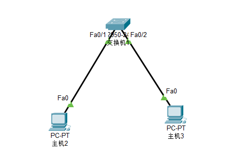
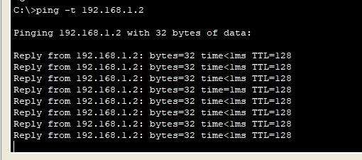
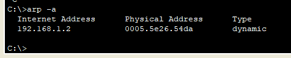
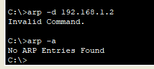
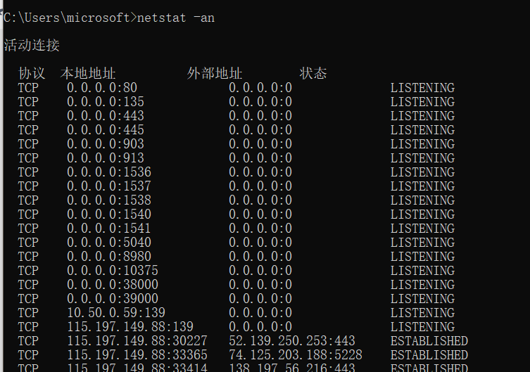
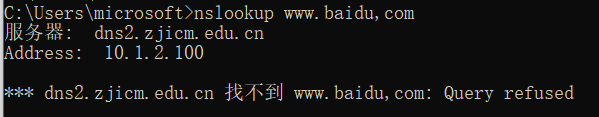
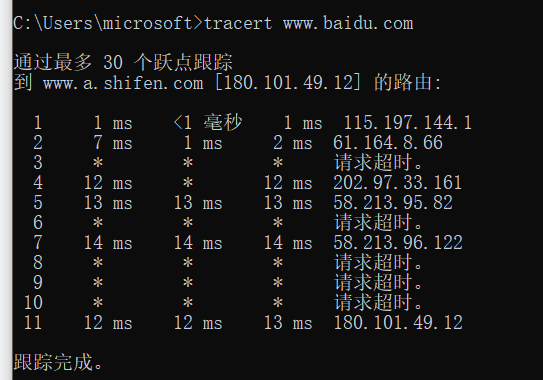

ipconfig:显示本机ip地址配置的简约情况。

ipconfig /all：显示本机ip地址等情况的详细信息

ping ：测试网络的联通性，默认发送4个icmp的类型8报文给对方，回应4个icmp的类型0报文给本机。

ping -t : 不停发送icmp的类型8报文，只要对方主机存活，就会不停地进行icmp的类型0报文回应。

arp -a : 显示本机的arp缓存内容，对方IP地址和对方mac地址的对应关系。

arp -d : 删除本机的arp缓存内容，清除了ip地址与mac地址的对应关系。

arp -s : 绑定本机中的arp缓存中的ip地址与mac地址的对应关系为静态关系

Netstat  -an ：显示本机的网络链接情况

Nslookup : 用于域名解析的指令，可以解析出域名所对应的ip地址

Tracetrt (trace route ), 跟踪路由，显示从本机到达目的主机所经过的路由器的ip地址情况

实验：

设备：cisco 交换机 2950-24型号 ，两台pc机

示意图：

1. ping -t ip地址

示例：ping -t 192.168.1.2

2.  arp -a (显示本机arp缓存）

3. arp -d (删除指定的缓存）

4.Netstat (显示本机的网络连通情况）

5.Nslookup（用于域名解析）

6.tracert (路由跟踪）

tracert www.baidu.com

