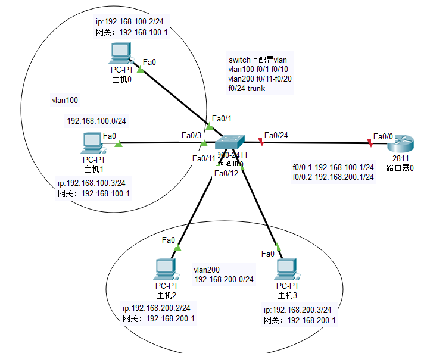
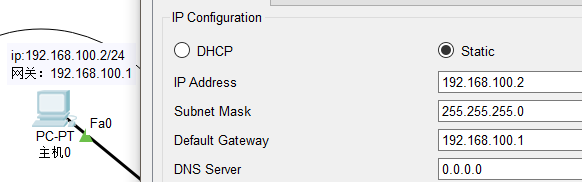

# 实验目的：

配置路由器的单臂路由。实现不同vlan的pc机能够通过同一条路由能ping通路由器


# 实验步骤：

1.配置主机ip

pc0:




pc1,pc2,pc3一样。


# 2.switch配置vlan

```javascript
Switch(config)#vlan 100
Switch(config-vlan)#vlan 200
Switch(config-vlan)#exit

Switch(config)#interface range fastEthernet 0/1-10
Switch(config-if-range)#switchport access vlan 100

Switch(config)#interface range fa0/11-20
Switch(config-if-range)#switchport access vlan 200

Switch(config)#interface fastEthernet 0/24
Switch(config-if)#switchport mode trunk
```


此时查看vlan，发现vlan以配置成功。show ip vlan:

```javascript
Switch#show vlan

VLAN Name Status Ports
---- -------------------------------- --------- -------------------------------
1 default active Fa0/21, Fa0/22, Fa0/23, Fa0/24
Gig0/1, Gig0/2
100 VLAN0100 active Fa0/1, Fa0/2, Fa0/3, Fa0/4
Fa0/5, Fa0/6, Fa0/7, Fa0/8
Fa0/9, Fa0/10
200 VLAN0200 active Fa0/11, Fa0/12, Fa0/13, Fa0/14
Fa0/15, Fa0/16, Fa0/17, Fa0/18
Fa0/19, Fa0/20
1002 fddi-default active
1003 token-ring-default active
1004 fddinet-default active
1005 trnet-default active

VLAN Type SAID MTU Parent RingNo BridgeNo Stp BrdgMode Trans1 Trans2
---- ----- ---------- ----- ------ ------ -------- ---- -------- ------ ------
1 enet 100001 1500 - - - - - 0 0
100 enet 100100 1500 - - - - - 0 0
200 enet 100200 1500 - - - - - 0 0
1002 fddi 101002 1500 - - - - - 0 0
1003 tr 101003 1500 - - - - - 0 0
1004 fdnet 101004 1500 - - - ieee - 0 0
1005 trnet 101005 1500 - - - ibm - 0 0
```


# 3.router配置单臂路由

```javascript
Router(config)#interface fastEthernet 0/0.1
Router(config-subif)#ip address 192.168.100.1 255.255.255.0

Router(config-subif)#encapsulation dot1Q 100
Router(config-subif)#ip address 192.168.100.1 255.255.255.0
Router(config-subif)#no shutdown
Router(config-subif)#exit

Router(config)#interface fastEthernet 0/0.2

Router(config-subif)#encapsulation dot1Q 200
Router(config-subif)#ip address 192.168.200.1 255.255.255.0
Router(config-subif)#no shutdown

//最后要激活fa0/0接口
Router(config)#interface fastEthernet 0/0
Router(config-if)#no shutdown
```


