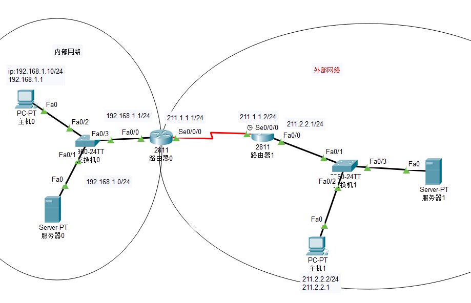

实验目的：

使内部网络能够访问外部网络，外部网路不能够访问内部网络。


实验步骤:

1.配置路由器ip地址


2.配置eigrp协议相互学习

```javascript
Router(config)#router eigrp 1
Router(config-router)#network 211.1.1.0 0.0.0.255
```


3.配置nat，访问控制列表

```javascript
Router(config)#interface fastEthernet 0/0  //从f0/0口进来

//1.指定inside接口和outside接口
Router(config-if)#ip nat inside
Router(config-if)#exit

Router(config)#interface serial 0/0/0 //从s0/0/0口出去
Router(config-if)#ip nat outside

//2.创建访问控制列表，定义符合访问控制列表的数据流量进行nat转换
Router(config)#access-list 10 permit 192.168.1.0 0.0.0.255 //访问控制列表

//3.启用nat功能，使得符合访问控制列表的流量进行nat转换
Router(config)#ip nat inside source list 10 interface serial 0/0/0
//从f0/0口进来的符合访问控制列表的ip，从s0/0/0口出去
```


