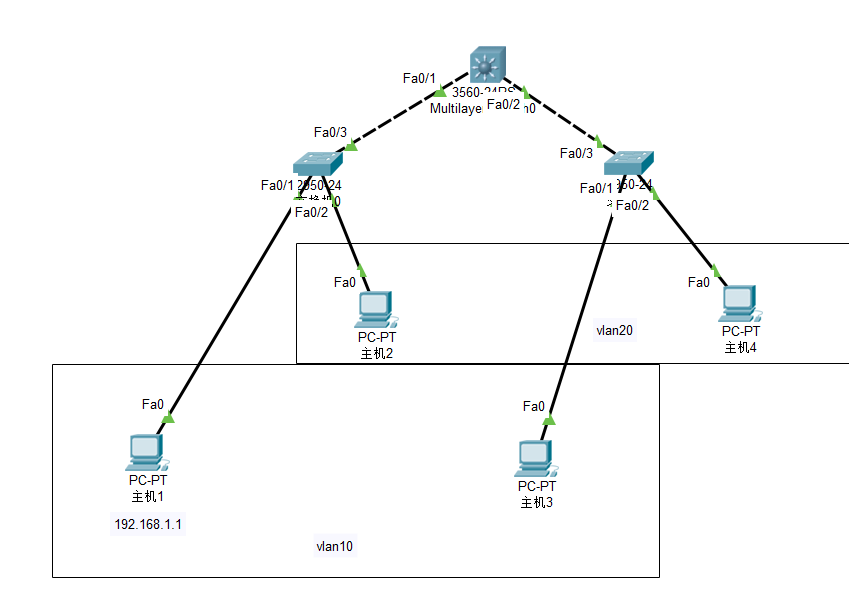

# 实验环境：



# 实验步骤：

## 1.创建vlan

## 2.添加端口成员

## 3.设置交换机之间的trunk链路


# router1:

## 1.创建vlan10，vlan20

```javascript
Switch(config)#vlan 10
Switch(config-vlan)#name vlan10
Switch(config-vlan)#exit
Switch(config)#vlan 20
Switch(config-vlan)#name vlan20
Switch(config-vlan)#exit
```

## 2.fa0/1加入vlan10,fa0/2加入vlan20

```javascript
Switch(config-if)#interface fastEthernet 0/1
Switch(config-if)#switchport access vlan 10
Switch(config-if)#inter fa 0/2
Switch(config-if)#switchport access vlan 20
Switch(config-if)#exit
```

## 3.为fa0/3创建trunk

```javascript
Switch(config)#interface fastEthernet 0/3
Switch(config-if)#switchport mode trunk
```


router2:(和router1一样）

1.创建vlan10，vlan20

2.fa0/1加入vlan10,fa0/2加入vlan20

3.为fa0/3创建trunk


# router3:

## 1.创建vlan10,vlan20

```javascript
Switch(config)#vlan 10
Switch(config-vlan)#vlan 20
```

## 2.为fa0/1-2创建trunk（注意：这里需要记一下，指定协议）

```javascript
Switch(config)#interface range fastEthernet 0/1-2
Switch(config-if-range)#switchport trunk encapsulation dot1q
Switch(config-if-range)#switchport mode trunk
```


# 结果分析：

即便是跨交换机，只要设置了交换机之间的trunk链路，同vlan之间的交换机能够ping通。

如果没有设置trunk链路，同vlan之间的