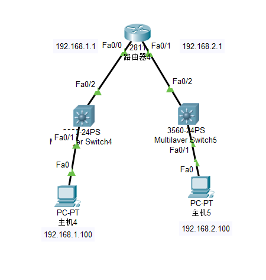
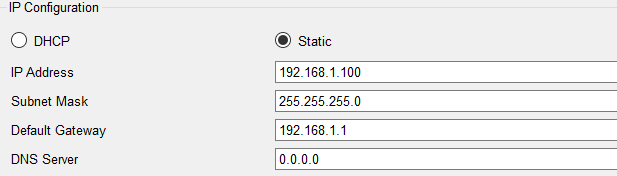
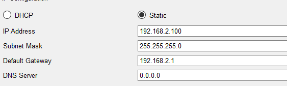

# 实验目的：

实现pc4和pc5相互ping通。

# 实验步骤：

## 主机4：

## 配置ip地址，配置子网掩码，配置网关




## 主机5：

## 配置ip地址，配置子网掩码，配置网关




## router:

## 配置网关ip地址。

```javascript
Router(config)#interface fastEthernet 0/0
Router(config-if)#ip address 192.168.1.1 255.255.255.0
Router(config-if)#no shutdown
Router(config)#interface fastEthernet 0/1
Router(config-if)#ip address 192.168.2.1 255.255.255.0
Router(config-if)#no shutdown
```


## 常用排错配置命令：

## 1. show ip route（查看路由表信息）

```javascript
Router#show ip route
Codes: C - connected, S - static, I - IGRP, R - RIP, M - mobile, B - BGP
D - EIGRP, EX - EIGRP external, O - OSPF, IA - OSPF inter area
N1 - OSPF NSSA external type 1, N2 - OSPF NSSA external type 2
E1 - OSPF external type 1, E2 - OSPF external type 2, E - EGP
i - IS-IS, L1 - IS-IS level-1, L2 - IS-IS level-2, ia - IS-IS inter area
* - candidate default, U - per-user static route, o - ODR
P - periodic downloaded static route

Gateway of last resort is not set

C 192.168.1.0/24 is directly connected, FastEthernet0/0
C 192.168.2.0/24 is directly connected, FastEthernet0/1
```


路由表由几个方面的内容组成：

路由来源，目的网络，子网掩码，管理距离和代价值，下一跳，本地接口等组成

