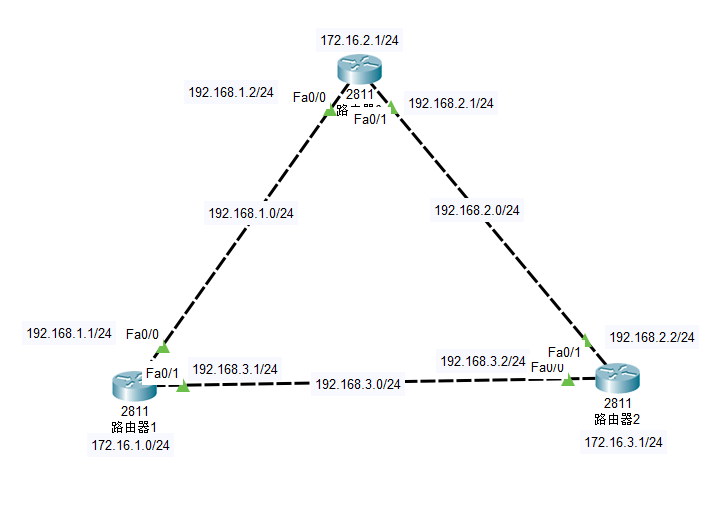

# 实验目的：

使用rip协议学习到全部路由。

# 配置步骤：

## 1.配置各接口ip地址


router1:

```javascript
router1(config)#interface fastEthernet 0/0
router1(config-if)#ip address 192.168.1.1 255.255.255.0
router1(config-if)#no shutdown
router1(config-if)#exit
router1(config)#interface fastEthernet 0/1
router1(config-if)#ip address 192.168.3.1 255.255.255.0
router1(config-if)#no shutdown
router1(config-if)#exit
router1(config)#interface loopback 0 //配置换回地址
router1(config-if)#ip address 172.16.2.1 255.255.255.0
router1(config-if)#no shutdown
```


注意： router1(config)#interface loopback 0 //配置换回地址


router2，router3一样


## 2.配置rip协议

## router1:

```javascript
router1(config)#router rip
router1(config-router)#version 2
router1(config-router)#no auto-summary //不做自动汇总
router1(config-router)#network 192.168.1.0
router1(config-router)#network 192.168.3.0
router1(config-router)#network 172.16.1.0
```

注意：router1(config-router)#no auto-summary //不做自动汇总


router2，router3类似


## 查看路由表：

```javascript
Router#show ip route
Codes: C - connected, S - static, I - IGRP, R - RIP, M - mobile, B - BGP
D - EIGRP, EX - EIGRP external, O - OSPF, IA - OSPF inter area
N1 - OSPF NSSA external type 1, N2 - OSPF NSSA external type 2
E1 - OSPF external type 1, E2 - OSPF external type 2, E - EGP
i - IS-IS, L1 - IS-IS level-1, L2 - IS-IS level-2, ia - IS-IS inter area
* - candidate default, U - per-user static route, o - ODR
P - periodic downloaded static route

Gateway of last resort is not set

172.16.0.0/24 is subnetted, 3 subnets
R 172.16.1.0 [120/1] via 192.168.3.1, 00:00:13, FastEthernet0/0
R 172.16.2.0 [120/1] via 192.168.2.1, 00:00:06, FastEthernet0/1
C 172.16.3.0 is directly connected, Loopback0
R 192.168.1.0/24 [120/1] via 192.168.3.1, 00:00:13, FastEthernet0/0
C 192.168.2.0/24 is directly connected, FastEthernet0/1
C 192.168.3.0/24 is directly connected, FastEthernet0/0
```


已经学习到全部的路由。


