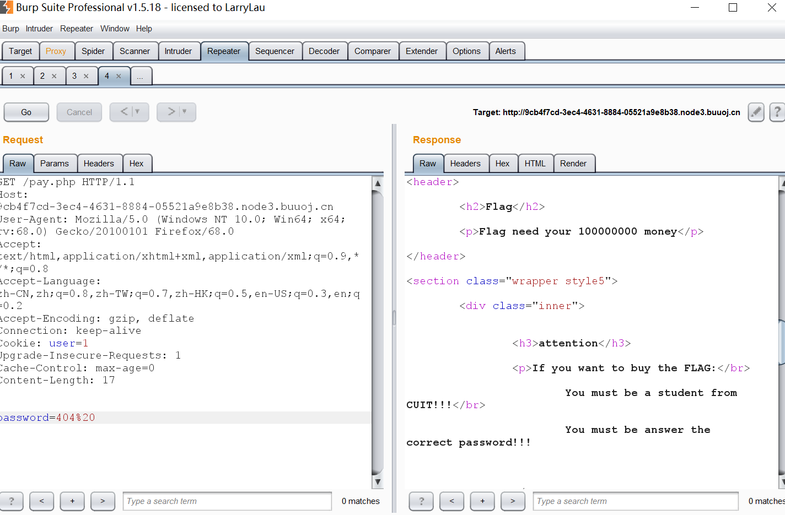
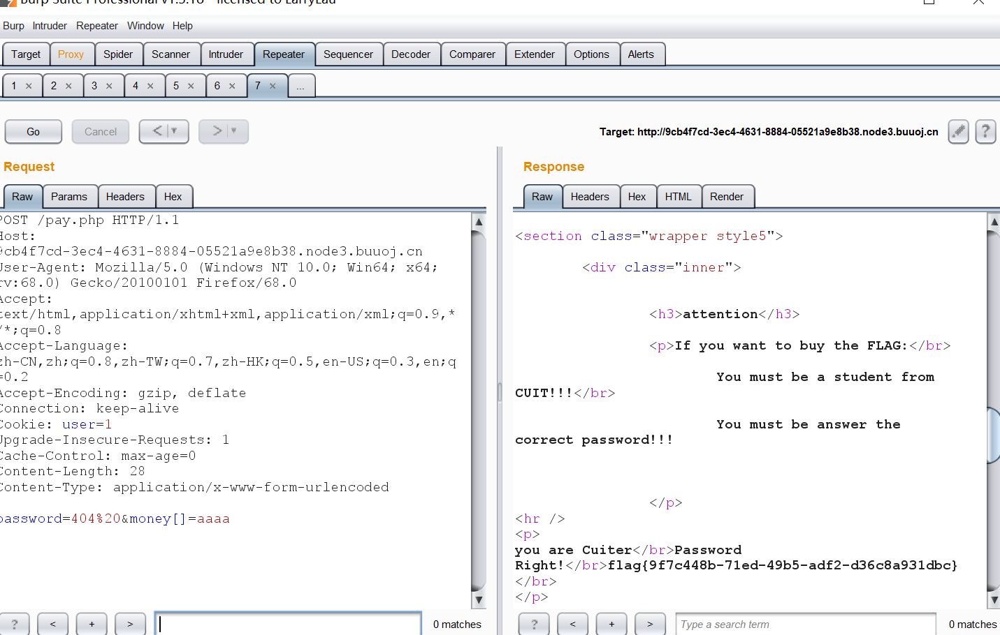

# 脑洞题：

关闭页面特效

0x00 知识点

php中的strcmp漏洞

说明：

int strcmp ( string $str1 , string $str2 )

参数 str1第一个字符串。str2第二个字符串。如果 str1 小于 str2 返回 < 0； 如果 str1 大于 str2 返回 > 0；如果两者相等，返回 0。

可知，传入的期望类型是字符串类型的数据，但是如果我们传入非字符串类型的数据的时候，这个函数将会有怎么样的行为呢？实际上，当这个函数接受到了不符合的类型，这个函数将发生错误，但是在5.3之前的php中，显示了报错的警告信息后，将return 0 ，

也就是虽然报了错，但却判定其相等

php中的is_numeric()漏洞

is_numeric函数对于空字符%00，无论是%00放在前后都可以判断为非数值，而%20空格字符只能放在数值后。所以，查看函数发现该函数对对于第一个空格字符会跳过空格字符判断，接着后面的判断！

0|10x01 解题

查看源代码发现：

<!--
    ~~~post money and password~~~
if (isset($_POST['password'])) {
    $password = $_POST['password'];
    if (is_numeric($password)) {
        echo "password can't be number ";
    }elseif ($password == 404) {
        echo "Password Right! ";
    }
}
-->

bp抓包：

将user=1,且password=404%20

提示我们与money=10000

意到这题Cookie没有用上PHPSESSID，那么这题猜一下逻辑就是直接将我们提交的money与要求的1000000比较，不存在记录的过程.

同时注意到，此题用到的是PHP 5.3.5，老版本PHP了。要求我们不能输入8位字符，而输入其他任何字符都会返回you have not enough money,loser~，合理猜测一下用的是strcmp，那么直接money[]=1就可以了。

__EOF__

作　　者：王叹之

出　　处：https://www.cnblogs.com/wangtanzhi/p/12238883.html

关于博主：编程路上的小学生，热爱技术，喜欢专研。评论和私信会在第一时间回复。或者直接私信我。

版权声明：署名 - 非商业性使用 - 禁止演绎，协议普通文本 | 协议法律文本。

声援博主：如果您觉得文章对您有帮助，可以点击文章右下角【推荐】一下。您的鼓励是博主的最大动力！

分类: CTF刷题

好文要顶 关注我 收藏该文 

 

王叹之

关注 - 4

粉丝 - 3

+加关注

0

0

« 上一篇： [WesternCTF2018]shrine

» 下一篇： 2020/1/29 PHP代码审计之XSS漏洞

posted @ 2020-01-28 20:47  王叹之  阅读(89)  评论(0)  编辑  收藏

刷新评论刷新页面返回顶部

注册用户登录后才能发表评论，请 登录 或 注册， 访问 网站首页。

[极客大挑战 2019]BuyFlag

Copyright © 2020 王叹之

Powered by .NET Core 3.1.1 on Linux

【学无止境❤️谦卑而行】

This blog has running : 287 d 13 h 26 m 46 sღゝ◡╹)ノ♡

友情链接：李教授の小屋/想做红队的Web狗/da4er师傅的博客/申请坑位/申请坑位

00:00 / 03:46   

- 0.1  0x01 解题