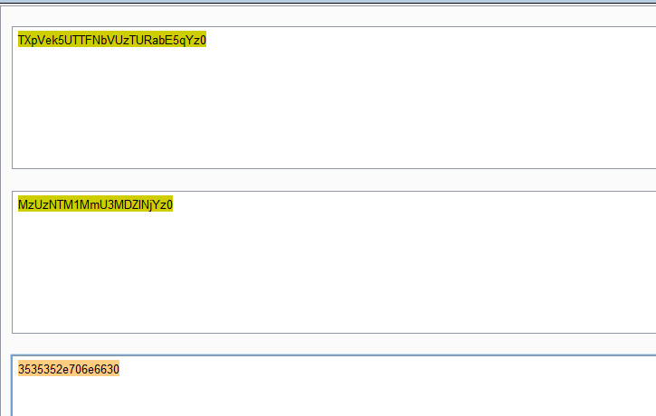
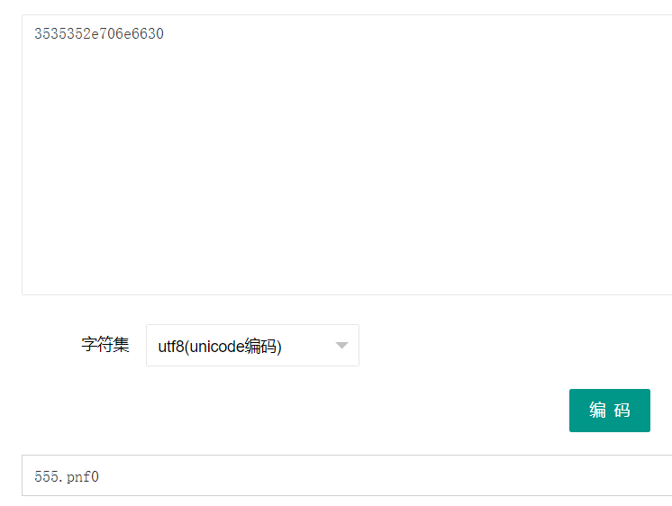
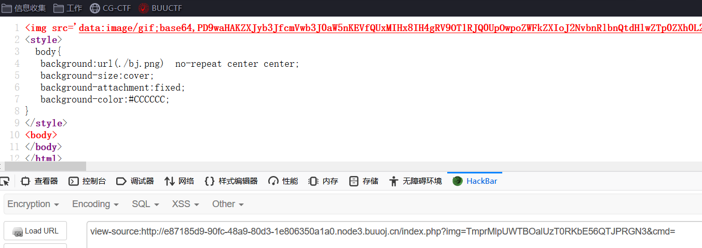

# 知识点：

# 1.MD5碰撞

# 2.文件读取

# 3.cat 禁用绕过（ca\t,sort)


# 1.img后面的字符串，两次base64解码，然后再hex解码得到图片名。

推测存在文件包含。将image=后面的文件名加密成base64字符串。







# 2.加密index.php。尝试读取index.php的源码

加密脚本：

```javascript
# python3
import binascii
import base64
filename = input().encode(encoding='utf-8')
hex = binascii.b2a_hex(filename)
base1 = base64.b64encode(hex)
base2 = base64.b64encode(base1)
print(base2.decode())
```


# 3.读取到index.php的内容



将base64密文解码即可：

```javascript
<?php
error_reporting(E_ALL || ~ E_NOTICE);
header('content-type:text/html;charset=utf-8');
$cmd = $_GET['cmd'];
if (!isset($_GET['img']) || !isset($_GET['cmd']))
    header('Refresh:0;url=./index.php?img=TXpVek5UTTFNbVUzTURabE5qYz0&cmd=');
$file = hex2bin(base64_decode(base64_decode($_GET['img'])));

$file = preg_replace("/[^a-zA-Z0-9.]+/", "", $file);
if (preg_match("/flag/i", $file)) {
    echo '';
    die("xixi～ no flag");
} else {
    $txt = base64_encode(file_get_contents($file));
    echo "</img>";
    echo "<br>";
}
echo $cmd;
echo "<br>";
if (preg_match("/ls|bash|tac|nl|more|less|head|wget|tail|vi|cat|od|grep|sed|bzmore|bzless|pcre|paste|diff|file|echo|sh|\'|\"|\`|;|,|\*|\?|\\|\\\\|\n|\t|\r|\xA0|\{|\}|\(|\)|\&[^\d]|@|\||\\$|\[|\]|{|}|\(|\)|-|<|>/i", $cmd)) {
    echo("forbid ~");
    echo "<br>";
} else {
    if ((string)$_POST['a'] !== (string)$_POST['b'] && md5($_POST['a']) === md5($_POST['b'])) {
        echo `$cmd`;
    } else {
        echo ("md5 is funny ~");
    }
}

?>
<html>
<style>
    body{
        background:url(./bj.png)  no-repeat center center;
        background-size:cover;
        background-attachment:fixed;
        background-color:#CCCCCC;
    }
</style>
<body>
</body>
</html>
```


## 4.代码存在命令执行

## 1.a!==b,md5(a)=md5(b)。可以使用MD5碰撞绕过。

## 2.正则存在两个绕过方式：

## cat可以使用：ca/t和sort替换。

```javascript
if (preg_match("/ls|bash|tac|nl|more|less|head|wget|tail|vi|cat|od|grep|sed|bzmore|bzless|pcre|paste|diff|file|echo|sh|\'|\"|\`|;|,|\*|\?|\\|\\\\|\n|\t|\r|\xA0|\{|\}|\(|\)|\&[^\d]|@|\||\\$|\[|\]|{|}|\(|\)|-|<|>/i", $cmd)) {
    echo("forbid ~");
    echo "<br>";
} else {
    if ((string)$_POST['a'] !== (string)$_POST['b'] && md5($_POST['a']) === md5($_POST['b'])) {
        echo `$cmd`;
    } else {
        echo ("md5 is funny ~");
    }
}
```


# 5.读取flag


