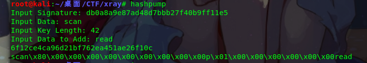
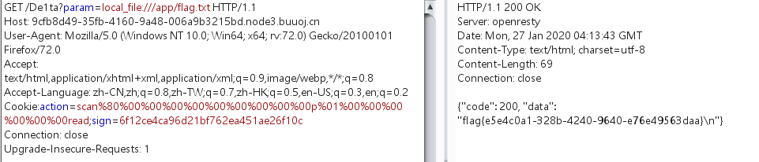

题目考察知识点：

1.pythpn代码审计

2.local_file:///协议绕过

3.md5长度扩展攻击

1.local_file:/// 协议绕过file,urllibe的一个cve：cve2019-9948

2.重点说一下md5长度扩展攻击

这里使用hashdump工具：

此处：input singnature:来自于 /geneSign

获取的md5值

input data:为盐值

input key length ： 为盐值长度

input data to add:貌似可以为任意值

最后需要将：

生成的payload的\x替换为%

