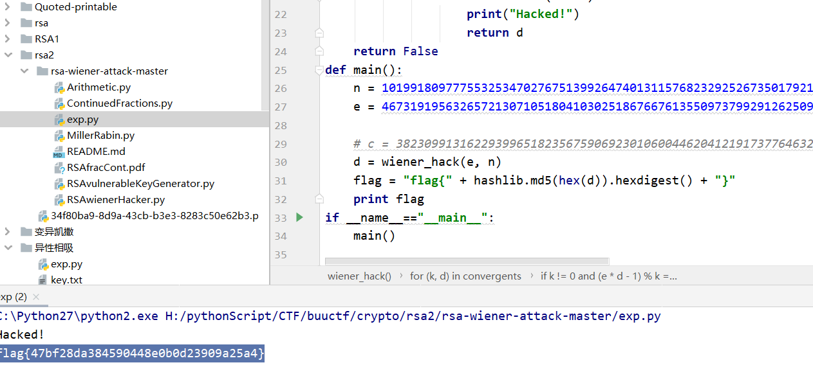

此题直接给了一个py脚本：

```javascript
N = 101991809777553253470276751399264740131157682329252673501792154507006158434432009141995367241962525705950046253400188884658262496534706438791515071885860897552736656899566915731297225817250639873643376310103992170646906557242832893914902053581087502512787303322747780420210884852166586717636559058152544979471
e = 46731919563265721307105180410302518676676135509737992912625092976849075262192092549323082367518264378630543338219025744820916471913696072050291990620486581719410354385121760761374229374847695148230596005409978383369740305816082770283909611956355972181848077519920922059268376958811713365106925235218265173085

d=0
import hashlib
flag = "flag{" + hashlib.md5(hex(d)).hexdigest() + "}"
```


这个特别大，此时可以考虑低指数幂攻击

攻击条件 ¶

在 d 比较小（d<13N14）时，攻击者可以使用 Wiener's Attack 来获得私钥。

攻击原理 ¶

- https://en.wikipedia.org/wiki/Wiener%27s_attack

- https://sagi.io/2016/04/crypto-classics-wieners-rsa-attack/

工具 ¶

- https://github.com/pablocelayes/rsa-wiener-attack


exp.py 将该脚本放到wiener-attack文件夹下运行即可

```javascript
#!/usr/bin/python
#coding:utf-8
import hashlib

import gmpy2
from Crypto.PublicKey import RSA
import ContinuedFractions, Arithmetic
from Crypto.Util.number import long_to_bytes 

def wiener_hack(e, n):
    # firstly git clone https://github.com/pablocelayes/rsa-wiener-attack.git !
    frac = ContinuedFractions.rational_to_contfrac(e, n)
    convergents = ContinuedFractions.convergents_from_contfrac(frac)
    for (k, d) in convergents:
        if k != 0 and (e * d - 1) % k == 0:
            phi = (e * d - 1) // k
            s = n - phi + 1
            discr = s * s - 4 * n
            if (discr >= 0):
                t = Arithmetic.is_perfect_square(discr)
                if t != -1 and (s + t) % 2 == 0:
                    print("Hacked!")
                    return d
    return False
def main():
    n = 101991809777553253470276751399264740131157682329252673501792154507006158434432009141995367241962525705950046253400188884658262496534706438791515071885860897552736656899566915731297225817250639873643376310103992170646906557242832893914902053581087502512787303322747780420210884852166586717636559058152544979471
    e = 46731919563265721307105180410302518676676135509737992912625092976849075262192092549323082367518264378630543338219025744820916471913696072050291990620486581719410354385121760761374229374847695148230596005409978383369740305816082770283909611956355972181848077519920922059268376958811713365106925235218265173085

    # c = 38230991316229399651823567590692301060044620412191737764632384680546256228451518238842965221394711848337832459443844446889468362154188214840736744657885858943810177675871991111466653158257191139605699916347308294995664530280816850482740530602254559123759121106338359220242637775919026933563326069449424391192
    d = wiener_hack(e, n)
    flag = "flag{" + hashlib.md5(hex(d)).hexdigest() + "}"
    print flag
if __name__=="__main__":
    main()
```




