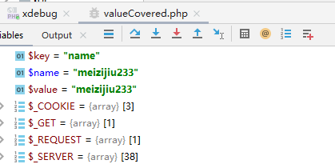

代码审计还是都应该把代码copy下来放到phpstrom里面运行debug看一下

```javascript
<?php
foreach($_GET as $key => $value){
    $$key = $value;
}
if($name == "meizijiu233"){
    echo flag;
}
```


1.此处的foreach($_GET as $key => $value)，会将$_GET数组的索引赋值给$key，值赋值给$value

列如：

```javascript
<?php
$arr=array("1"=>"one","2"=>"tow");
foreach($arr as $key=>$value){
    echo $key."=>".$value."\n";
}

输出：
1=>one
2=>two
```

所以此处的$key和$value我们是能够控制的

2.$$key

$$在php中很容易导致变量覆盖

当$key=name时，就可以产生$name


3.所以此处的思路就是

构造一个数组，索引为name,值为meizijiu233

经过多次调试，



payload:?name=meizijiu

