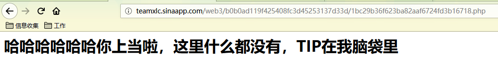
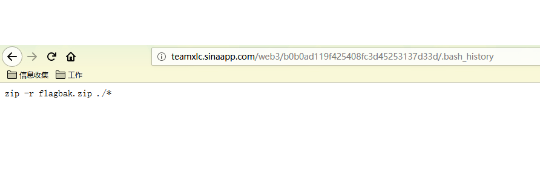

1.打开网页jsfuck

直接执行，得到：1bc29b36f623ba82aaf6724fd3b16718.php

2.访问：

http://teamxlc.sinaapp.com/web3/b0b0ad119f425408fc3d45253137d33d/1bc29b36f623ba82aaf6724fd3b16718.php

提示：

3.http请求包，响应头

这一步代表提示访问，网站的.bash_history文件

4.访问：

http://teamxlc.sinaapp.com/web3/b0b0ad119f425408fc3d45253137d33d/.bash_history

发现执行zip -r 命令

所以访问flagbak.zip下载文件

解压得到flag

