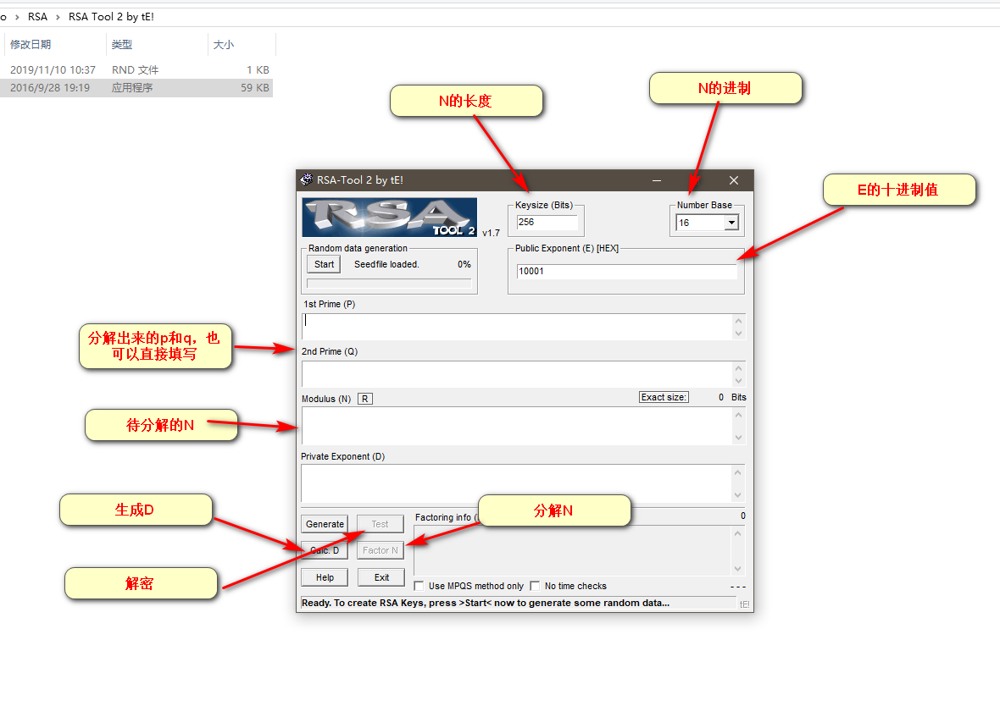
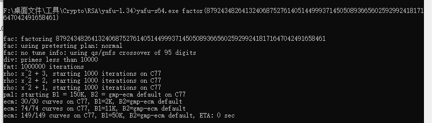

1.rsa tool



2.yafu-1.34




3.openssl

1.生成私钥

```javascript
openssl genrsa -out key.pem 1024
    -out 指定生成文件，此文件包含公钥和私钥两部分，所以即可以加密，也可以解密
    1024 生成密钥的长度
```


2.从私钥中提取公钥

```javascript
openssl rsa -in key.pem -pubout -out pubkey.pem
    -in 指定输入的密钥文件
    -out 指定提取生成公钥的文件(PEM公钥格式)
```


3.将公钥转换为明文

```javascript
openssl rsa -in pubkey.pem -pubin -noout -text -modulus
       -in 指定公钥文件
       -out 
```


openssl rsa -in private.pem -text -out private.txt