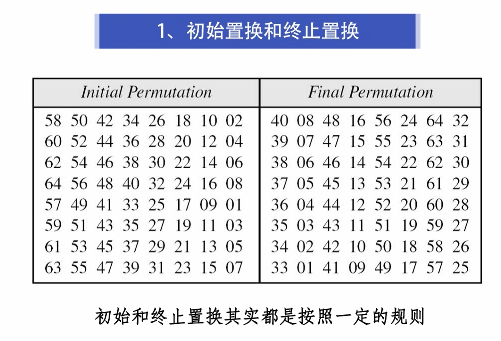
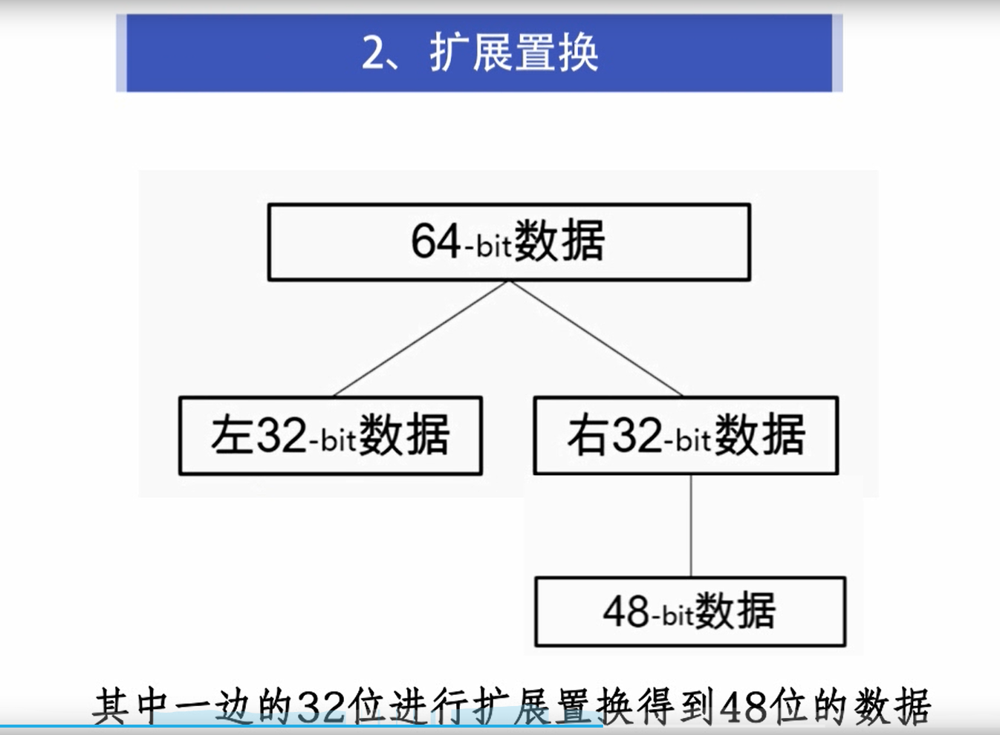
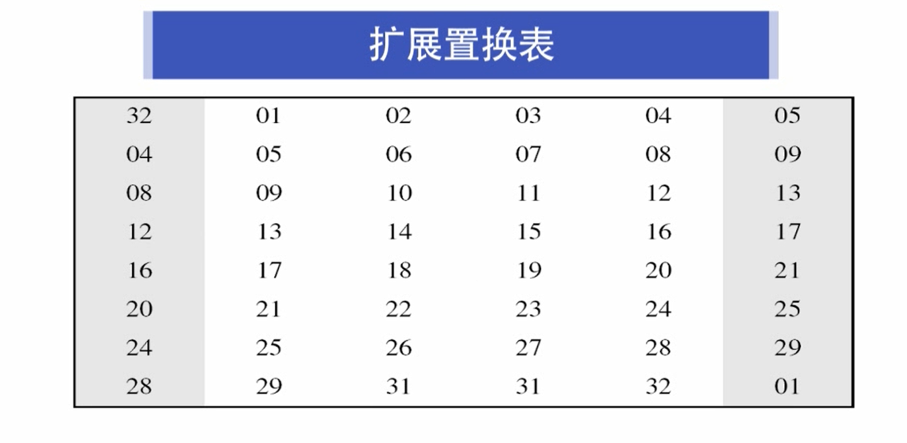
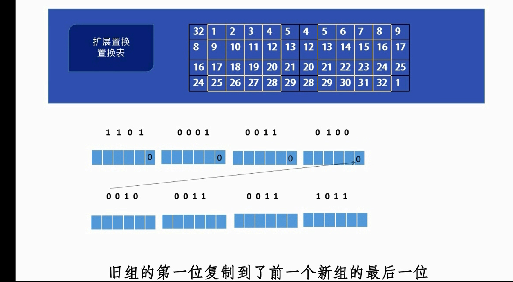
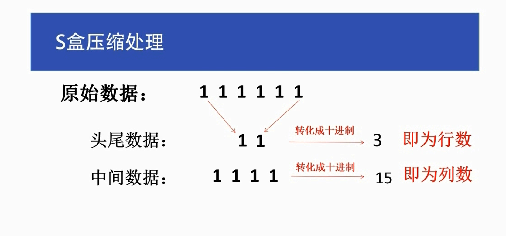
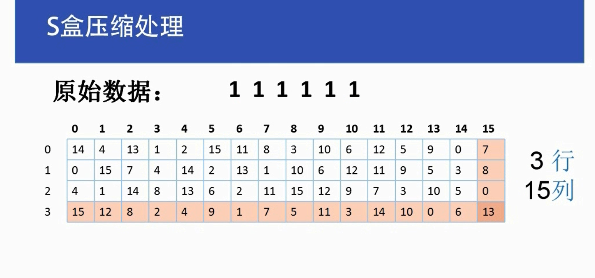
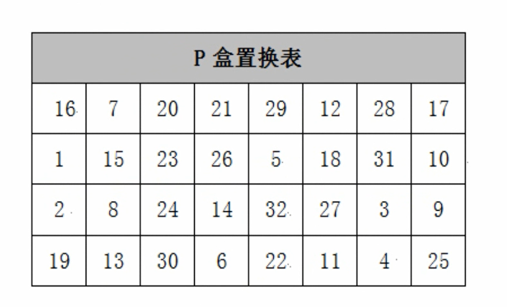

# 1. 初始置换

1.1

初始置换表，将原始数据64位二进制的第58位放到第1位，第50位放到第2位.........第7位放到最后一位

2.终止置换

和初始置换一样

# 3.扩展置换

# 3.1 将其中一边的32位数，扩展成48位数

# 扩展置换表，

# 将32位数据，分成8组，再根据扩展置换表，得出扩展置换后的数据

# 4.s盒压缩处理

经过扩展的48位明文和48密钥，进行异或运算后，在使用8个s盒压缩处理得到32位数据

# 4.1将数据的头尾数据，转成十进制数，表示行数

# 中间数据转成十进制表示，列数

# 4.2 根据行数和列数在压缩表中找到，对应的数

比如此处的3行15列，对应的数为13

# 4.3 再将对应的数转成2进制

13------->1101

# 5.p盒置换

大概是将数据转成32位2进制数，然后类似初始置换和终止置换，得到结果

