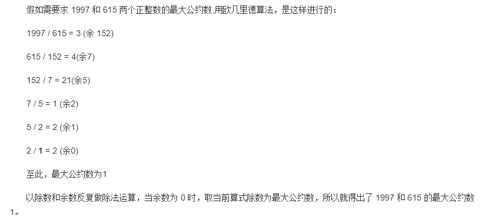

1997x+615y=1

采用欧几里得算法求x,y,q

初始化：x=1,y=0,q=1（x,y都是固定的，q=余数为0时的式子的除数）

算法：x,y=x,(x-(a//b)*y) (a,b 为辗转相除法，倒回去，列如：（2，1),(5,2),(7,5),(152,7),(615,152),(1997,615)

# 计算过程：

把辗转相除法的工程倒回去

x=0,y=(1-2//1*0)=1

x=1,y=(0-5//2*1)=-2

x=-2,y=(1-7//5*(-2))=3

x=3,y=(-2-152//7*3)=-2-21*3=-65

x=-65 ,y=(3-615//152*-65)=263

x=263,y=(-65-1997//615*163)=-854

