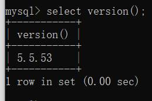

# 3.1常见的sql注入利用技术

# 3.1.1使用堆叠查询

堆叠查询指的是在单个数据库连接中执行多个查询。

 

# 3.2识别数据库

# 3.2.1 常见系统架构组合识别

Asp和.net通常使用sqlserver

Php通常使用mysql或者postgresql

Java通常是oracle或mysql

Iis服务器是基于windows的架构，后台数据库有可能是sqlserver

Apache服务器，可能使用开源数据库mysql或postgresql

 

# 3.2.2 非盲跟踪

大多数情况下想识别数据，只需查看一条足够详细的错误信息即可。不同数据库错误信息也不同。

例如：添加一个单引号使数据库报错。


通过报错信息，就能很轻易判断出是mysql数据库。

 


如果出现类似错误说明。服务端代码没有对数据库查询语句进行错误判断。这样是非常危险的，直接将服务器文件目录返回给了用户。

 

进行错误判断的代码实列：


其他类型数据库报错信息，如果自己无法判断，google搜索一下，就可以查询到。

 

## 3.2.2.1 获取标志信息

从错误信息中，我们可以获取很多的数据库信息，但是这样还不够。

我们可以使用数据库查询函数进行，更多的查询。

 

| 数据库服务器 | 查询 |
| - | - |
| Mysql | Select version();    &amp;    select @@version; |
| sqlserver | Select @@version |
| oracle | Select banner from v$version<br>Select banner from v$version where rownum=1 |
| postgresqls | Select version() |


 

例如：对于mysql数据库，执行select version();



即可查看数据库版本。还可以进一步查看用户，用户权限等等

- [ ] //UNDO


# 3.2.3 盲跟踪

如果应用不直接返回你所需 的数据，就需要采用其他方法。这种方法基于不同数据库所使用的sql语句上的细微差异。最常用的技术就是利用不同数据库在连接字符串上的差异。


## 3.2.3.1 连接字符串判断数据库

```javascript
select 'string'
```

 该查询对大多数数据库，查询结果都一致，当如果将字符串分成两个字串，不同产品会有不同结果。


| 数据库服务器 | 查询 |
| - | - |
| mysql | select 'str' 'ing'<br>select concat('str','ing') |
| sqlserver | select 'str'+'ing' |
| oracle | select 'str'||'ing'<br>select concat('str','ing') |


## 3.2.3.1 针对mysql数据库：

1. select concat('str','ing')


使用concat()函数时，需为数字型注入


2. select 'str' 'ing'


构造payload过程中需时刻注意闭合问题。


## 3.2.3.2 数字函数判断数据库

| 数据库服务器 | 查询 |
| - | - |
| mysql | selct connection\_id()//查询当前连接的线程<br>slect last\_inset\_id() //<br>select row\_count()// |
| slqserver | @@pack\_received<br>@@rowcount |
| oracle | BITAND(1,1) |


## 3.2.3.3 使用特定的sql结构

面对mysql可以使用三种不同的方式来包含注释。

 1）#

 2）--

 3）/**/

针对第三个注释如果在第一个*后面加一个！，后面再跟上数据库版本编号，那么该注释将被解析成带代码。

例如：

select 1 /*！40119 + 1*/

返回结果：

2（如果mysql版本为4.01.19或更高版本）

1（其他情况）

这里我版本为5.5.53。只能返回1.


