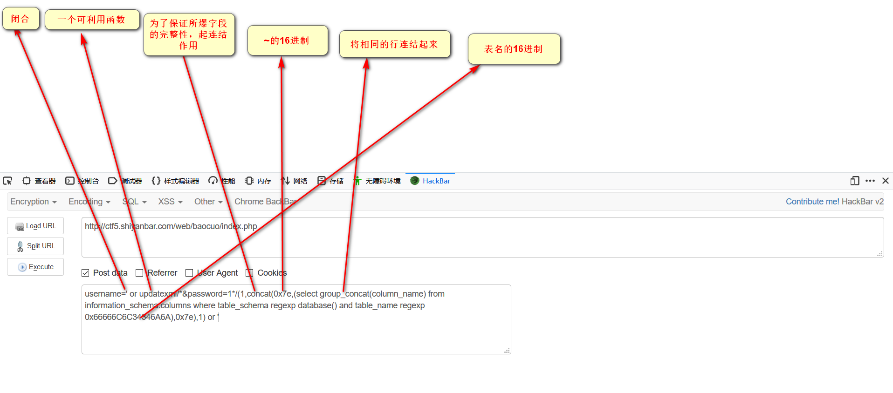

1.xmlupdate()

UPDATEXML (XML_document, XPath_string, new_value); 

第一个参数：XML_document是String格式，为XML文档对象的名称，文中为Doc 

第二个参数：XPath_string (Xpath格式的字符串) ，如果不了解Xpath语法，可以在网上查找教程。 

第三个参数：new_value，String格式，替换查找到的符合条件的数据 

作用：改变文档中符合条件的节点的值

然后咱们再看看语句：

http://domain.com/flag.php?id=1 and updatexml(1,concat(0x7e,(SELECT @@version),0x7e),1)

CONCAT(str1,str2,…)  

返回结果为连接参数产生的字符串。如有任何一个参数为NULL ，则返回值为 NULL。

通过查询@@version,返回版本。然后CONCAT将其字符串化。因为UPDATEXML第二个参数需要Xpath格式的字符串,所以不符合要求，然后报错。

错误大概会是：

ERROR 1105 (HY000): XPATH syntax error: ’:root@localhost’

不懂Xpath格式的字符串的来这里：http://www.cnblogs.com/Loofah/archive/2012/05/10/2494036.html

