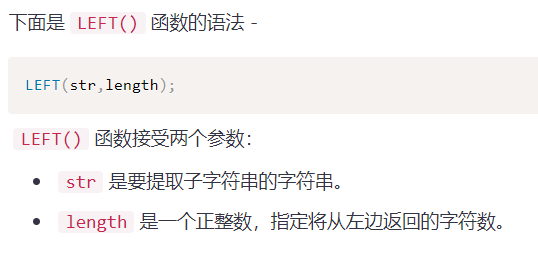
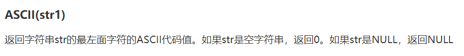
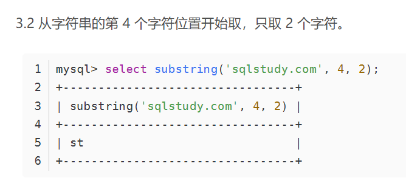
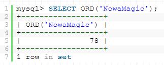
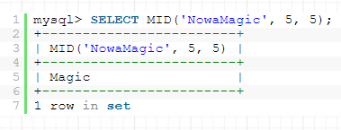
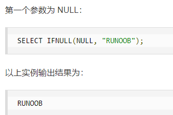

# left():

# ascii():

# substr():

sbustr(string string,int startNum,int lengthNum):

# limit:

limit offset,count;

limit 1,1; 检索记录行1-1，也就是第一行

limit 2,1;检索记录行2-1，也就是检索第二行

# ord():

ord(string);

ord()函数返回所包含字符串第一个字符的ascii码。

# mid():

mid(string string,int start,int length)

mid函数用于得到一个字符串的一部分 ，只在mysql中使用，mssql和oracle中可用SQL SUBSTRING函数或者 SQL SUBSTR函数代替。

# ifnull():

ifnull(expression（表达式）,alt_vule(自动线路测试值）);

ifnull函数用来判断第一个字符串是否为null，如果为null，则返回第二个值。

